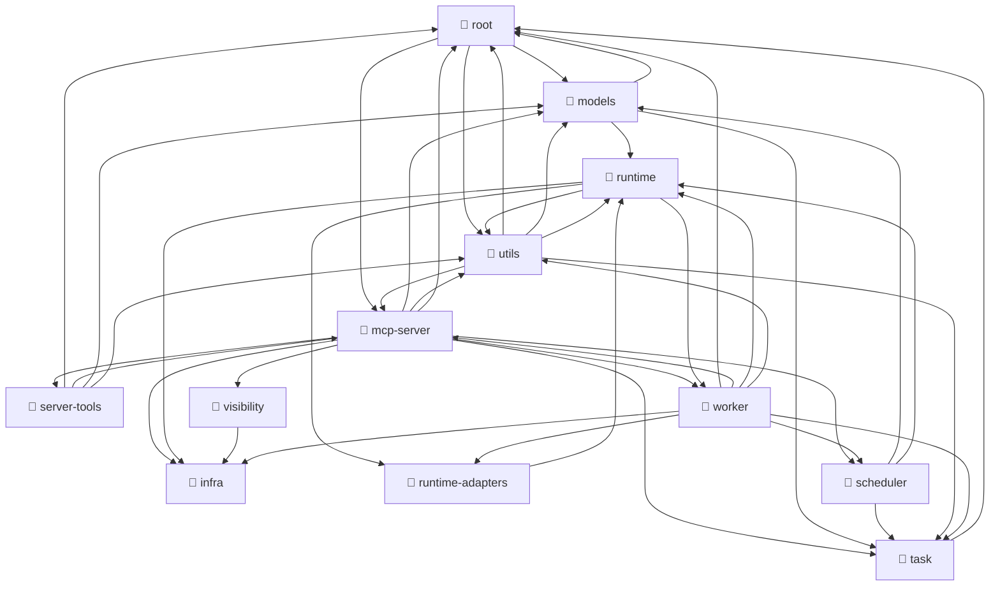
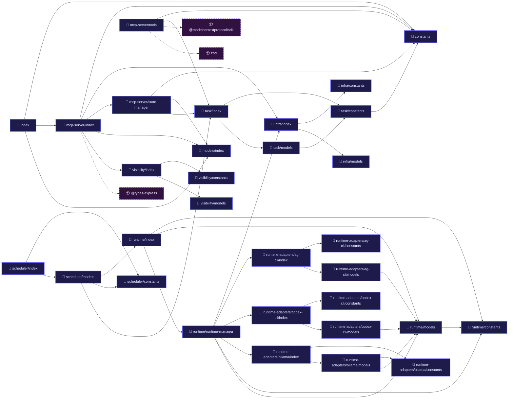

# Workspace Memory — agent-orchestrator

> Last updated: 2026-05-22
> Phase: **Phase 2 — Hybrid Agentic Architecture** (Phase 1 archived)

## Project Overview

- **Name**: agent-orchestrator
- **Version**: 0.3.0-dev (Phase 2)
- **Stack**: Node.js, TypeScript, ESM
- **Module system**: Pure ESM (`import`/`export`)
- **Root**: `D:\workspace\agent-orchestrator`
- **Server port**: 3847

## Architecture

**Server-Centric Unidirectional Data Flow (Head-Body-Limb)**

```
Server (Node.js) → dispatches task → Agent Runner → LLM → tools → report back
```

- Server owns state, schedules work, spawns workers as subprocesses
- Agent Runner is one-shot: stdin → LLM → tools → notify → exit
- Communication: stdin/stdout + HTTP (language-agnostic)
- LLM Harness: `LLMAdapter` interface supports cloud (Gemini) + local (Ollama)

See `.agent/knowledge/architecture-philosophy.md` for design principles.

## Current State

- **Phase 1**: Archived → `_archive/phase1/` (after P2-PRE task completes)
- **Phase 2 tasks**: `tasks/pending/` — 34 tasks (P2-PRE → P2-23 + WM series)
- **Active plan**: `dev-docs/2026-05-07_plan_phase2-revised-with-research-insights.md`
- **Core plan**: `dev-docs/plan_phase2-hybrid-architecture.md`
- **Task board**: `tasks/README.md`

## Key Directories

| Directory | Purpose |
|-----------|---------|
| `src/` | Source code (Phase 2 — being rebuilt) |
| `dev-docs/` | Technical docs, active plans |
| `tasks/pending/` | Dev task board |
| `reference/skills/` | Product skills for workers |
| `.agent/` | Dev agent infrastructure (skills, workflows, rules, memory) |
| `plan/` | User plan ingestion (pending → processing → done) |
| `exchange/` | File IPC directories |
| `prompts/` | Agent prompt templates (Phase 2 worker prompts) |

## Key Decisions (Phase 2)

| Decision | Detail |
|----------|--------|
| Language | Node.js/TypeScript (Go migration Phase 3) |
| LLM Harness | Cloud + Local via `LLMAdapter` interface |
| Skills storage | `reference/skills/` (product), `.agent/skills/` (dev) |
| Reflections | Markdown format, global case-bank |
| Case Bank | Global cross-project (`~/.orchestrator/case-bank/`) |
| Local capacity | Dynamic infra verification; no hardcoded VRAM or GPU baseline |

## Build & Dev

```bash
npm run dev          # Development (tsx watch)
npm run build        # TypeScript compile
npm run serve        # Production serve
```

## Don't Touch

- `.agent/skills/` — read-only during task execution
- `reference/` — product assets, not dev artifacts
- `plan/` — user-facing, not dev artifacts
- Architecture decisions without asking first

<!-- START_DEPENDENCY_MAP -->
## Codebase Relation Map (Auto-generated)

*This section is dynamically generated by codebase scanner.*

### 📂 High-level Domain Dependencies


### ⚙️ Core Modules Flow


### 🔄 Circular Dependencies Analysis
> [!NOTE]
> **Clean architecture!** No circular dependencies found.


### 📦 Complete Codebase Directory
<details>
<summary>🔍 Click to view full module relations directory</summary>

| Source File | Local Dependencies | External Libraries Used (NPM) |
| :--- | :--- | :--- |
| `config.ts` | `constants.ts`, `models/config.ts`, `utils/workspace-registry.ts` | _None_ |
| `constants.ts` | _None_ | _None_ |
| `index.ts` | `config.ts`, `constants.ts`, `mcp-server/index.ts`, `models/index.ts`, `utils/startup-prompt.ts` | _None_ |
| `infra/capacity-store.ts` | `infra/models.ts` | _None_ |
| `infra/constants.ts` | _None_ | _None_ |
| `infra/index.ts` | `infra/capacity-store.ts`, `infra/constants.ts`, `infra/infra-verifier.ts`, `infra/models.ts`, `infra/resource-monitor.ts` | _None_ |
| `infra/infra-verifier.ts` | `infra/models.ts` | _None_ |
| `infra/models.ts` | _None_ | _None_ |
| `infra/resource-monitor.ts` | `infra/constants.ts`, `infra/models.ts` | _None_ |
| `mcp-server/context.ts` | `mcp-server/plan-watcher.ts`, `mcp-server/recovery.ts`, `mcp-server/state-manager.ts`, `models/config.ts`, `utils/logger.ts`, `utils/worker-registry.ts` | _None_ |
| `mcp-server/index.ts` | `constants.ts`, `infra/index.ts`, `mcp-server/context.ts`, `mcp-server/plan-watcher.ts`, `mcp-server/recovery.ts`, `mcp-server/state-manager.ts`, `mcp-server/transport.ts`, `models/index.ts`, `utils/bootstrap.ts`, `utils/identity-invariants.ts`, `utils/logger.ts`, `utils/ollama-launcher.ts`, `utils/worker-registry.ts`, `utils/workspace-registry.ts`, `visibility/index.ts`, `worker/adapters/ollama-adapter.ts`, `worker/dispatch-loop.ts`, `worker/model-selector.ts`, `worker/vram-manager.ts` | `@types/express` |
| `mcp-server/plan-watcher.ts` | `constants.ts`, `mcp-server/state-manager.ts`, `models/index.ts`, `utils/file-backend.ts`, `utils/logger.ts`, `utils/workspace-registry.ts` | _None_ |
| `mcp-server/recovery.ts` | `constants.ts`, `mcp-server/state-manager.ts`, `models/index.ts`, `task/index.ts`, `utils/file-backend.ts`, `utils/lifecycle-timing.ts`, `utils/logger.ts`, `utils/worker-registry.ts` | _None_ |
| `mcp-server/server.ts` | `constants.ts`, `mcp-server/context.ts`, `mcp-server/tools.ts` | `@modelcontextprotocol/sdk` |
| `mcp-server/state-manager.ts` | `constants.ts`, `mcp-server/task-queue.ts`, `models/index.ts`, `task/index.ts`, `utils/file-backend.ts`, `utils/logger.ts`, `utils/task-identity-registry.ts` | _None_ |
| `mcp-server/task-queue.ts` | `constants.ts`, `models/index.ts`, `scheduler/index.ts`, `task/index.ts` | _None_ |
| `mcp-server/tools.ts` | `constants.ts`, `mcp-server/context.ts`, `mcp-server/tools/scan-workspace.ts`, `mcp-server/tools/session-checkpoint.ts`, `server-tools/task-submitter.ts`, `server-tools/workspace-connector.ts`, `task/index.ts`, `utils/bootstrap.ts`, `utils/file-backend.ts`, `utils/identity-invariants.ts`, `utils/workspace-registry.ts` | `@modelcontextprotocol/sdk`, `zod` |
| `mcp-server/tools/scan-workspace.ts` | _None_ | _None_ |
| `mcp-server/tools/session-checkpoint.ts` | `constants.ts` | `zod` |
| `mcp-server/transport.ts` | `constants.ts`, `mcp-server/context.ts`, `mcp-server/server.ts` | `@modelcontextprotocol/sdk`, `@types/express` |
| `models/assignment.ts` | `runtime/models.ts` | _None_ |
| `models/bootstrap.ts` | _None_ | _None_ |
| `models/checkpoint.ts` | _None_ | _None_ |
| `models/config.ts` | _None_ | _None_ |
| `models/index.ts` | `models/assignment.ts`, `models/bootstrap.ts`, `models/checkpoint.ts`, `models/config.ts`, `models/mcp.ts`, `models/plan.ts`, `models/task-metadata.ts`, `models/task.ts`, `models/worker.ts` | _None_ |
| `models/mcp.ts` | _None_ | _None_ |
| `models/plan.ts` | _None_ | _None_ |
| `models/task-metadata.ts` | `constants.ts`, `models/task.ts` | _None_ |
| `models/task.ts` | `task/models.ts` | _None_ |
| `models/worker.ts` | _None_ | _None_ |
| `runtime-adapters/ag-cli/ag-runtime.ts` | `runtime-adapters/ag-cli/constants.ts`, `runtime-adapters/ag-cli/models.ts`, `runtime/constants.ts` | _None_ |
| `runtime-adapters/ag-cli/constants.ts` | _None_ | _None_ |
| `runtime-adapters/ag-cli/index.ts` | `runtime-adapters/ag-cli/ag-runtime.ts`, `runtime-adapters/ag-cli/constants.ts`, `runtime-adapters/ag-cli/models.ts` | _None_ |
| `runtime-adapters/ag-cli/models.ts` | `runtime/models.ts` | _None_ |
| `runtime-adapters/codex-cli/codex-runtime.ts` | `runtime-adapters/codex-cli/constants.ts`, `runtime-adapters/codex-cli/models.ts`, `runtime/constants.ts` | _None_ |
| `runtime-adapters/codex-cli/constants.ts` | _None_ | _None_ |
| `runtime-adapters/codex-cli/index.ts` | `runtime-adapters/codex-cli/codex-runtime.ts`, `runtime-adapters/codex-cli/constants.ts`, `runtime-adapters/codex-cli/models.ts` | _None_ |
| `runtime-adapters/codex-cli/models.ts` | `runtime/models.ts` | _None_ |
| `runtime-adapters/ollama/constants.ts` | _None_ | _None_ |
| `runtime-adapters/ollama/index.ts` | `runtime-adapters/ollama/constants.ts`, `runtime-adapters/ollama/models.ts`, `runtime-adapters/ollama/ollama-runtime.ts` | _None_ |
| `runtime-adapters/ollama/models.ts` | `runtime-adapters/ollama/constants.ts`, `runtime/models.ts` | _None_ |
| `runtime-adapters/ollama/ollama-runtime.ts` | `runtime-adapters/ollama/constants.ts`, `runtime-adapters/ollama/models.ts`, `runtime/constants.ts`, `runtime/models.ts` | _None_ |
| `runtime/constants.ts` | _None_ | _None_ |
| `runtime/heartbeat-store.ts` | `runtime/constants.ts`, `runtime/models.ts`, `utils/lifecycle-timing.ts` | _None_ |
| `runtime/index.ts` | `runtime/constants.ts`, `runtime/heartbeat-store.ts`, `runtime/lease-validator.ts`, `runtime/models.ts`, `runtime/point-allocator.ts`, `runtime/runtime-manager.ts`, `runtime/runtime-registry.ts` | _None_ |
| `runtime/lease-validator.ts` | `runtime/models.ts` | _None_ |
| `runtime/models.ts` | `runtime/constants.ts` | _None_ |
| `runtime/point-allocator.ts` | `infra/index.ts`, `runtime/models.ts` | _None_ |
| `runtime/runtime-manager.ts` | `infra/index.ts`, `runtime-adapters/ag-cli/index.ts`, `runtime-adapters/codex-cli/index.ts`, `runtime-adapters/ollama/index.ts`, `runtime/constants.ts`, `runtime/heartbeat-store.ts`, `runtime/models.ts`, `runtime/point-allocator.ts`, `runtime/runtime-registry.ts`, `worker/adapters/ollama-adapter.ts`, `worker/process-manager.ts` | _None_ |
| `runtime/runtime-registry.ts` | `runtime/constants.ts`, `runtime/models.ts` | _None_ |
| `scheduler/constants.ts` | _None_ | _None_ |
| `scheduler/index.ts` | `scheduler/constants.ts`, `scheduler/models.ts` | _None_ |
| `scheduler/models.ts` | `models/assignment.ts`, `runtime/index.ts`, `scheduler/constants.ts`, `task/index.ts` | _None_ |
| `server-tools/task-submitter.ts` | `constants.ts`, `mcp-server/context.ts`, `models/task-metadata.ts`, `utils/file-backend.ts`, `utils/identity-invariants.ts`, `utils/workspace-registry.ts` | _None_ |
| `server-tools/workspace-connector.ts` | `constants.ts`, `utils/bootstrap.ts`, `utils/identity-invariants.ts`, `utils/workspace-registry.ts` | _None_ |
| `task/constants.ts` | `constants.ts` | _None_ |
| `task/index.ts` | `task/constants.ts`, `task/models.ts` | _None_ |
| `task/models.ts` | `task/constants.ts` | _None_ |
| `utils/bootstrap.ts` | `constants.ts`, `models/bootstrap.ts`, `models/config.ts`, `utils/file-backend.ts` | _None_ |
| `utils/file-backend.ts` | `constants.ts` | _None_ |
| `utils/identity-invariants.ts` | `constants.ts`, `models/index.ts`, `task/index.ts`, `utils/workspace-registry.ts` | _None_ |
| `utils/lifecycle-timing.ts` | `runtime/constants.ts` | _None_ |
| `utils/logger.ts` | `constants.ts`, `utils/file-backend.ts` | _None_ |
| `utils/ollama-launcher.ts` | _None_ | _None_ |
| `utils/startup-prompt.ts` | `constants.ts`, `models/index.ts` | _None_ |
| `utils/task-identity-registry.ts` | `constants.ts`, `mcp-server/task-queue.ts`, `task/index.ts`, `utils/file-backend.ts`, `utils/identity-invariants.ts` | _None_ |
| `utils/worker-registry.ts` | `constants.ts`, `models/index.ts`, `utils/file-backend.ts`, `utils/identity-invariants.ts`, `utils/task-identity-registry.ts` | _None_ |
| `utils/workspace-registry.ts` | `utils/bootstrap.ts` | _None_ |
| `visibility/constants.ts` | _None_ | _None_ |
| `visibility/index.ts` | `visibility/constants.ts`, `visibility/models.ts`, `visibility/resource-terminal-table.ts` | _None_ |
| `visibility/models.ts` | _None_ | _None_ |
| `visibility/resource-terminal-table.ts` | `infra/index.ts`, `visibility/constants.ts`, `visibility/models.ts` | _None_ |
| `worker/adapters/llm-adapter.ts` | _None_ | _None_ |
| `worker/adapters/ollama-adapter.ts` | `worker/adapters/llm-adapter.ts` | _None_ |
| `worker/dispatch-loop.ts` | `constants.ts`, `infra/index.ts`, `mcp-server/state-manager.ts`, `mcp-server/task-queue.ts`, `runtime-adapters/ollama/index.ts`, `runtime/index.ts`, `scheduler/index.ts`, `utils/worker-registry.ts`, `worker/model-selector.ts`, `worker/process-manager.ts` | _None_ |
| `worker/model-selector.ts` | `constants.ts`, `infra/index.ts`, `mcp-server/task-queue.ts`, `task/index.ts`, `worker/adapters/ollama-adapter.ts` | _None_ |
| `worker/process-manager.ts` | `constants.ts`, `runtime/constants.ts`, `runtime/models.ts`, `utils/lifecycle-timing.ts` | _None_ |
| `worker/vram-manager.ts` | `constants.ts`, `worker/adapters/ollama-adapter.ts`, `worker/model-selector.ts` | _None_ |

</details>
<!-- END_DEPENDENCY_MAP -->
