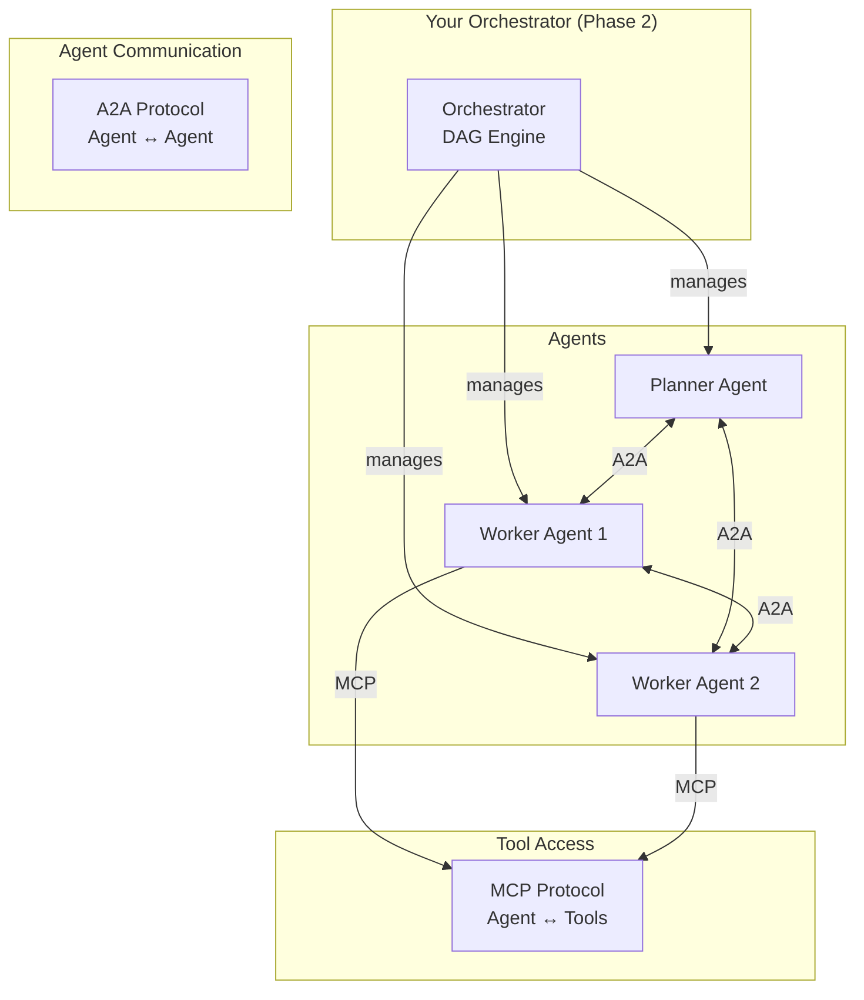

# Phase 2 Research Report — Agent Orchestrator

> **Date**: 2026-05-07  
> **Type**: Research only — Không implement  
> **Context**: Orchestrator hiện tại = Node.js/TS, MCP server, DAG-based task queue, file-based IPC

---

## 📑 Mục lục

1. [Hệ thống cùng mindset — So sánh](#1-hệ-thống-cùng-mindset--so-sánh)
2. [CLI Harness — Bọc LLM làm coding agent](#2-cli-harness--bọc-llm-làm-coding-agent)
3. [Phase 1 Cleanup — Giữ gì, bỏ gì](#3-phase-1-cleanup--giữ-gì-bỏ-gì)
4. [Future-proofing — Có outdate không?](#4-future-proofing--có-outdate-không)
5. [Go vs Node — Có nên chuyển?](#5-go-vs-node--có-nên-chuyển)

---

## 1. Hệ thống cùng mindset — So sánh

### Landscape 2026

Năm 2026, industry đã chia rõ 2 layer:
- **LLM Reasoning Layer** — Agent logic, planning, tool calling
- **Deterministic Plumbing Layer** — Task queue, state machine, orchestration

Hệ thống của bạn đang ở **Plumbing Layer** (zero-knowledge engine, DAG resolution, file-based IPC). Đây là so sánh trực tiếp:

### So sánh chi tiết

| Tiêu chí | **Bạn (Agent Orchestrator)** | **LangGraph** | **CrewAI** | **AutoGen/AG2** | **Temporal/Prefect** |
|---|---|---|---|---|---|
| **Triết lý** | Zero-knowledge state machine | Deterministic state graph | Role-based crew | Conversational agents | Durable workflow engine |
| **Orchestration** | DAG + file IPC | Directed graph + checkpoints | Sequential/hierarchical | Message passing | Event-driven workflow |
| **State** | File-based (`inbox/active/outbox/`) | In-memory + persistence | Internal | Conversation history | Event sourcing |
| **Intelligence** | 100% delegated to agents | Mixed (graph logic + LLM) | Mixed (crew roles + LLM) | 100% LLM conversations | 0% (pure infra) |
| **Coupling** | Zero — works for any project | Tight — LangChain ecosystem | Medium — Python-centric | Medium — Python-centric | Zero — language agnostic |
| **Production readiness** | Phase 1 (PoC) | ✅ Production standard | ✅ Fast prototyping | ⚠️ Experimental | ✅ Battle-tested infra |

### Phân tích

> [!IMPORTANT]
> **Điểm mạnh độc đáo của bạn**: Triết lý "Zero-Knowledge Engine" rất giống Temporal/Prefect — orchestrator không biết gì về domain, chỉ lo di chuyển state. Đây là kiến trúc **đúng hướng** cho production.

**Vs LangGraph** (đối thủ gần nhất):
- LangGraph mạnh hơn về tooling (LangSmith tracing, checkpointing, time-travel debug)
- Nhưng LangGraph **tightly coupled** với LangChain ecosystem & Python
- Bạn có lợi thế: language-agnostic, LLM-agnostic, framework-agnostic

**Vs CrewAI**:
- CrewAI rất nhanh để prototype nhưng **opinionated** — khó customize
- Bạn linh hoạt hơn nhưng cần tự build nhiều thứ hơn

**Vs Temporal** (đáng chú ý nhất):
- Temporal là **durable execution engine** cùng layer với bạn
- Battle-tested ở scale lớn (Uber, Netflix, Snap)
- Nhưng Temporal nặng, cần infra riêng (server cluster)
- Bạn nhẹ hơn nhiều (single process, file-based)

### Khuyến nghị

```
Phase 2 nên:
├── Học từ LangGraph: Checkpointing, state persistence, observability
├── Học từ Temporal: Retry logic, timeout handling, dead letter queue
├── Giữ triết lý: Zero-knowledge, LLM-agnostic
└── KHÔNG thành framework: Giữ là infrastructure layer
```

---

## 2. CLI Harness — Bọc LLM làm coding agent

### Kiến trúc chuẩn 2026

Tất cả CLI agent tools (Codex CLI, Claude Code, Gemini CLI) đều dùng cùng 1 pattern:

```
┌─────────────────────────────────────┐
│           CLI Entry Layer           │
│  (Terminal UI, Input/Output, PTY)   │
├─────────────────────────────────────┤
│           Core Engine               │
│  ┌─────────────────────────────┐    │
│  │     ReAct Loop (vòng lặp)  │    │
│  │  Observe → Reason → Act    │    │
│  │       → Reflect → Loop     │    │
│  └─────────────────────────────┘    │
├─────────────────────────────────────┤
│           Tool System               │
│  file_edit | shell | git | search   │
├─────────────────────────────────────┤
│        Memory & Context             │
│  Short-term (session) + Long-term   │
│  (GEMINI.md, CODE_PLAN.md, etc.)    │
├─────────────────────────────────────┤
│      LLM Backend (swappable)        │
│  GPT-5.5 | Gemini 3.x | Ollama     │
└─────────────────────────────────────┘
```

### So sánh các CLI Agent

| Tool | LLM Backend | Open Source | Local Support | Đặc điểm nổi bật |
|---|---|---|---|---|
| **Codex CLI** | GPT-5.5 | ✅ | ❌ (API only) | Multi-agent, background workers, deployment-aware |
| **Gemini CLI** | Gemini 2.5/3.x | ✅ | ❌ (API only) | MCP native, Skills system, 1M+ context |
| **Claude Code** | Claude | ❌ | ❌ | Strong reasoning, plan-and-execute |
| **Aider** | Any (via API) | ✅ | ✅ (Ollama) | Git-native, pair programming |
| **Goose** | Any | ✅ | ✅ (Ollama) | CLI + Desktop, modular |
| **Continue** | Any | ✅ | ✅ (Ollama) | IDE extension, context-aware |
| **OpenCode** | Any | ✅ | ✅ (Ollama) | Privacy-first, provider-agnostic |

### Ollama — Local LLM Setup

```bash
# Recommended models cho coding agent (2026)
ollama pull qwen3.5-coder     # Best open-source coding model
ollama pull llama3.1           # General reasoning
ollama pull deepseek-coder-v3  # Alternative coding model

# Custom Modelfile cho coding agent
FROM qwen3.5-coder
PARAMETER temperature 0.2       # Low creativity = precise code
PARAMETER num_ctx 16384          # Larger context window
SYSTEM "You are an expert software engineer..."

# Performance optimization
export OLLAMA_FLASH_ATTENTION=1  # GPU acceleration
export OLLAMA_HOST=127.0.0.1     # Local only
```

### Khuyến nghị cho Phase 2

> [!TIP]
> **Industry standard 2026**: "Build the harness first, treat LLM as swappable brain"

Đây chính xác là triết lý hiện tại của bạn ("Intelligence Lives in Agents"). Phase 2 nên:

```
CLI Harness Strategy:
├── Adapter pattern: Interface chung cho mọi LLM backend
│   ├── CloudAdapter (OpenAI, Gemini, Anthropic API)
│   └── LocalAdapter (Ollama, llama.cpp)
├── ReAct Loop: Observe → Reason → Act → Reflect
├── Tool Registry: Pluggable tools (file, shell, git, MCP)
├── Context Engineering: Smart file selection, RAG, summarization
└── Budget Control: Token limits, iteration caps, timeout
```

---

## 3. Phase 1 Cleanup — Giữ gì, bỏ gì

### Phase 1 hiện tại bao gồm

```
src/
├── agents/          # Agent logic
├── config.ts        # Configuration
├── constants.ts     # Constants
├── index.ts         # Entry point
├── mcp-server/      # MCP server implementation
├── models/          # Data models
└── utils/           # Utilities
```

### Đề xuất giữ/bỏ

| Component | Quyết định | Lý do |
|---|---|---|
| **Architecture Philosophy** (`.agent/knowledge/`) | ✅ **GIỮ** | Triết lý zero-knowledge vẫn đúng |
| **DAG Resolution Logic** | ✅ **GIỮ** | Core value — dependency resolution |
| **File-based IPC** (`inbox/active/outbox/`) | ⚠️ **XEM LẠI** | Đơn giản nhưng có thể cần upgrade cho reliability |
| **MCP Server interface** | ✅ **GIỮ** | MCP là standard 2026, đúng hướng |
| **Worker detection/crash recovery** | ✅ **GIỮ** | Essential cho production |
| **Phase 1 demo/test code** | ❌ **BỎ** | Chỉ là PoC evidence |
| **Hardcoded configs** | ❌ **BỎ** | Cần config system flexible hơn |

> [!WARNING]
> Đừng bỏ quá nhiều! Kiến trúc và abstractions của Phase 1 phần lớn đúng hướng. Chỉ bỏ **implementation details** không cần cho Phase 2, giữ **architecture decisions**.

---

## 4. Future-proofing — Có outdate không?

### Verdict: ❌ KHÔNG outdate — nhưng cần adapt

### Lý do hệ thống KHÔNG outdate

1. **Zero-knowledge architecture** = Temporal/Prefect mindset — đây là production pattern đã proven
2. **MCP support** = Đang là industry standard (Linux Foundation governance, cả Anthropic + Google + Microsoft adopt)
3. **DAG-based orchestration** = Foundational CS concept, không bao giờ outdate

### Nhưng cần adapt cho 2026+ trends

| Trend 2026 | Impact lên hệ thống | Action |
|---|---|---|
| **MCP + A2A dual protocol** | MCP = Agent↔Tool, A2A = Agent↔Agent. Cần support cả 2 | Implement A2A Agent Cards cho agent discovery |
| **Multi-agent coordination** | Agents không chỉ nhận task mà cần nói chuyện với nhau | Cần communication channel giữa workers |
| **Agentic Workspaces** | CLI agents đang trở thành workspace (persistent goals, browser verify, auto-PR) | Orchestrator cần hỗ trợ long-running agent sessions |
| **Context Engineering > Prompt Engineering** | RAG, smart file selection, memory management quan trọng hơn prompt | Orchestrator có thể cung cấp context service cho agents |
| **Durable Execution** | Agents cần survive restart, network failures | File-based IPC cần upgrade → event sourcing hoặc WAL |

### Protocol Landscape 2026



> [!NOTE]
> **Key insight**: MCP (Anthropic, 2024) là "USB-C cho AI" — agent↔tool. A2A (Google, 2025) là agent↔agent coordination. Cả 2 đều dưới Linux Foundation governance. Hệ thống bạn đã có MCP, chỉ cần thêm A2A layer.

---

## 5. Go vs Node — Có nên chuyển?

### So sánh trực tiếp

| Tiêu chí | **Go** | **Node.js (hiện tại)** |
|---|---|---|
| **Performance** | ⭐⭐⭐⭐⭐ Compiled, native binary | ⭐⭐⭐ V8 JIT, event loop |
| **Concurrency** | ⭐⭐⭐⭐⭐ Goroutines, true parallel | ⭐⭐⭐ Async I/O, single-thread CPU |
| **CPU-bound** | ⭐⭐⭐⭐⭐ Multi-core native | ⭐⭐ Worker threads workaround |
| **Memory** | ⭐⭐⭐⭐⭐ Minimal footprint | ⭐⭐⭐ V8 overhead |
| **Deployment** | ⭐⭐⭐⭐⭐ Single static binary | ⭐⭐ node_modules, runtime dep |
| **Dev speed** | ⭐⭐⭐ Verbose but predictable | ⭐⭐⭐⭐⭐ Rapid iteration |
| **Ecosystem (AI)** | ⭐⭐ Growing, infrastructure focus | ⭐⭐⭐⭐ Massive, npm everything |
| **JSON handling** | ⭐⭐⭐ Struct-based, explicit | ⭐⭐⭐⭐⭐ Native, zero friction |
| **MCP SDK** | ⭐⭐⭐ Official Go SDK available | ⭐⭐⭐⭐⭐ First-class TypeScript SDK |
| **Error handling** | ⭐⭐⭐⭐⭐ Explicit, compile-time | ⭐⭐⭐ Runtime, try/catch |

### Khi nào nên chọn Go?

✅ **Chọn Go nếu:**
- Performance critical — nhiều concurrent agents, high throughput
- Deployment đơn giản — single binary, no runtime dependency
- Hệ thống cần chạy lâu dài, ít restart — Go binary rất stable
- Team comfortable với Go

❌ **Không chọn Go nếu:**
- Cần prototype nhanh và iterate fast
- Cần nhiều npm packages cho integrations
- Chỉ 1 người develop — Go verbose hơn

### Phân tích cho hệ thống của bạn

| Yếu tố | Phân tích |
|---|---|
| **Workload type** | I/O heavy (file IPC, API calls) → Node.js đủ tốt |
| **Concurrency need** | DAG resolution, multiple workers → Go có lợi thế |
| **Deployment** | Single binary vs node_modules → Go thắng rõ |
| **MCP compatibility** | Cả 2 đều có SDK, nhưng Node SDK mature hơn |
| **Maintenance** | 1 person project → Node nhanh hơn để develop |

### Khuyến nghị

> [!TIP]
> **Hybrid Approach** (Pattern phổ biến 2026):
> - **Go** cho orchestrator core (DAG engine, state machine, file watcher) — performance & reliability
> - **Node/TS** cho MCP interface layer & agent harness — ecosystem & dev speed

```
Nếu phải chọn 1:
├── Solo dev, iterate fast → GIỮ Node.js
├── Production, nhiều agents → CHUYỂN Go
└── Best of both → Hybrid (Go core + Node MCP)
```

### Migration Path nếu chọn Go

```
Phase 1: Prototype Go core (DAG engine only)
Phase 2: Port state management (inbox/active/outbox)
Phase 3: Implement MCP server in Go
Phase 4: Deprecate Node.js version
Timeline estimate: 2-4 weeks cho Go rewrite
```

---

## 🎯 Tổng kết

| Topic | Kết luận |
|---|---|
| **1. Hệ thống tương tự** | Kiến trúc đúng hướng (giống Temporal philosophy). Cần học thêm observability từ LangGraph |
| **2. CLI Harness** | Pattern chuẩn: ReAct loop + swappable LLM + pluggable tools. Ollama viable cho local |
| **3. Phase 1 cleanup** | Giữ: architecture + DAG + MCP. Bỏ: demo code + hardcoded configs |
| **4. Outdate?** | KHÔNG — nhưng cần thêm A2A protocol support + durable execution |
| **5. Go vs Node** | Hybrid approach tốt nhất. Solo dev thì giữ Node. Nếu chuyển Go, ưu tiên core engine trước |
