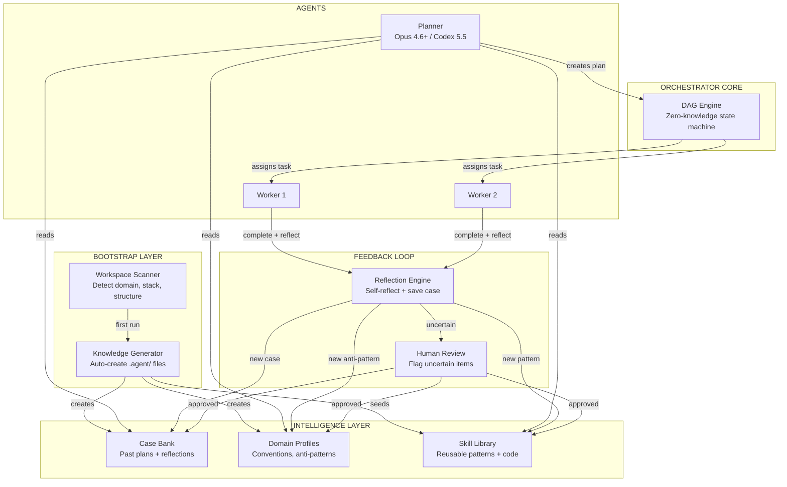

# Planner Intelligence, Domain Adaptation & Empty Box Problem

> **Date**: 2026-05-07  
> **Type**: Research + Design proposal  
> **Context**: Architecture Philosophy dòng 30: *"If a Planner enters a blank project with no `.agent/knowledge/`, it should auto-scan `package.json`, read `src/`, and generate these knowledge files"*

---

## 📑 Mục lục

1. [Planner ngày càng thông minh — How?](#1-planner-ngày-càng-thông-minh--how)
2. [Domain Specialization — Bộ improve cho mỗi domain](#2-domain-specialization--bộ-improve-cho-mỗi-domain)
3. [Empty Box Problem — Khi gặp project trống](#3-empty-box-problem--khi-gặp-project-trống)

---

## 1. Planner ngày càng thông minh — How?

### Vấn đề

Planner dùng model lớn (Codex 5.5, Opus 4.6+) → general intelligence rất cao. Nhưng:
- Lần đầu plan cho project X → kết quả "OK"
- Lần thứ 10 plan cho project X → vẫn chỉ "OK" (không improve)
- Model không nhớ gì từ lần trước

**Mục tiêu**: Planner phải **tích luỹ kinh nghiệm** → plan lần sau tốt hơn lần trước, mà **KHÔNG cần fine-tune model**.

### Giải pháp: Case Bank Architecture

Lấy cảm hứng từ **Case-Based Reasoning (CBR)** + **Reflexion** + **Thoth Knowledge Graph**:

```
┌──────────────────────────────────────────────────────────┐
│              PLANNER INTELLIGENCE SYSTEM                  │
│                                                          │
│  ┌─────────────────────────────────────────────────┐     │
│  │              Case Bank (per domain)             │     │
│  │                                                 │     │
│  │  case_001.md:                                   │     │
│  │    task: "Add auth to React app"                │     │
│  │    plan_given: [step1, step2, step3]            │     │
│  │    outcome: SUCCESS                             │     │
│  │    reflection: "Nên tách middleware riêng..."   │     │
│  │    domain: react-web                            │     │
│  │                                                 │     │
│  │  case_002.md:                                   │     │
│  │    task: "Add REST API endpoint"                │     │
│  │    plan_given: [step1, step2]                   │     │
│  │    outcome: FAILED                              │     │
│  │    reflection: "Thiếu step validate schema..."  │     │
│  │    domain: node-backend                         │     │
│  │                                                 │     │
│  └───────────────────┬─────────────────────────────┘     │
│                      │                                   │
│  ┌───────────────────▼─────────────────────────────┐     │
│  │         Planner Pre-Flight (enhanced)           │     │
│  │                                                 │     │
│  │  1. Read .agent/knowledge/ (project context)    │     │
│  │  2. Classify current task → domain              │     │
│  │  3. Retrieve TOP-K similar cases from Case Bank │     │
│  │  4. Include in planning prompt:                 │     │
│  │     - Relevant past successes (as examples)     │     │
│  │     - Past failures (as warnings)               │     │
│  │     - Accumulated reflections                   │     │
│  │  5. Generate plan                               │     │
│  │                                                 │     │
│  └───────────────────┬─────────────────────────────┘     │
│                      │                                   │
│  ┌───────────────────▼─────────────────────────────┐     │
│  │         Post-Execution Feedback Loop            │     │
│  │                                                 │     │
│  │  Worker hoàn thành task →                       │     │
│  │  1. Report outcome (success/fail/partial)       │     │
│  │  2. Worker self-reflect (Reflexion-style)       │     │
│  │  3. Planner reviews worker reflection           │     │
│  │  4. Planner generates own reflection:           │     │
│  │     "Plan tốt ở đâu? Sai ở đâu? Fix gì?"     │     │
│  │  5. Save case to Case Bank                      │     │
│  │                                                 │     │
│  │  ⚠️ HUMAN REVIEW FLAG:                         │     │
│  │  Nếu outcome = FAILED hoặc reflection có       │     │
│  │  uncertainty > threshold → flag cho human       │     │
│  │                                                 │     │
│  └─────────────────────────────────────────────────┘     │
│                                                          │
└──────────────────────────────────────────────────────────┘
```

### Cách Planner "thông minh hơn" qua mỗi lần

| Lần | Behavior | Case Bank |
|---|---|---|
| **Lần 1** | Plan purely from general knowledge | Empty → Tạo case đầu tiên |
| **Lần 5** | Retrieve 2-3 similar past cases | 5 cases → bắt đầu thấy patterns |
| **Lần 20** | Retrieve highly relevant cases + reflections | 20 cases → domain-specific expertise |
| **Lần 50** | Almost no mistakes for known task types | 50 cases → "expert" level cho domain |

### Tại sao KHÔNG cần fine-tune?

```
Thay vì:    Model weights ← training data (expensive, risky)
Dùng:       Prompt context ← Case Bank retrieval (cheap, controllable)

Ưu điểm:
├── Human có thể review/edit/delete cases
├── Không risk catastrophic forgetting
├── Transparent — biết chính xác planner học từ đâu
├── Portable — Case Bank là files, chuyển được
└── Model-agnostic — đổi LLM bất kỳ lúc nào, Case Bank vẫn dùng được
```

> [!IMPORTANT]
> **Đây chính xác là điều bạn nói**: SEAL ở dạng LAB, không đảm bảo học đúng, vẫn cần human review. Case Bank approach giải quyết bằng cách:
> - Mọi "learning" đều là text files → human readable + reviewable
> - Human flag cho uncertain cases
> - Không sửa model weights → zero risk

---

## 2. Domain Specialization — Bộ improve cho mỗi domain

### Vấn đề

Opus 4.6+ hoặc Codex 5.5 rất giỏi **general**, nhưng:
- Plan cho React app ≠ Plan cho Golang microservice ≠ Plan cho embedded C
- Mỗi domain có conventions, patterns, gotchas riêng
- Model "biết" nhưng không "chuyên" — dễ bỏ sót domain-specific best practices

### Giải pháp: Domain Profile System

```
.agent/
├── knowledge/                    # Project-specific (hiện có)
│   └── architecture-philosophy.md
│
├── domains/                      # 🆕 Domain Profiles
│   ├── _index.md                 # Domain registry
│   ├── react-web/
│   │   ├── profile.md            # Domain conventions & patterns
│   │   ├── anti-patterns.md      # Common mistakes to avoid
│   │   ├── planning-guide.md     # How to decompose tasks
│   │   └── case-bank/            # Historical cases
│   │       ├── case_001.md
│   │       └── case_002.md
│   │
│   ├── node-backend/
│   │   ├── profile.md
│   │   ├── anti-patterns.md
│   │   ├── planning-guide.md
│   │   └── case-bank/
│   │
│   └── golang-service/
│       ├── profile.md
│       ├── anti-patterns.md
│       ├── planning-guide.md
│       └── case-bank/
│
└── skills/                       # Reusable skills (hiện có)
```

### Domain Profile anatomy

```markdown
# Domain Profile: React Web Application

## Stack Detection Rules
- Has: package.json with "react" dependency
- Has: src/ with .tsx or .jsx files
- Has: vite.config.ts or next.config.js

## Planning Conventions
- Always check for existing component library before creating new
- State management: check for zustand/redux/context first
- Routing: check for react-router or Next.js pages/app
- Testing: check for vitest/jest setup

## Task Decomposition Rules
- UI tasks: Component → Style → Integration → Test
- API tasks: Route → Handler → Validation → Error handling → Test
- Refactor tasks: Analysis → Plan → Migrate → Verify → Cleanup

## Anti-Patterns (learned from failures)
- ❌ Tạo component mới khi đã có component tương tự
- ❌ Dùng state management global cho local state
- ❌ Quên cleanup useEffect
- ❌ Skip error boundary cho async components

## Quality Gates
- [ ] No TypeScript errors
- [ ] All tests pass
- [ ] No console.log in production
- [ ] Accessibility: all interactive elements have labels
```

### Workflow: Planner + Domain Profile

```
New Task arrives
    │
    ▼
┌───────────────────────────────────┐
│ 1. DETECT DOMAIN                  │
│                                   │
│    Scan workspace:                │
│    - package.json → react? node?  │
│    - go.mod → golang?             │
│    - Cargo.toml → rust?           │
│    - pyproject.toml → python?     │
│                                   │
│    OR: Read .agent/domains/_index │
│    (if already classified)        │
└──────────┬────────────────────────┘
           │
           ▼
┌───────────────────────────────────┐
│ 2. LOAD DOMAIN PROFILE            │
│                                   │
│    Read:                          │
│    - profile.md (conventions)     │
│    - anti-patterns.md (warnings)  │
│    - planning-guide.md (how-to)   │
│    - case-bank/ (past experience) │
└──────────┬────────────────────────┘
           │
           ▼
┌───────────────────────────────────┐
│ 3. PLAN WITH DOMAIN CONTEXT       │
│                                   │
│    Prompt = {                     │
│      system: "You are Planner..." │
│      project_knowledge: [...]     │
│      domain_profile: [...]        │
│      relevant_cases: [...]        │
│      anti_patterns: [...]         │
│      task: "..."                  │
│    }                              │
│                                   │
│    → Output: Domain-aware plan    │
└──────────┬────────────────────────┘
           │
           ▼
┌───────────────────────────────────┐
│ 4. POST-EXECUTION: ENRICH DOMAIN  │
│                                   │
│    If new pattern discovered:     │
│    → Update profile.md            │
│    If new anti-pattern found:     │
│    → Update anti-patterns.md      │
│    Always:                        │
│    → Save case to case-bank/      │
│                                   │
│    ⚠️ All updates flagged for     │
│       human review                │
└───────────────────────────────────┘
```

### Bootstrapping Domain Profiles

> [!TIP]
> **Bạn KHÔNG cần viết domain profiles từ đầu.** Planner (model lớn) có thể tự generate initial profile dựa trên general knowledge, rồi refine qua experience.

```
Phase 1: Planner auto-generates initial domain profile
         (from general knowledge of Opus/Codex)
         → Human reviews + approves

Phase 2: Profile enriched by real case outcomes
         → New anti-patterns discovered
         → Planning guides refined
         → Case bank grows

Phase 3: Domain profile becomes "expert-level"
         → Even a smaller/cheaper model can plan well
            using this rich domain context
```

---

## 3. Empty Box Problem — Khi gặp project trống

### Vấn đề chính xác

Từ architecture-philosophy.md dòng 30:

> *"If a Planner enters a blank project with no `.agent/knowledge/`, it should auto-scan `package.json`, read `src/`, and **generate** these knowledge files"*

Câu hỏi thực tế:
1. **Project hoàn toàn mới** (empty repo) → scan gì? Không có code
2. **Project có sẵn code** nhưng chưa có `.agent/` → cần bootstrap knowledge
3. **Knowledge đã có** nhưng stale → cần refresh

### Giải pháp: 3-Phase Bootstrap Protocol

```
┌──────────────────────────────────────────────────────────┐
│              BOOTSTRAP PROTOCOL                          │
│                                                          │
│  ┌────────────────────────────────────────────────────┐  │
│  │  PHASE A: SENSE (Scan & Detect)                   │  │
│  │                                                    │  │
│  │  Planner scans workspace-root:                    │  │
│  │                                                    │  │
│  │  Tier 1 — Manifest files (instant domain detect): │  │
│  │  ├── package.json      → Node/React/Vue/etc       │  │
│  │  ├── go.mod            → Golang                   │  │
│  │  ├── Cargo.toml        → Rust                     │  │
│  │  ├── pyproject.toml    → Python                   │  │
│  │  ├── pom.xml           → Java/Spring              │  │
│  │  └── docker-compose.yml → Containerized           │  │
│  │                                                    │  │
│  │  Tier 2 — Structure analysis:                     │  │
│  │  ├── ls -R (depth=3) → folder tree               │  │
│  │  ├── Count files by extension                     │  │
│  │  └── Detect patterns: src/, tests/, docs/         │  │
│  │                                                    │  │
│  │  Tier 3 — Content sampling:                       │  │
│  │  ├── Read README.md (if exists)                   │  │
│  │  ├── Read entry points (index.ts, main.go, etc)   │  │
│  │  └── Read config files (.env.example, etc)        │  │
│  │                                                    │  │
│  │  Tier 4 — If TRULY EMPTY:                         │  │
│  │  └── Ask user: "What are we building?"            │  │
│  │      → Generate skeleton from description         │  │
│  │                                                    │  │
│  └────────────────────────┬───────────────────────────┘  │
│                           │                              │
│  ┌────────────────────────▼───────────────────────────┐  │
│  │  PHASE B: SYNTHESIZE (Generate Knowledge)          │  │
│  │                                                    │  │
│  │  Auto-generate these files:                       │  │
│  │                                                    │  │
│  │  .agent/                                          │  │
│  │  ├── knowledge/                                   │  │
│  │  │   ├── architecture-philosophy.md  (generated)  │  │
│  │  │   ├── tech-stack.md               (generated)  │  │
│  │  │   ├── folder-map.md               (generated)  │  │
│  │  │   └── conventions.md              (generated)  │  │
│  │  │                                                │  │
│  │  ├── domains/                                     │  │
│  │  │   └── <detected-domain>/                       │  │
│  │  │       └── profile.md              (generated)  │  │
│  │  │                                                │  │
│  │  └── workspace-memory.md             (generated)  │  │
│  │                                                    │  │
│  │  ⚠️ ALL files marked as [AUTO-GENERATED]         │  │
│  │     Human should review and refine                │  │
│  │                                                    │  │
│  └────────────────────────┬───────────────────────────┘  │
│                           │                              │
│  ┌────────────────────────▼───────────────────────────┐  │
│  │  PHASE C: VERIFY & EVOLVE                          │  │
│  │                                                    │  │
│  │  1. Human review prompt:                          │  │
│  │     "I've generated initial knowledge.            │  │
│  │      Please review .agent/knowledge/              │  │
│  │      and correct anything wrong."                 │  │
│  │                                                    │  │
│  │  2. After first task completion:                  │  │
│  │     Compare generated knowledge vs reality        │  │
│  │     → Auto-correct discrepancies                  │  │
│  │     → Flag for human if uncertain                 │  │
│  │                                                    │  │
│  │  3. Continuous evolution:                         │  │
│  │     Each task enriches knowledge                  │  │
│  │     → folder-map updated when new files created   │  │
│  │     → conventions refined when patterns emerge    │  │
│  │     → anti-patterns added when failures happen    │  │
│  │                                                    │  │
│  └────────────────────────────────────────────────────┘  │
│                                                          │
└──────────────────────────────────────────────────────────┘
```

### Scan Tool Output — Ví dụ thực tế

Khi Planner scan một project Node.js/TypeScript (như agent-orchestrator):

```markdown
# Auto-Generated: Tech Stack Analysis
<!-- AUTO-GENERATED by Planner Bootstrap — Review Required -->

## Detected Stack
- **Runtime**: Node.js (ESM)
- **Language**: TypeScript (strict mode)
- **Build**: tsx (dev), tsc (build)
- **Port**: 3847
- **Architecture**: MCP Server

## Dependencies (from package.json)
- zod: Schema validation
- @modelcontextprotocol/sdk: MCP implementation

## Project Structure
src/
├── agents/        # Agent logic (Planner, Worker)
├── config.ts      # Configuration management
├── constants.ts   # Shared constants
├── index.ts       # Entry point
├── mcp-server/    # MCP server implementation
├── models/        # Data models / types
└── utils/         # Shared utilities

## Detected Conventions
- Pure ESM (import/export, no require)
- Zod for all schema validation
- JSDoc for public functions
- File naming: kebab-case

## Entry Points
- Main: src/index.ts
- Dev: npm run dev (tsx)
- Build: npm run build && npm run serve

## Confidence: HIGH (manifest + code analysis match)
```

### Edge Case: Project hoàn toàn mới (truly empty)

```
Planner enters → Finds NOTHING

Option A: Interactive Bootstrap
  Planner: "This workspace is empty. What are we building?"
  Human: "A REST API for inventory management using Go"
  Planner: → Generates go.mod, folder structure, initial knowledge

Option B: Task-Driven Bootstrap
  Orchestrator assigns task: "Build inventory API"
  Planner: → Infers domain from task description
  → Generates project skeleton + knowledge in one go

Option C: Template-Based Bootstrap
  .agent/domains/ has pre-built templates
  Planner: → Detects "Go REST API" from task
  → Copies template → Customizes for specific project
```

### Skill Library — Đồ lấy ở đâu?

> [!IMPORTANT]
> **"Skill đồ lấy đâu ra?"** — Đây là câu hỏi rất thực tế. Có 3 nguồn:

```
SKILL SOURCES
│
├── 1. PRE-BUILT SKILLS (shipped with orchestrator)
│   │
│   │   Orchestrator ships với bộ "starter skills":
│   │   - git-operations (commit, branch, merge)
│   │   - file-management (create, move, refactor)
│   │   - test-runner (detect framework, run tests)
│   │   - code-review (lint, format, check patterns)
│   │   - documentation (generate README, JSDoc)
│   │
│   │   Đây là skills CHUNG — domain-agnostic
│   │   Works cho mọi project
│   │
├── 2. DOMAIN TEMPLATE SKILLS (from domain profiles)
│   │
│   │   Khi detect domain → load domain-specific skills:
│   │   - react-web/skills/component-creation
│   │   - node-backend/skills/api-endpoint
│   │   - golang-service/skills/handler-pattern
│   │
│   │   Đây là skills domain-specific
│   │   Có thể ship sẵn hoặc community-contributed
│   │
├── 3. LEARNED SKILLS (Voyager-style, qua experience)
│   │
│   │   Workers hoàn thành task → Extract reusable pattern:
│   │   - "Cách tôi setup auth middleware cho Express"
│   │   - "Pattern xử lý error boundary trong React"
│   │
│   │   Lưu vào .agent/skills/<new-skill>/
│   │   → Workers sau tự search + reuse
│   │   → ⚠️ Human review trước khi merge
│   │
└── 4. PLANNER-GENERATED SKILLS (meta-learning)
    │
    │   Planner nhận ra pattern lặp lại:
    │   "Workers đã làm 'add REST endpoint' 5 lần,
    │    mỗi lần đều follow same steps"
    │   → Planner tự abstract thành skill template
    │   → ⚠️ Human review required
    │
    └── Đây là level cao nhất — planner "teaches" workers
```

### Skill Lifecycle

```
  EMPTY              SEEDED              GROWING             MATURE
    │                  │                   │                   │
    │  Ship with       │  Domain detect    │  Workers learn    │  Stable
    │  starter skills  │  loads templates  │  from experience  │  library
    │                  │                   │                   │
    ▼                  ▼                   ▼                   ▼
┌────────┐      ┌────────────┐      ┌────────────┐      ┌────────────┐
│ 5-10   │      │ 15-25      │      │ 30-50      │      │ 50+        │
│ generic│  →   │ generic +  │  →   │ generic +  │  →   │ generic +  │
│ skills │      │ domain     │      │ domain +   │      │ domain +   │
│        │      │ templates  │      │ learned    │      │ learned +  │
│        │      │            │      │ skills     │      │ meta-skills│
└────────┘      └────────────┘      └────────────┘      └────────────┘
```

---

## Tổng hợp: Kiến trúc hoàn chỉnh



---

## Human Review Points — Cụ thể khi nào

Vì bạn nói đúng: **SEAL lab-level, cần human review**, system này đảm bảo human luôn là gatekeeper:

| Event | Auto? | Human Review? | Lý do |
|---|---|---|---|
| Bootstrap generate knowledge | ✅ Auto | ⚠️ **Review required** | Auto-generated có thể sai |
| Save successful case | ✅ Auto | 🟢 Optional review | Low risk, chỉ là ghi chép |
| Save failed case + reflection | ✅ Auto | ⚠️ **Review recommended** | Reflection có thể sai lệch |
| Create new skill from experience | ✅ Auto draft | 🔴 **Review REQUIRED** | Skill sẽ ảnh hưởng future workers |
| Update domain anti-patterns | ✅ Auto draft | 🔴 **Review REQUIRED** | Sai anti-pattern = block đúng patterns |
| Update domain planning guide | ✅ Auto draft | 🔴 **Review REQUIRED** | Ảnh hưởng mọi plan trong domain |
| Planner abstract meta-skill | ✅ Auto draft | 🔴 **Review REQUIRED** | Highest impact, highest risk |

> [!CAUTION]
> **Rule**: Mọi thứ ảnh hưởng đến **future behavior** (skills, anti-patterns, planning guides) phải qua human review. Mọi thứ chỉ là **ghi chép** (cases, reflections) có thể auto-save.

---

## Key Takeaways

> [!IMPORTANT]
> ### 3 things to remember:
> 
> 1. **Planner gets smarter via Case Bank** — không fine-tune, transparent, human-reviewable, model-agnostic. Retrieve relevant past cases → enrich planning prompt.
> 
> 2. **Domain specialization via Domain Profiles** — general model + domain-specific context files = domain expert. Profiles tự enrich qua experience, có thể ship pre-built templates.
> 
> 3. **Empty Box solved by 3-Phase Bootstrap** — Sense (scan) → Synthesize (generate knowledge) → Verify (human review + evolve). Skills come from 4 sources: pre-built, domain templates, learned from experience, planner-abstracted.
