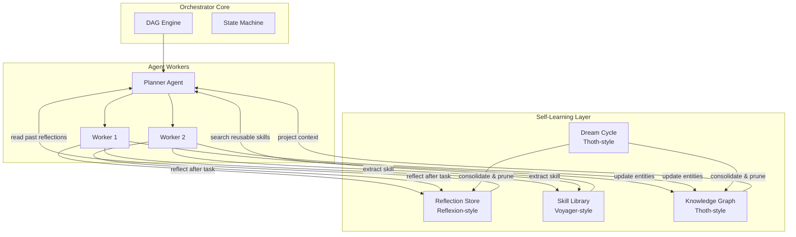

# Deep Research: Thoth & Agent Self-Learning

> **Date**: 2026-05-07  
> **Type**: Research only — Không implement  
> **Relevance**: Cả 2 topic đều liên quan trực tiếp đến Phase 2 agent-orchestrator

---

## 📑 Mục lục

- [Part 1: Thoth — Personal AI Sovereignty](#part-1-thoth--personal-ai-sovereignty)
- [Part 2: SEAL & Agent Self-Learning](#part-2-seal--agent-self-learning)
- [Tổng hợp: Ứng dụng cho Agent Orchestrator](#tổng-hợp-ứng-dụng-cho-agent-orchestrator)

---

# Part 1: Thoth — Personal AI Sovereignty

## 1.1 Thoth là gì?

**Thoth** (`siddsachar/Thoth` trên GitHub) là một **local-first AI assistant** open-source, được thiết kế xoay quanh triết lý "Personal AI Sovereignty" — tức mọi intelligence, memory, và workflow automation đều thuộc quyền sở hữu của user, chạy trên máy user, không phụ thuộc cloud.

> [!IMPORTANT]
> **Triết lý core**: "Accumulated intelligence stays with the user" — Agent tích luỹ kiến thức càng dùng càng giỏi, và tất cả đều ở local. Không telemetry, không account, không cloud lock-in.

## 1.2 Kiến trúc kỹ thuật

```
┌──────────────────────────────────────────────────┐
│                 THOTH ARCHITECTURE                │
├──────────────────────────────────────────────────┤
│                                                  │
│  ┌─────────────────────────────────────────┐     │
│  │         Context Assembly Layer          │     │
│  │  Tools | Skills | Preferences | Rules   │     │
│  └─────────────┬───────────────────────────┘     │
│                │                                 │
│  ┌─────────────▼───────────────────────────┐     │
│  │     LangGraph ReAct Agent Engine        │     │
│  │  Observe → Reason → Act → Reflect       │     │
│  └─────────────┬───────────────────────────┘     │
│                │                                 │
│  ┌─────────────▼───────────────────────────┐     │
│  │     Persistent Knowledge Graph          │     │
│  │  Entities ←→ Typed Relationships        │     │
│  │  Export: Obsidian vault compatible       │     │
│  └─────────────┬───────────────────────────┘     │
│                │                                 │
│  ┌─────────────▼───────────────────────────┐     │
│  │         "Dream Cycle"                   │     │
│  │  Background: refine stale data,         │     │
│  │  resolve conflicts, consolidate memory  │     │
│  └─────────────────────────────────────────┘     │
│                                                  │
│  ┌─────────────────────────────────────────┐     │
│  │     LLM Backend (Swappable)             │     │
│  │  Local: Ollama (default)                │     │
│  │  Cloud: OpenAI, Anthropic, Google (opt) │     │
│  └─────────────────────────────────────────┘     │
│                                                  │
└──────────────────────────────────────────────────┘
```

### Các module chính

| Module | Mô tả | Số lượng tools |
|---|---|---|
| **Knowledge Graph** | Entity + relationship graph, exportable, searchable | Core |
| **Dream Cycle** | Background process tự dọn dẹp và consolidate memory | Auto |
| **Designer Studio** | Sandboxed runtime cho tạo UI mockups, documents, landing pages | Media |
| **Automation** | Browser automation, shell execution, scheduled tasks | 30+ tools |
| **Communication** | Telegram, WhatsApp, Discord, Slack, SMS integration | Messaging |
| **Perception** | Voice I/O (local Kokoro TTS), vision capabilities | Input/Output |

## 1.3 So sánh Thoth vs Agent Orchestrator (của bạn)

| Tiêu chí | **Thoth** | **Agent Orchestrator (bạn)** |
|---|---|---|
| **Layer** | End-user application | Infrastructure / Plumbing |
| **Target user** | Cá nhân / Power users | Developers / Systems |
| **Triết lý** | Personal AI Sovereignty (local-first) | Zero-Knowledge Engine (stateless) |
| **Intelligence** | Built-in (LangGraph + Knowledge Graph) | Delegated to agents (LLM workers) |
| **Memory** | Knowledge Graph (entities + relationships) | File-based (inbox/active/outbox) |
| **Background learning** | ✅ Dream Cycle (auto-refine) | ❌ Không có |
| **Multi-agent** | ❌ Single agent architecture | ✅ Multi-agent DAG orchestration |
| **Extensibility** | Plugin system, opt-in cloud models | MCP server, pluggable workers |
| **Scope** | Vertical: 1 user's entire digital life | Horizontal: orchestrate any project |
| **LLM Backend** | Ollama local + opt-in cloud | Agnostic (bất kỳ) |

### Phân tích

> [!TIP]
> **Thoth và Agent Orchestrator không phải đối thủ — chúng ở 2 layer khác nhau.**
> 
> - **Thoth** = End-user agent (agent LÀM việc)
> - **Agent Orchestrator** = Infrastructure (ĐIỀU PHỐI agents)
> 
> Một Thoth instance hoàn toàn có thể là **1 worker** trong hệ thống orchestrator của bạn.

### Những gì nên học từ Thoth

1. **Knowledge Graph**: Thay vì file-based IPC thuần tuý, agent workers có thể xây dựng knowledge graph riêng cho mỗi project → context ngày càng giàu
2. **Dream Cycle**: Background process tự động consolidate kiến thức — rất hay cho long-running orchestration
3. **Context Assembly Layer**: Cách Thoth tổ chức Tools + Skills + Preferences + Rules thành 1 layer — giống cách bạn đang dùng `.agent/knowledge/` nhưng sophisticated hơn
4. **Hybrid model access**: Mặc định local, opt-in cloud khi cần — thực tế và tiết kiệm

---

# Part 2: SEAL & Agent Self-Learning

## 2.1 SEAL Framework (MIT CSAIL)

**SEAL** = **Self-Adapting Large Language Models**  
Paper: Zweiger et al., arXiv:2506.10943 (June 2025)

### Vấn đề SEAL giải quyết

LLM sau khi train xong = **static**. Muốn nó học thêm thì phải:
- Fine-tune (tốn tiền, tốn data)
- In-context learning (tạm thời, mất khi hết session)
- RAG (tra cứu, không thật sự "học")

SEAL cho phép LLM **tự sửa chính nó** — autonomously update weights mà không cần human intervention.

### Kiến trúc Two-Loop

```
┌─────────────────────────────────────────────────────┐
│                    SEAL FRAMEWORK                    │
│                                                     │
│  ┌───────────────────────────────────────────────┐  │
│  │              OUTER LOOP (RL)                  │  │
│  │                                               │  │
│  │  ┌─────────┐    ┌──────────────────────────┐  │  │
│  │  │ Reward  │◄───│  Evaluate on Target Task │  │  │
│  │  │ Signal  │    │  (accuracy, quality)     │  │  │
│  │  └────┬────┘    └──────────────▲───────────┘  │  │
│  │       │                        │              │  │
│  │       ▼                        │              │  │
│  │  ┌─────────────────────────────┤              │  │
│  │  │  Optimize Self-Edit Policy  │              │  │
│  │  │  (learn to generate better  │              │  │
│  │  │   self-edits over time)     │              │  │
│  │  └─────────┬───────────────────┘              │  │
│  │            │                                  │  │
│  └────────────┼──────────────────────────────────┘  │
│               │                                     │
│  ┌────────────▼──────────────────────────────────┐  │
│  │            INNER LOOP (SFT)                   │  │
│  │                                               │  │
│  │  ┌──────────────┐    ┌─────────────────────┐  │  │
│  │  │ LLM generates│    │  Apply Self-Edit     │  │  │
│  │  │ "Self-Edit"  │───▶│  via LoRA update     │  │  │
│  │  │ (natural     │    │  (lightweight weight  │  │  │
│  │  │  language     │    │   modification)      │  │  │
│  │  │  directives)  │    │                     │  │  │
│  │  └──────────────┘    └─────────────────────┘  │  │
│  │                                               │  │
│  └───────────────────────────────────────────────┘  │
│                                                     │
└─────────────────────────────────────────────────────┘
```

### Cách hoạt động step-by-step

1. **LLM gặp task mới** → sinh ra "self-edit" (tự viết instruction cho chính mình)
2. **Self-edit** có thể là: synthetic training data, paraphrased knowledge, hoặc hyperparameter config
3. **Inner Loop**: Apply self-edit qua LoRA (sửa 1 phần nhỏ weights, không retrain toàn bộ)
4. **Đánh giá**: Kiểm tra performance trên target task sau khi update
5. **Outer Loop (RL)**: Nếu performance tốt → reward → model học cách generate self-edit tốt hơn
6. **Lặp lại**: Qua nhiều iteration, model ngày càng giỏi tự improve

### Challenges

| Thách thức | Mô tả | Status |
|---|---|---|
| **Catastrophic Forgetting** | Khi learn cái mới, quên cái cũ | ⚠️ Active research |
| **Compute Cost** | Cần evaluate model sau mỗi self-edit | ⚠️ Expensive |
| **Safety** | Model tự sửa có thể dẫn đến drift không kiểm soát | ⚠️ Cần guardrails |
| **Scaling** | Từ single-model → multi-agent shared learning | 🔬 Early research |

## 2.2 Các biến thể Self-Learning Agent

SEAL không đứng một mình. Có cả một ecosystem research xoay quanh "agent tự học":

### Bản đồ Self-Learning Agent Landscape

```
                    Agent Self-Learning
                         │
            ┌────────────┼────────────┐
            │            │            │
     Weight-Level    Prompt-Level   Architecture-Level
     (sửa model)    (sửa prompt)   (sửa chính mình)
            │            │            │
         ┌──┘         ┌──┘         ┌──┘
         │            │            │
       SEAL        Reflexion      ADAS
    (MIT 2025)   (Shinn 2023)  (Clune 2024)
         │            │            │
     Self-Edit    Self-Reflect  Meta Agent
     via LoRA     via Verbal RL   Search
         │            │            │
    ┌────┘       ┌────┘       ┌────┘
    │            │            │
  Voyager    ExpeL       Darwin Gödel
 (NVIDIA     (2023)      Machine (Meta)
  2023)                       │
    │                    Hyperagent
  Skill                  (DGM-H)
  Library
```

### 2.2.1 Reflexion (Shinn et al., 2023) — Verbal Reinforcement Learning

**Ý tưởng**: Thay vì update weights (tốn kém), agent **tự phản ánh bằng ngôn ngữ** về lỗi của mình rồi lưu lại để cải thiện.

```
Task → Attempt → Fail → Self-Reflect (text) → Store reflection 
  → Next attempt uses stored reflections → Better performance
```

| Đặc điểm | Chi tiết |
|---|---|
| **Input** | Task + environment feedback + execution trace |
| **Output** | Self-reflection text (lưu vào memory) |
| **Update method** | KHÔNG sửa weights — chỉ sửa memory/prompt |
| **Ưu điểm** | Nhẹ, nhanh, không cần fine-tune |
| **Nhược điểm** | Bị giới hạn bởi context window, không "thật sự" học |

> [!NOTE]
> **Relevance cho bạn**: Reflexion là cách tiếp cận **pragmatic nhất** cho Phase 2. Workers có thể tự-reflect sau mỗi task, lưu reflections lại, và improve qua thời gian — KHÔNG cần fine-tune model.

### 2.2.2 Voyager (NVIDIA, 2023) — Skill Library

**Ý tưởng**: Agent tự khám phá, viết code giải quyết task, rồi **lưu code thành skill** trong thư viện. Lần sau gặp task tương tự → retrieve skill đã có.

```
Explore → Generate code → Execute → Success?
  ├── Yes → Store as skill in library
  └── No → Self-debug → Retry
```

| Component | Mô tả |
|---|---|
| **Automatic Curriculum** | Tự generate task sequence phù hợp level hiện tại |
| **Skill Library** | Vector database lưu executable code programs |
| **Iterative Prompting** | Tự debug code dựa trên execution feedback |

> [!NOTE]
> **Relevance cho bạn**: Concept "Skill Library" rất match với `.agent/skills/` trong project của bạn. Workers có thể tự tạo skills mới dựa trên kinh nghiệm → lưu vào skill library → workers khác reuse.

### 2.2.3 ADAS — Automated Design of Agentic Systems (Clune, ICLR 2025)

**Ý tưởng**: Thay vì con người design agent, dùng **meta-agent** để tự động search và code ra agent designs tốt hơn.

```
Meta Agent → Generate agent code → Evaluate performance 
  → Archive best designs → Generate improved agents → Loop
```

| Đặc điểm | Chi tiết |
|---|---|
| **Meta Agent Search** | Algorithm tự tìm kiếm space of code để discover agent designs |
| **Code as medium** | Agent mới được "viết" bằng code Python |
| **Transfer** | Agent được discover có thể transfer sang tasks/models khác |
| **Ưu điểm** | Discover designs mà human chưa nghĩ tới |
| **Nhược điểm** | Compute intensive, khó kiểm soát |

### 2.2.4 Darwin Gödel Machine & Hyperagent (Meta, 2025)

**Ý tưởng**: Agent không chỉ tự improve performance, mà còn **tự sửa cách nó improve** (metacognitive self-modification).

```
┌─────────────────────────────────────────┐
│           Hyperagent (DGM-H)            │
│                                         │
│  ┌───────────┐    ┌──────────────────┐  │
│  │ Task      │    │ Meta Agent       │  │
│  │ Agent     │◄──▶│ (improves how    │  │
│  │ (does     │    │  to improve)     │  │
│  │  work)    │    │                  │  │
│  └───────────┘    └──────────────────┘  │
│                                         │
│  BOTH are part of single editable       │
│  program — meta can modify itself too   │
└─────────────────────────────────────────┘
```

> [!WARNING]
> Đây là frontier research — rất interesting nhưng chưa production-ready. Ý tưởng "meta-agent tự sửa cách nó improve" có rủi ro safety lớn.

## 2.3 So sánh toàn bộ Self-Learning Approaches

| Approach | Level | Cần Fine-tune? | Persistence | Compute Cost | Practical cho Phase 2? |
|---|---|---|---|---|---|
| **SEAL** | Weight | ✅ (LoRA) | Permanent (weights) | 🔴 High | ❌ Quá nặng |
| **Reflexion** | Prompt/Memory | ❌ | Session/File | 🟢 Low | ✅ **Rất phù hợp** |
| **Voyager** | Skill/Code | ❌ | Library (files) | 🟢 Low | ✅ **Rất phù hợp** |
| **ADAS** | Architecture | ❌ | Code archive | 🟡 Medium | ⚠️ Research only |
| **DGM/Hyperagent** | Meta-cognitive | ❌ | Self-modifying | 🔴 High | ❌ Frontier research |

---

# Tổng hợp: Ứng dụng cho Agent Orchestrator

## Practical Roadmap cho Phase 2

Dựa trên toàn bộ research, đây là những gì **thực sự áp dụng được** cho agent-orchestrator Phase 2:

### Tier 1: Áp dụng ngay (Low effort, High value)

```
┌──────────────────────────────────────────────────────┐
│  1. REFLEXION-STYLE SELF-REFLECTION                  │
│                                                      │
│  Worker hoàn thành task → Tự reflect:                │
│  - "Tôi đã làm gì tốt?"                            │
│  - "Tôi gặp vấn đề gì?"                            │
│  - "Lần sau nên làm khác thế nào?"                  │
│                                                      │
│  Lưu reflection → .agent/reflections/                │
│  Planner đọc reflections khi assign task tương tự    │
│                                                      │
│  Implementation: Chỉ cần thêm 1 step vào worker     │
│  workflow + 1 folder convention                      │
└──────────────────────────────────────────────────────┘

┌──────────────────────────────────────────────────────┐
│  2. VOYAGER-STYLE SKILL LIBRARY                      │
│                                                      │
│  Worker giải xong task → Extract reusable pattern:   │
│  - Code snippets đã work                            │
│  - Config patterns                                   │
│  - Solution approaches                               │
│                                                      │
│  Lưu thành skill → .agent/skills/<new-skill>/        │
│  Workers sau tự search + reuse skills                │
│                                                      │
│  Implementation: Bạn ĐÃ CÓ .agent/skills/ folder!  │
│  Chỉ cần cho workers quyền TẠO skills mới          │
└──────────────────────────────────────────────────────┘
```

### Tier 2: Áp dụng Phase 2+ (Medium effort, High value)

```
┌──────────────────────────────────────────────────────┐
│  3. THOTH-STYLE KNOWLEDGE GRAPH                      │
│                                                      │
│  Thay vì flat .agent/knowledge/ files:               │
│  → Structured knowledge graph per project            │
│                                                      │
│  Entities: Files, Functions, APIs, Configs           │
│  Relationships: depends_on, imports, calls           │
│                                                      │
│  Benefit: Workers ngày càng hiểu project sâu hơn    │
│  Implementation: JSON/SQLite graph + query interface │
└──────────────────────────────────────────────────────┘

┌──────────────────────────────────────────────────────┐
│  4. THOTH-STYLE DREAM CYCLE                          │
│                                                      │
│  Background process chạy khi orchestrator idle:      │
│  - Consolidate reflections → patterns                │
│  - Prune stale knowledge                            │
│  - Resolve conflicting knowledge entries             │
│  - Generate summary reports                          │
│                                                      │
│  Implementation: Scheduled task trong orchestrator   │
└──────────────────────────────────────────────────────┘
```

### Tier 3: Future research (High effort, experimental)

```
┌──────────────────────────────────────────────────────┐
│  5. ADAS-STYLE META-AGENT SEARCH                     │
│                                                      │
│  Orchestrator tự tìm workflow patterns tốt nhất:     │
│  - Thử nhiều cách decompose tasks                   │
│  - Đánh giá kết quả                                 │
│  - Tự tối ưu DAG structure                          │
│                                                      │
│  Status: Research only, chưa practical              │
└──────────────────────────────────────────────────────┘

┌──────────────────────────────────────────────────────┐
│  6. SEAL-STYLE WEIGHT ADAPTATION                     │
│                                                      │
│  Nếu dùng local model (Ollama):                     │
│  - Collect successful task completions               │
│  - Fine-tune local model via LoRA                   │
│  - Model ngày càng giỏi project-specific tasks      │
│                                                      │
│  Status: Possible nhưng cần significant infra       │
└──────────────────────────────────────────────────────┘
```

## Kiến trúc "Self-Learning Orchestrator" — Vision



## Key Insights

> [!IMPORTANT]
> ### 3 điều quan trọng nhất từ research này:
> 
> 1. **Reflexion + Skill Library = Low-hanging fruit** cho Phase 2. Không cần fine-tune, không cần infra mới, chỉ cần conventions và workflow steps.
> 
> 2. **Thoth's Knowledge Graph + Dream Cycle** là hướng đi tốt cho "accumulated intelligence". Project của bạn đã có `.agent/knowledge/` — chỉ cần upgrade từ flat files → structured graph.
> 
> 3. **SEAL (weight-level) quá nặng cho Phase 2**, nhưng concept "self-edit" có thể adapt ở prompt-level: agent tự viết "ghi chú cho bản thân" để improve mà KHÔNG cần sửa model weights.
