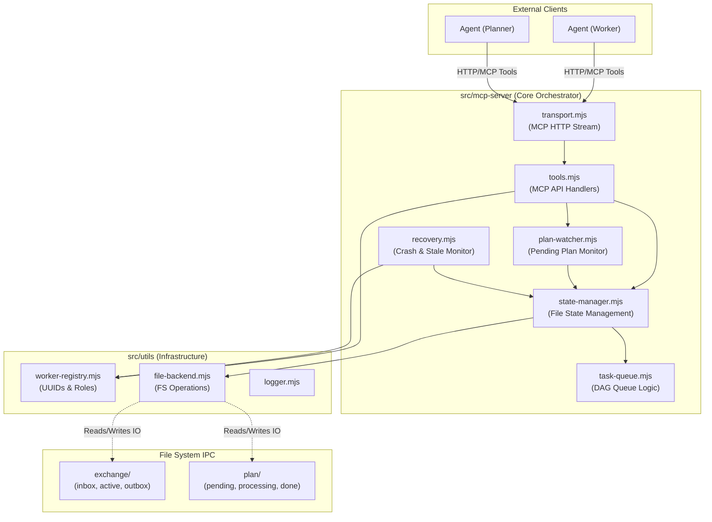
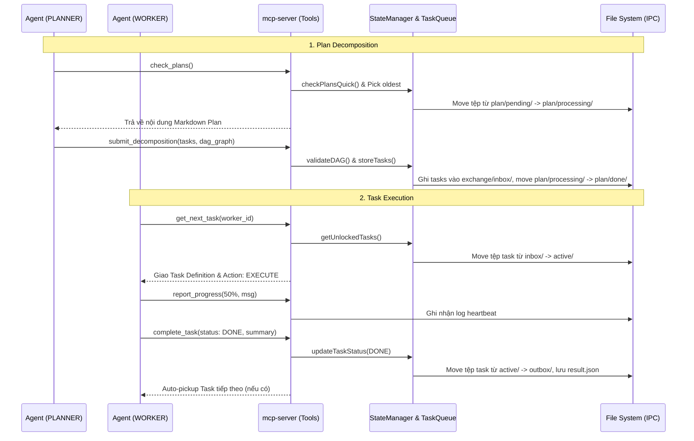

# Agent Orchestrator - Technical Architecture Document

**Project Name:** agent-orchestrator  
**Version:** 0.1.0  
**Date Create:** 2026-04-07  
**Date Release:** 2026-04-07  

---

## 1. System Architecture (Kiến trúc hệ thống)

Hệ thống điều phối (Orchestrator) hoạt động dựa trên cơ chế IPC qua tệp tin (File-based IPC) kết hợp với Model Context Protocol (MCP). Dưới đây là kiến trúc phân tầng cốt lõi:



---

## 2. Layer Responsibilities (Trách nhiệm phân tầng)

| Phân vùng (Layer) | Trách nhiệm cốt lõi (Responsibility) | Dependencies |
|----------------|-------------------------------------|:---:|
| **mcp-server** | Điểm truy cập MCP (Tools, Transport). Giám sát tiến trình, quản lý DAG Queue, phục hồi hệ thống (Recovery). | `utils`, `fs`, `zod` |
| **utils** | Cung cấp backend thao tác File System thuần túy, đăng ký đối tượng Worker, Logger và khởi động hệ thống. | `fs`, `path` |
| **exchange/** | Cấu trúc dữ liệu trung gian cho các Task (IPC Storage / DB thay thế). | Tệp .json tĩnh |
| **plan/** | Lưu trữ Kế hoạch đầu vào dạng Markdown phục vụ tiến trình Decompose. | Tệp .md tĩnh |

> **Quy tắc (Rule):** Các module trong phân vùng `utils` hoàn toàn độc lập, không import bất kỳ module logic nào từ `mcp-server` để tránh phụ thuộc chéo (Circular dependency).

---

## 3. Data Flow & Task Sequence (Luồng dữ liệu)

Quá trình vòng đời thực thi từ lúc Khởi tạo Kế hoạch đến khi Worker trả kết quả:



---

## 4. MCP Tools - Phương thức giao tiếp (API)

Hệ thống cung cấp hệ sinh thái API thông qua giao thức Model Context Protocol để Worker (cấp độ Agent) tương tác:

- **`register_worker`**: Thiết lập phiên làm việc, định danh Worker ID và xác định vai trò dự kiến.
- **`get_status` & `get_queue_status`**: API thống kê số lượng Task và phản hồi trạng thái toàn hệ thống hiện tại.
- **`get_next_task`**: Được Worker gọi (cơ chế Long Poll) nhằm nhận diện và điều hướng Task khả dụng tiếp theo từ `inbox/`.
- **`complete_task`**: Xác nhận kết quả xử lý (`DONE` / `FAILED`). Điều phối di chuyển Task từ `active/` sang `outbox/`. Hỗ trợ luồng thao tác tự động tiếp nhận công việc kế tiếp (Auto-pickup).
- **`report_progress`**: Ghi nhận tỷ lệ hoàn thành (%) và tóm tắt tiến trình. Đóng vai trò tín hiệu duy trì kết nối (Heartbeat ping) cho Worker.
- **`check_plans`**: Được triệu gọi riêng bởi `PLANNER` nhằm nhận diện tín hiệu và khóa tệp tin hợp lệ từ `plan/pending/` để chuẩn bị phân rã.
- **`submit_decomposition`**: API cốt lõi dùng để cấu trúc hóa dữ liệu đầu ra sau giai đoạn phân tích (bao gồm Task Definitions và DAG Arrays). Chuyển Kế hoạch gốc sang vùng lưu trữ `done/`.
- **`request_retry` & `force_release_task`**: Khối API quản trị ngoại lệ, hỗ trợ khôi phục tiến trình khi xảy ra lỗi cục bộ hoặc xử lý tắc nghẽn hệ thống (Deadlocks).

---

## 5. Module Detail (Chi tiết Tệp tin & Cấu trúc)

### `src/mcp-server/` (Core Orchestration Logic)

Chịu trách nhiệm quản trị vòng đời ứng dụng và giao thức kết nối:

```text
src/mcp-server/
├── index.mjs           ← Khởi tạo hệ thống, setup middleware Express & Recovery.
├── transport.mjs       ← Xử lý luồng Model Context Protocol Streamable HTTP.
├── tools.mjs           ← Định nghĩa toàn bộ schema (Zod) và handler cho MCP API Tools.
├── state-manager.mjs   ← Engine điều phối State. Xử lý logic move/copy IPC Filesystem.
├── task-queue.mjs      ← Memory Map Queue - Chứa hàm `validateDAG` & `getUnlockedTasks`.
├── plan-watcher.mjs    ← Background process (30s) poll `plan/pending/` kích hoạt Planner.
├── recovery.mjs        ← Quản lý Crash Recovery, Stale Worker & Orphan Tasks.
├── poll-helpers.mjs    ← Tiện ích Long Polling cho Task và Plan (idle check).
└── idle-resolver.mjs   ← Đánh giá vai trò khi rảnh rỗi (Promotion to PLANNER vs WORKER).
```

### `src/utils/` (Infrastructure & IO)

Các hàm rải rác phục vụ thao tác I/O và Logger hoàn toàn vô danh (stateless helpers):

```text
src/utils/
├── file-backend.mjs    ← fs wrapper (readJSON, writeJSON, moveFile, listFiles).
├── worker-registry.mjs ← Quản trị in-memory Registry cho Worker (Heartbeat, Roles).
├── logger.mjs          ← Appends JSON log vào `exchange/logs/`.
├── bootstrap.mjs       ← Tạo cấu trúc thư mục tự động trước khi boot hệ thống.
└── startup-prompt.mjs  ← Tiện ích nhập liệu CLI khi chạy độc lập.
```

### Dữ liệu luân chuyển File IPC (`exchange/` & `plan/`)

Chuẩn thay thế Database nội tại:

```text
exchange/               
├── inbox/              ← Các task sinh ra từ decomposition (Chờ pick).
├── active/             ← Scheduler đã assign UUID, task do Worker khóa và chạy.
├── outbox/             ← Task hoàn thành dạng `result-{id}.json`.
└── checkpoints/        ← Tự động serialize TaskQueue snapshot theo thời gian (Crash Recovery).

plan/
├── pending/            ← Nơi drop tệp markdown đầu vào.
├── processing/         ← Tệp bị Planner khóa làm vật liệu phân tích.
└── done/               ← Tệp kết thúc chu kỳ phân tích.
```

---

## 6. Resilience Highlights (Tổng kết tính năng chịu lỗi)

1. **Khôi phục lỗi (Crash Recovery):** Máy chủ duy trì `checkpoints` và `ShutdownMarker`. Bất cứ khi nào hệ thống tái khởi động ngoài ý muốn (Unclean ShutdownMarker), module `RecoveryManager` quét toàn bộ `active/`, nhận diện Task không chính chủ (Orphans) và điều hướng về mốc xuất phát (`inbox/`).
2. **Loại trừ Agent rác (Stale Worker Eviction):** Máy quét vòng lặp nền nhận diện Worker rớt kết nối hoặc kẹt tiến trình vĩnh viễn (Timeouts). Thu hồi Task và tái xử lý tự động đính kèm thông số đếm Retries nhằm ngăn kẹt băng thông.
3. **Giám sát trực quan hệ phân tán (Visual State Observer):** Lợi thế của cấu trúc IPC bằng File là mô hình dữ liệu có độ minh bạch tối đa. Nhận diện lỗi hệ thống chỉ cần thao tác kiểm tra cấu trúc lưu trữ nội tại (File Explorer) mà không đòi hỏi thao tác SQL truy vấn hoặc phần mềm quản lý Database bên thứ 3.
