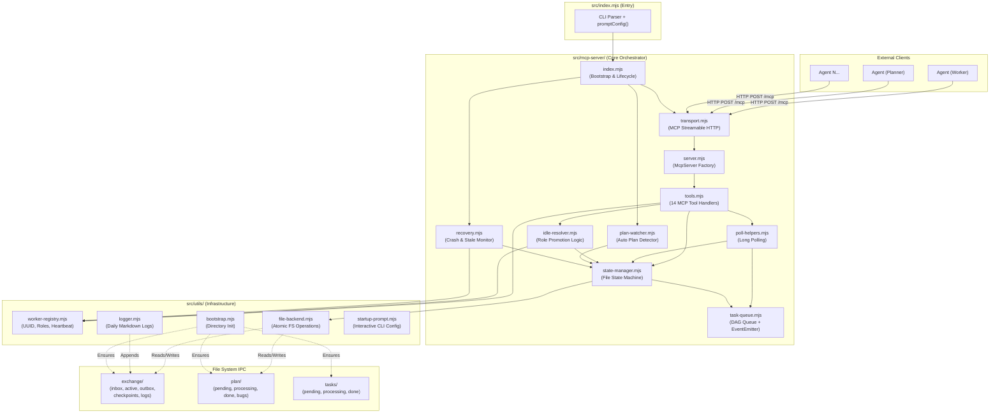
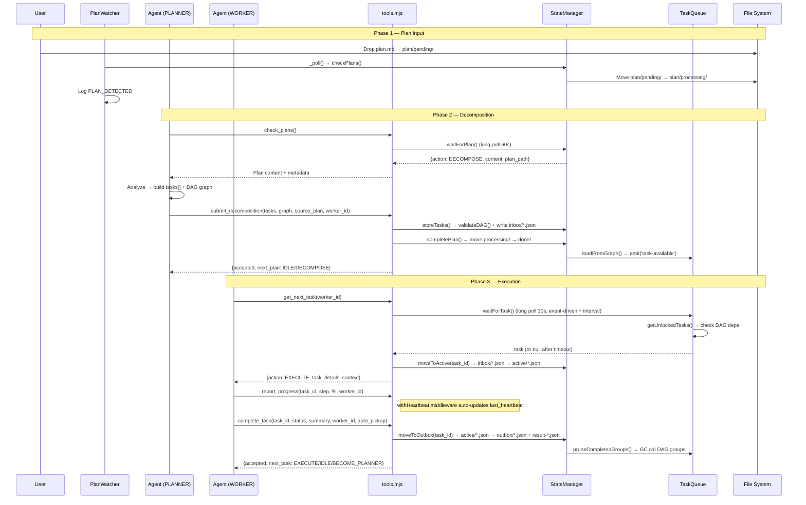

# Agent Orchestrator — Technical Architecture Document

**Project Name:** agent-orchestrator  
**Version:** 0.2.0  
**Date Created:** 2026-04-07  
**Last Updated:** 2026-04-13  
**Status:** Beta  

---

## 1. System Overview

Agent Orchestrator là một **standalone Auto-Tasking Engine** dùng để điều phối nhiều AI Agent song song. Hệ thống hoạt động trên nền tảng:

- **File-based IPC** (Inter-Process Communication) — thay thế database truyền thống bằng hệ thống file JSON/Markdown.
- **Model Context Protocol (MCP)** — giao thức chuẩn kết nối AI Agent với external tools qua Streamable HTTP.
- **DAG-based Task Queue** — quản lý phụ thuộc giữa các task bằng Directed Acyclic Graph.

### Key Capabilities

| Capability | Description |
|-----------|-------------|
| Auto-Tasking | Plan → DAG decomposition → parallel task execution |
| Multi-Session | Multiple AI Agents coordinate via single server |
| Dynamic Role Switching | Agent tự chuyển vai trò (Planner ↔ Worker ↔ Idle) |
| Crash Recovery | Auto-detect orphans, requeue, checkpoint restoration |
| Long Polling | Event-driven + interval polling hybrid |
| Stale Worker Detection | Auto-requeue tasks from unresponsive workers |
| Disk-based Retry Tracking | Retry count persisted in task files, survives restarts |

---

## 2. Architecture Diagram



---

## 3. Layer Responsibilities

| Layer | Responsibility | Key Modules | Dependencies |
|-------|---------------|-------------|:---:|
| **Entry** | CLI parsing, interactive config prompt, server bootstrap | `index.mjs`, `startup-prompt.mjs` | `mcp-server`, `utils` |
| **Transport** | MCP Streamable HTTP session management, per-session McpServer instances | `transport.mjs`, `server.mjs` | `@modelcontextprotocol/sdk` |
| **Tools** | 14 MCP tool definitions with Zod validation, auto-heartbeat middleware | `tools.mjs` | `state-manager`, `worker-registry`, `poll-helpers`, `idle-resolver` |
| **State Machine** | File-based task state transitions (inbox→active→outbox), plan lifecycle, checkpointing | `state-manager.mjs` | `task-queue`, `file-backend` |
| **Task Queue** | In-memory DAG tracking, dependency resolution, EventEmitter for real-time notifications | `task-queue.mjs` | `constants` |
| **Recovery** | Crash recovery, orphan detection, stale worker eviction, shutdown markers | `recovery.mjs` | `state-manager`, `worker-registry` |
| **Plan Watcher** | Auto-polling `plan/pending/` directory on configurable interval | `plan-watcher.mjs` | `state-manager` |
| **Polling** | Long-poll helpers with hybrid event+interval strategy | `poll-helpers.mjs` | `task-queue`, `state-manager` |
| **Idle Resolver** | Decides worker promotion (IDLE→PLANNER) when no tasks available | `idle-resolver.mjs` | `state-manager`, `worker-registry` |
| **Utils** | Stateless helpers: atomic file I/O, worker registry, logger, bootstrap | `file-backend.mjs`, `worker-registry.mjs`, `logger.mjs`, `bootstrap.mjs` | `fs`, `path`, `crypto` |
| **File IPC** | JSON/Markdown files as persistent state store | `exchange/`, `plan/`, `tasks/` | filesystem |

> **Rule:** Modules trong `utils/` KHÔNG import bất kỳ module nào từ `mcp-server/` — tránh circular dependency.

---

## 4. Data Flow & Task Lifecycle

### 4.1 Full Lifecycle Sequence



### 4.2 Auto-Pickup Flow

Khi `complete_task(auto_pickup: true)`:

```
Worker completes task-01
    ↓ moveToOutbox()
    ↓ queue.getNextTask()
    ├── Has task-02 → moveToActive() → return {action: EXECUTE, task: task-02}
    └── No tasks → resolveIdleAction()
        ├── Has pending plans + no active planner → {action: BECOME_PLANNER}
        └── Nothing → {action: IDLE}
```

### 4.3 Disconnected Worker Reconnection

```
Worker goes stale (>90s no heartbeat)
    ↓ RecoveryManager.checkStaleWorkers()
    ↓ markDisconnected(worker_id)
    ↓ requeueWithRetry(task_id) → inbox/

Later, worker comes back with complete_task():
    ↓ Detect worker.status === DISCONNECTED
    ↓ isTaskInActive(task_id)?
    ├── YES → Accept result, re-activate worker
    └── NO → Discard late result (task already requeued/completed)
```

---

## 5. Module Reference

### 5.1 `src/mcp-server/` — Core Orchestration

```
src/mcp-server/
├── index.mjs           ← Server lifecycle: bootstrap, Express app, middleware,
│                          recovery, planWatcher, graceful shutdown (SIGINT/SIGTERM)
├── transport.mjs       ← MCP Streamable HTTP session management.
│                          Per-session McpServer via StreamableHTTPServerTransport.
│                          Handles GET/POST/DELETE /mcp routes.
├── server.mjs          ← McpServer factory. Creates MCP server instance + registers tools.
├── tools.mjs           ← 14 MCP tool definitions. Zod schema validation.
│                          withHeartbeat() middleware for auto-keepalive.
│                          compactTask() strips internal fields from responses.
├── state-manager.mjs   ← File-based state machine engine:
│                          - Plan lifecycle: pending/ → processing/ → done/
│                          - Task lifecycle: inbox/ → active/ → outbox/
│                          - Checkpointing with rotation (keep last 10)
│                          - Disk-based retry tracking (requeueWithRetry)
│                          - State restoration from files (restoreFromFiles)
├── task-queue.mjs      ← In-memory DAG queue (extends EventEmitter):
│                          - validateDAG(): cycle detection via DFS
│                          - getUnlockedTasks(): resolve dependencies
│                          - pruneCompletedGroups(): GC terminated groups
│                          - emit('task-available') for real-time notification
├── recovery.mjs        ← RecoveryManager class:
│                          - Shutdown marker (.shutdown_clean) write/check/clear
│                          - Orphan detection: scan active/ vs worker assignments
│                          - Stale worker eviction (configurable threshold)
│                          - Failed task safety net (_requeueFailedFromOutbox)
│                          - Race condition guards (isTaskInActive check)
│                          - Startup/Shutdown lifecycle methods
├── plan-watcher.mjs    ← PlanWatcher class:
│                          - Auto-polls plan/pending/ every N seconds
│                          - Moves detected plans to processing/
│                          - Stats tracking for /health endpoint
│                          - unref() to not block Node.js exit
├── poll-helpers.mjs    ← Long polling utilities:
│                          - waitForTask(): hybrid event + interval polling
│                          - waitForPlan(): interval-based plan polling
│                          - Configurable timeout and check interval
└── idle-resolver.mjs   ← resolveIdleAction():
                           - Check pending plans + active planner
                           - Promote worker → PLANNER if needed
                           - Return IDLE if nothing to do
```

### 5.2 `src/utils/` — Infrastructure & I/O

```
src/utils/
├── file-backend.mjs    ← Atomic file operations:
│                          - ensureDir(): recursive mkdir
│                          - atomicWrite(): write .tmp → rename (crash-safe)
│                          - readJSON() / writeJSON(): JSON with atomic writes
│                          - readFile(): plain text read
│                          - moveFile(): rename with ensureDir
│                          - listFiles(): directory listing with extension filter
│                          - deleteFile(): safe unlink
├── worker-registry.mjs ← WorkerRegistry class (singleton export):
│                          - register(): generate w-<hex> UUID
│                          - updateHeartbeat(): auto re-activate disconnected workers
│                          - markDisconnected(): soft-delete (keeps entry for late results)
│                          - cleanupDisconnected(): hard cleanup on startup
│                          - getActivePlanner(): find alive planner within threshold
│                          - setRole(): update worker role (PLANNER/WORKER/IDLE)
│                          - Persists to exchange/workers.json
├── logger.mjs          ← Logger class:
│                          - Daily log files: exchange/logs/YYYY-MM-DD.md
│                          - Markdown format: ## HH:MM:SS — EVENT_TYPE
│                          - Key-value data entries
├── bootstrap.mjs       ← bootstrapDirectories():
│                          - Creates all required directories on startup
│                          - Reports: created[], failed[], skipped count
│                          - Idempotent: skips existing dirs
└── startup-prompt.mjs  ← promptConfig():
                           - Interactive CLI: default/custom mode
                           - Custom: port, stale threshold, poll timeout, plan watcher
                           - Returns runtime config overrides
```

### 5.3 `src/` — Root Modules

```
src/
├── index.mjs           ← CLI entry point:
│                          - Parse args (serve, --port)
│                          - Call promptConfig() → loadConfig(overrides) → startServer()
├── config.mjs          ← loadConfig(overrides):
│                          - Builds full config object with paths for exchange/, plan/, tasks/
│                          - Server, polling, recovery configs with defaults
│                          - Cross-platform path resolution (__dirname)
└── constants.mjs       ← All system constants:
                           - VERSION: '0.2.0'
                           - TOOL_NAMES: 14 tool name constants
                           - TASK_STATUS: pending/active/done/failed/blocked
                           - AGENT_ACTION: EXECUTE/IDLE/BECOME_PLANNER/DECOMPOSE/WAIT
                           - WORKER_ROLE: PLANNER/WORKER/IDLE
                           - WORKER_STATUS: idle/busy/offline/disconnected
                           - STATE_EVENTS, RECOVERY_EVENTS: logging event types
                           - RECOVERY_DEFAULTS: thresholds (90s stale, 3 retries)
                           - POLL_DEFAULTS: 30s task poll, 60s plan poll
                           - DIR_NAMES, FILE_PREFIXES, API_ROUTES, SHUTDOWN_SIGNALS
```

---

## 6. MCP Tools API (14 tools)

### 6.1 Common Tools (All Agents)

| Tool | Description | Input | Output |
|------|------------|-------|--------|
| `hello_world` | Health check | `name: string` | Greeting message |
| `register_worker` | Register agent, get UUID + role assignment | `workspace_path?: string` | `{worker_id, role, server_root, workspace_root, queue_summary, has_pending_plans}` |
| `get_status` | Server info | *(none)* | `{server, version, uptime, transport, connected_workers}` |
| `get_queue_status` | Queue counts | *(none)* | `{total, pending, active, done, failed, blocked, workers}` |
| `get_checkpoint` | Save & return checkpoint path | *(none)* | `{checkpoint_file_path}` |
| `get_template` | Get template file content by name | `template_name: string` | Template content (auto-resolves .md/.json extensions) |
| `ping` | Keep session alive (heartbeat) | `worker_id: string` | `{status: "alive"}` |

### 6.2 Worker Tools

| Tool | Description | Input | Output |
|------|------------|-------|--------|
| `get_next_task` | Long-poll for next task (30s timeout) | `worker_id: string` | `{action: EXECUTE, task_id, task_details, context}` or idle action |
| `complete_task` | Complete a task with status | `task_id, status (done/failed/blocked), summary, worker_id, auto_pickup?` | `{accepted, completed/requeued, next_task}` |
| `report_progress` | Report task progress | `task_id, step, percentage (0-100), worker_id` | `"ok"` |

### 6.3 Planner Tools

| Tool | Description | Input | Output |
|------|------------|-------|--------|
| `check_plans` | Long-poll for pending plans (60s timeout) | *(none)* | `{action: DECOMPOSE, plan_path, content, pending_count}` or IDLE |
| `submit_decomposition` | Submit tasks + DAG graph | `tasks[], graph, reasoning, source_plan, worker_id?` | `{accepted, plan_completed, tasks_created, next_plan}` |

### 6.4 Admin Tools

| Tool | Description | Input | Output |
|------|------------|-------|--------|
| `request_retry` | Requeue failed task (max 3 retries) | `task_id, reason, attempt` | `{approved, file_path, retry_count}` |
| `force_release_task` | Force-release stuck task from active/ | `task_id, reason` | `{released, task_id, moved_to, reason}` |

### 6.5 Auto-Heartbeat Middleware

Tools sử dụng `withHeartbeat()` wrapper tự động update `worker.last_heartbeat` khi có `worker_id` trong params. Áp dụng cho: `get_next_task`, `complete_task`, `report_progress`, `submit_decomposition`, `request_retry`, `ping`.

→ Agent không cần gọi `report_progress` chỉ để keepalive.

---

## 7. File System IPC Layout

### 7.1 Exchange Directory (Runtime State)

```
exchange/
├── inbox/              ← Task files chờ Worker pick (task-{id}.json)
│                          Status: PENDING
├── active/             ← Task files đang được Worker xử lý
│                          Status: ACTIVE. Locked by worker_id.
├── outbox/             ← Task files đã hoàn thành + result files
│                          task-{id}.json (status: DONE/FAILED)
│                          result-{id}.json (completion details)
├── checkpoints/        ← Auto-saved TaskQueue snapshots
│                          checkpoint-{ISO-timestamp}.json
│                          Rotation: keep last 10 files
├── logs/               ← Daily Markdown logs
│                          YYYY-MM-DD.md (## HH:MM:SS — EVENT entries)
├── _queue.json         ← DAG graph metadata (groups + dependencies)
├── workers.json        ← Worker registry persistence
└── .shutdown_clean     ← Clean shutdown marker (timestamp)
```

### 7.2 Plan Directory (Plan Lifecycle)

```
plan/
├── pending/            ← User drops .md files here (FIFO by filename)
├── processing/         ← Exactly 1 plan at a time (locked by Planner)
├── done/               ← Completed plans (archive)
└── bugs/               ← Bug report files
```

### 7.3 Tasks Directory (Dev Task Board — NOT runtime!)

```
tasks/
├── pending/            ← Dev tasks waiting to be picked
├── processing/         ← Dev tasks in progress
└── done/               ← Completed dev tasks
```

> **Note:** `tasks/` là dev-only task board cho quy trình nội bộ, KHÔNG liên quan đến exchange/ runtime queue.

### 7.4 Task File Format

```json
{
  "id": "plan-name-01-task-name",
  "module": "src/components",
  "action": "Implement feature X",
  "verification": "npm test -- --grep X",
  "status": "pending",
  "retry_count": 0
}
```

> Task ID được auto-prefixed với plan filename khi `submit_decomposition`: `source_plan.replace('.md','') + '-' + task.id`

### 7.5 Result File Format

```json
{
  "task_id": "plan-name-01-task-name",
  "status": "done",
  "summary": "Implemented feature X with tests",
  "worker_id": "w-2458e9ef",
  "completed_at": "2026-04-05T17:00:42.201Z"
}
```

---

## 8. Configuration System

### 8.1 Config Flow

```
CLI args (--port 4000)
    ↓ overrides
promptConfig() → interactive prompt
    ↓ promptOverrides
loadConfig({ ...promptOverrides, ...cliOverrides })
    ↓ final config object
startServer(config)
```

### 8.2 Config Parameters

| Parameter | Default | Source | Description |
|-----------|---------|-------|-------------|
| `server.port` | `3847` | CLI / prompt | Server listen port |
| `server.host` | `127.0.0.1` | hardcoded | Bind address |
| `polling.pollTimeoutMs` | `30,000` | prompt | Task long-poll timeout |
| `polling.checkIntervalMs` | `2,000` | hardcoded | Internal poll check interval |
| `polling.planPollTimeoutMs` | `60,000` | hardcoded | Plan long-poll timeout |
| `planWatcher.intervalMs` | `30,000` | prompt | Plan directory scan interval |
| `recovery.staleWorkerThresholdMs` | `90,000` | prompt | Worker stale detection threshold |
| `recovery.plannerAliveThresholdMs` | `90,000` | hardcoded | Planner heartbeat check threshold |
| `recovery.maxTaskRetries` | `3` | hardcoded | Max explicit FAILED/BLOCKED before permanent fail |

---

## 9. Recovery & Resilience System

### 9.1 Startup Recovery Flow

```mermaid
flowchart TB
    Start[Server starts] --> CheckMarker{.shutdown_clean<br/>exists?}
    CheckMarker -->|Yes = Clean| Restore[restoreFromFiles()]
    CheckMarker -->|No = Crash| LogUnclean[Log UNCLEAN_SHUTDOWN]
    LogUnclean --> RestoreCrash[restoreFromFiles()]
    RestoreCrash --> DetectOrphans[detectOrphans()<br/>scan active/ vs workers]
    DetectOrphans --> RequeueOrphans[requeueWithRetry() each]
    Restore --> StartMonitor[startMonitoring()<br/>every 5s]
    RequeueOrphans --> StartMonitor
    StartMonitor --> ClearMarker[clearShutdownMarker()]
    ClearMarker --> Ready[Server Ready]
```

### 9.2 Runtime Monitoring (every 5s)

1. **Stale Worker Detection**: Scan workers with `current_task` whose `last_heartbeat` exceeds threshold (90s)
   - Race guard: Check `isTaskInActive(taskId)` before requeuing
   - If task already moved (by `complete_task`): skip requeue, only `markDisconnected`
   - If task still in active/: `requeueWithRetry()` + `markDisconnected`

2. **Failed Task Safety Net**: Scan outbox/ for FAILED tasks with `retry_count < maxTaskRetries`
   - Move back to inbox/ via `moveToInbox()` (no retry increment)
   - Permanently failed tasks (`retry_count >= max`) stay in outbox

### 9.3 Graceful Shutdown (SIGINT / SIGTERM)

```
SIGINT received
    ↓ planWatcher.stop()
    ↓ workerRegistry.workers.clear() + _save()
    ↓ recoveryManager.runGracefulShutdown()
        ↓ stopMonitoring()
        ↓ saveCheckpoint()
        ↓ markCleanShutdown() → write .shutdown_clean
    ↓ close all transports
    ↓ httpServer.close()
    ↓ process.exit(0)
```

### 9.4 Retry Count Tracking

| Type | Mechanism | Increment | Permanent Fail |
|------|----------|-----------|----------------|
| **Task-level retry** | `requeueWithRetry()` | Reads `retry_count` from disk file, +1, writes back | After 3 explicit FAILED/BLOCKED via `complete_task` |
| **Orphan requeue** | `requeueOrphans()` | Uses `requeueWithRetry()` (always requeue orphans) | Never — orphan ≠ broken |
| **Stale requeue** | `_handleStaleTask()` | Uses `requeueWithRetry()` | Never — stale ≠ broken |
| **Force release** | `force_release_task` tool | NO increment (manual intervention) | Never |

---

## 10. Dynamic Role System

### 10.1 Role Assignment Logic

```
register_worker() →
    Has tasks in queue?
        YES → role = WORKER
        NO →
            Has pending/processing plans?
                YES → Has active planner (alive < 90s)?
                    YES → role = IDLE
                    NO → role = PLANNER
                NO → role = IDLE
```

### 10.2 Role Transitions

| From | To | Trigger |
|------|-----|---------|
| WORKER → PLANNER | `resolveIdleAction()` detects pending plan + no active planner |
| PLANNER → WORKER | `submit_decomposition()` completes last plan |
| WORKER → IDLE | No tasks + no plans |
| IDLE → WORKER | `get_next_task()` finds available task |
| IDLE → PLANNER | `resolveIdleAction()` during idle resolution |

### 10.3 Agent Actions (Server → Agent signals)

| Action | Meaning | Agent Response |
|--------|---------|----------------|
| `EXECUTE` | Task available — execute it | Execute task, then complete_task |
| `IDLE` | Nothing to do — wait | Long-poll again |
| `BECOME_PLANNER` | Promoted to planner — plan attached | Switch to check_plans/decompose loop |
| `DECOMPOSE` | Plan ready — analyze and decompose | Read plan, submit_decomposition |
| `WAIT` | Plan busy — try later | Short wait, then re-poll |

---

## 11. Transport & Session Management

### 11.1 MCP Streamable HTTP

- **Protocol**: MCP over Streamable HTTP (POST/GET/DELETE)
- **Session**: Per-connection `StreamableHTTPServerTransport` with UUID `sessionId`
- **Multiplexing**: Each session gets its own `McpServer` instance via `createServer(context)`
- **SSE**: GET requests for server-to-client streaming (long-poll responses)

### 11.2 Session Lifecycle

```
POST /mcp (no session) + isInitializeRequest
    → Create StreamableHTTPServerTransport
    → Generate sessionId (crypto.randomUUID)
    → Create McpServer + register tools
    → Store in transports{} map

POST /mcp (with session)
    → Reuse existing transport

DELETE /mcp (with session)
    → Close transport → remove from map
```

### 11.3 Express Middleware Stack

1. Request logger (method, URL, session-id)
2. `express.json()` body parser
3. JSON parse error handler (→ 400 with JSONRPC error)
4. Health endpoint (`GET /health`)
5. MCP routes (`GET/POST/DELETE /mcp`)
6. Catch-all error handler (→ 500)

---

## 12. Product Directory Structure

```
agent-orchestrator/
├── src/                          ← ⚙️ Core source code (18 files, ~71KB)
│   ├── index.mjs                 ← CLI entry point
│   ├── config.mjs                ← Config builder (paths, defaults, overrides)
│   ├── constants.mjs             ← All system constants & enums
│   ├── mcp-server/               ← Core orchestration layer (10 files)
│   │   ├── index.mjs             ← Server bootstrap & lifecycle
│   │   ├── transport.mjs         ← MCP Streamable HTTP routing
│   │   ├── server.mjs            ← McpServer factory
│   │   ├── tools.mjs             ← 14 MCP tool handlers
│   │   ├── state-manager.mjs     ← File state machine
│   │   ├── task-queue.mjs        ← DAG queue + EventEmitter
│   │   ├── recovery.mjs          ← Crash recovery + monitoring
│   │   ├── plan-watcher.mjs      ← Auto plan detection
│   │   ├── poll-helpers.mjs      ← Long polling utilities
│   │   └── idle-resolver.mjs     ← Idle role promotion
│   └── utils/                    ← Infrastructure helpers (5 files)
│       ├── file-backend.mjs      ← Atomic file I/O
│       ├── worker-registry.mjs   ← Worker UUID/role management
│       ├── logger.mjs            ← Daily Markdown logger
│       ├── bootstrap.mjs         ← Directory initialization
│       └── startup-prompt.mjs    ← Interactive CLI config
│
├── prompts/                      ← 📋 Agent prompt templates
│   ├── README.md                 ← Usage guide
│   └── agent-prompt.md           ← Unified Dynamic Role Switching prompt (~440 lines)
│
├── templates/                    ← 📄 JSON/Markdown contract templates
│   ├── task.template.json        ← Task file schema
│   ├── checkpoint.template.json  ← Checkpoint schema
│   ├── plan-output.template.json ← Plan output schema
│   ├── archive-entry.template.json ← Archive entry schema
│   └── knowledge.md              ← Project knowledge template for agents
│
├── reference/                    ← 📦 Ships with product
│   ├── tools/                    ← Utility scripts
│   │   ├── health-check.mjs      ← Server health check
│   │   ├── queue-status.mjs      ← Queue status report
│   │   ├── init-exchange.mjs     ← Initialize exchange dirs
│   │   ├── task-scanner.mjs      ← Scan task file metadata
│   │   └── reset-exchange.mjs    ← Reset exchange data
│   ├── skills/                   ← Agent skills
│   │   ├── orchestrator-protocol/ ← MCP protocol skill
│   │   └── strict-scope/         ← Scope enforcement skill
│   ├── context/                  ← Project context docs
│   │   └── context.md            ← Project context template
│   └── workflows/                ← (Reserved for future)
│
├── exchange/                     ← 📁 Runtime IPC data (gitignored content)
├── plan/                         ← 📝 Plan lifecycle dirs
├── package.json                  ← Dependencies: express@5, zod@4, @modelcontextprotocol/sdk
└── tests/                        ← 🧪 Test files
    ├── e2e-flow.mjs              ← Full E2E test via HTTP
    ├── test-check-plans.mjs      ← Plan lifecycle test
    └── test-visual-queue.mjs     ← Visual queue test
```

---

## 13. Tech Stack

| Component | Technology | Version |
|----------|-----------|---------|
| Runtime | Node.js (ESM) | ≥ 18 |
| Protocol | MCP — Streamable HTTP | Latest |
| Web Framework | Express | 5.x |
| Validation | Zod | 4.x |
| MCP SDK | `@modelcontextprotocol/sdk` | ^1.29.0 |
| Transport Bridge | `mcp-remote` (npx) | Latest |
| Event System | Node.js `EventEmitter` | Built-in |
| File I/O | Node.js `fs` (sync) | Built-in |

---

## 14. Key Design Decisions

### 14.1 File-based IPC vs Database
- **Lý do**: Tối đa transparency — mọi state có thể inspect bằng File Explorer
- **Trade-off**: Không có transaction/ACID, dùng atomic write (tmp+rename) thay thế
- **Mitigation**: Race condition guards + retry count tracking trên disk

### 14.2 Singleton WorkerRegistry
- Exported as singleton instance (`export const workerRegistry = new WorkerRegistry()`)
- Persists to `exchange/workers.json` — survives import cycles
- **Known issue**: `loadConfig()` called at module level (line 7) — creates tight coupling

### 14.3 Per-Session McpServer
- Mỗi MCP connection tạo riêng 1 `McpServer` instance
- Tools share global `context` (stateManager, workerRegistry, logger)
- Tránh session leaks via `transport.onclose` callback

### 14.4 Hybrid Polling Strategy
- Primary: `EventEmitter` — instant notification khi task available
- Fallback: Interval polling (2s) — safety net if event missed
- Timeout: Configurable (30s task, 60s plan)

### 14.5 DAG Group Pruning
- Groups với ALL tasks DONE/FAILED bị xóa khỏi memory + `_queue.json`
- Prevents unbounded growth khi nhiều plans được submit liên tục
- Triggered after mỗi `moveToOutbox()`

---

## 15. Changelog (v0.1.0 → v0.2.0)

| Area | Change |
|------|--------|
| **New Modules** | `idle-resolver.mjs`, `plan-watcher.mjs`, `poll-helpers.mjs` |
| **New Tools** | `get_template`, `ping`, `force_release_task` |
| **Recovery** | Full RecoveryManager class: orphan detection, stale worker eviction, shutdown markers, monitoring interval, failed task safety net |
| **Worker Registry** | `markDisconnected()`, `cleanupDisconnected()`, `getActivePlanner()`, heartbeat auto re-activation |
| **State Manager** | `requeueWithRetry()`, `isTaskInActive()`, `getTaskRetryCount()`, `_rotateCheckpoints()`, `getProcessingPlan()` |
| **Task Queue** | `EventEmitter` base class, `pruneCompletedGroups()` GC |
| **File Backend** | `atomicWrite()`, `readFile()`, `deleteFile()` |
| **Tools** | `withHeartbeat()` middleware, disconnected worker reconnection, auto-pickup idle resolution, task ID auto-prefixing |
| **Config** | Interactive startup prompt (default/custom), extended recovery config |
| **Directories** | `reference/` (tools, skills, context), `prompts/`, `plan/bugs/` |
| **Templates** | `knowledge.md` — project knowledge template for agents |
