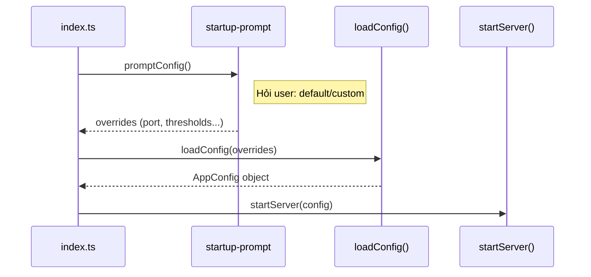

# Agent Orchestrator — Technical Flow v0.2.0

> Tài liệu mô tả chi tiết luồng chạy toàn bộ hệ thống, trace từ source code.

---

## 1. Server Startup Flow

```
npm run serve
  → node dist/index.js serve
  → src/index.ts
```

### Sequence:



### `startServer()` — `src/mcp-server/index.ts`

Thực hiện theo thứ tự:

1. **`bootstrapDirectories(config)`** — Tạo tất cả thư mục cần thiết (exchange/, plan/, tasks/)
2. **`new Logger()`** — Khởi tạo logger ghi vào `exchange/logs/YYYY-MM-DD.md`
3. **`workerRegistry.cleanupDisconnected()`** — Xóa worker DISCONNECTED từ session trước
4. **`new StateManager(logger, config)`** — Khởi tạo TaskQueue rỗng + ensure exchange dirs
5. **`new RecoveryManager({...})`** — Khởi tạo recovery module
6. **`recoveryManager.runStartupRecovery()`** — ⭐ Recovery sequence (xem mục 2)
7. **`new PlanWatcher({...}).start()`** — Bắt đầu poll `plan/pending/` mỗi 30s
8. **`startBrainWatcher()`** — Bắt đầu monitor Antigravity conversations (nếu không bị disable)
9. **`express()` setup** — Middleware, JSON parser, error handlers
10. **`setupMcpRoutes(app, context)`** — Mount MCP transport tại `/mcp`
11. **`app.listen(port)`** — Lắng nghe HTTP
12. **Đăng ký SIGINT/SIGTERM** → graceful shutdown

### Graceful Shutdown sequence:
```
SIGINT/SIGTERM →
  planWatcher.stop()
  stopBrainWatcher()
  workerRegistry.clearAll()
  recoveryManager.runGracefulShutdown()
    → stopMonitoring()
    → saveCheckpoint()
    → markCleanShutdown()  // ghi file .shutdown_clean
  close transports
  process.exit(0)
```

---

## 2. Recovery Flow

### Startup Recovery — `RecoveryManager.runStartupRecovery()`

```
1. Check .shutdown_clean marker file
   ├─ EXISTS (clean) → restoreFromFiles() → startMonitoring()
   └─ NOT EXISTS (crash) →
        restoreFromFiles()
        detectOrphans()     // scan active/ cho task không có worker
        requeueOrphans()    // move orphan active/ → inbox/ (có retry tracking)
        startMonitoring()

2. clearShutdownMarker()  // xóa marker, sẽ ghi lại khi shutdown clean
```

### `restoreFromFiles()` — `StateManager`

```
1. Scan inbox/*.json   → load vào Map (status=PENDING)
2. Scan active/*.json  → load vào Map (status=ACTIVE)
3. Scan outbox/*.json  → load vào Map (status=DONE)
4. Tìm task FAILED trong outbox:
   ├─ retry_count < 3 → move outbox/ → inbox/ (auto-recover)
   └─ retry_count >= 3 → giữ nguyên (permanently failed)
5. Load _queue.json → rebuild DAG groups
6. pruneCompletedGroups() → GC old done groups
```

### Runtime Monitoring — mỗi 5s

```
RecoveryManager._monitorTimer (5s interval):
  1. checkStaleWorkers()
     → Scan all workers with current_task
     → If last_heartbeat > 90s ago:
        ├─ Task still in active/? → requeueWithRetry() + markDisconnected()
        └─ Task already moved? → chỉ markDisconnected() (race guard)
  2. _requeueFailedFromOutbox()
     → Safety net: scan outbox/ cho FAILED tasks
     → retry_count < 3? → moveToInbox()
```

---

## 3. MCP Transport Layer

### `transport.ts` — Streamable HTTP

```
POST /mcp (no session-id + isInitializeRequest)
  → Tạo StreamableHTTPServerTransport mới
  → Tạo McpServer mới (registerTools)
  → server.connect(transport)
  → Trả về session-id trong response header

POST /mcp (có session-id)
  → Reuse existing transport → handleRequest()

GET /mcp (có session-id)
  → SSE stream cho server-push events

DELETE /mcp
  → Close transport
```

Mỗi MCP session (mỗi Antigravity window) có **transport riêng** + **McpServer instance riêng**, nhưng tất cả share cùng **context** (stateManager, workerRegistry, logger).

---

## 4. Agent Registration & Role Assignment

### `register_worker` tool

```typescript
// tools.ts line 83-140
Agent gọi register_worker({ workspace_path? })
  → workerRegistry.register()  // tạo worker_id mới (w-XXXXXXXX)
  → Kiểm tra queue status
  → Quyết định role:
     ├─ queue có task pending/active → WORKER
     ├─ queue rỗng + có plan pending/processing:
     │   ├─ không có active planner → PLANNER
     │   └─ đã có planner alive → IDLE
     └─ queue rỗng + không plan → IDLE
  → workerRegistry.setRole(worker_id, role)
  → Return { worker_id, role, server_root, workspace_root, queue_summary }
```

---

## 5. Plan Lifecycle

### File flow:
```
plan/pending/xxx.md  →  plan/processing/xxx.md  →  plan/done/xxx.md
```

### Hai cơ chế phát hiện plan:

**A. PlanWatcher (background, mỗi 30s)**
```
PlanWatcher._poll()
  → stateManager.checkPlans()
     → Nếu processing/ có file → return 'busy'
     → Nếu pending/ có file → move oldest → processing/ → return 'ready'
     → Không có gì → return 'idle'
  → Log + console output khi detect plan mới
```

**B. Agent gọi `check_plans` tool (long-poll 60s)**
```
check_plans()
  → waitForPlan(stateManager, { timeout: 60s })
     → checkPlans() ngay lập tức
     → Nếu idle → poll mỗi 4s cho đến 60s
     → Return kết quả (idle/busy/ready)
  → Response cho agent:
     ├─ IDLE → { action: "IDLE" }
     ├─ DECOMPOSE → { action: "DECOMPOSE", plan_path, content }
```

### `submit_decomposition` — Planner nộp kết quả

```
1. Auto-prefix task IDs: "xxx.md-01-task-name"
2. Auto-prefix group IDs tương tự
3. validateDAG(graph) → throw nếu circular
4. storeTasks(tasks, graph)
   → queue.loadFromGraph() → emit 'task-available'
   → Write task files → inbox/task-xxx.json
   → Write _queue.json
5. completePlan(source_plan) → move processing/ → done/
6. Check next plan:
   ├─ Có plan pending → return { DECOMPOSE, next plan }
   └─ Hết plan → setRole(WORKER) → return { IDLE }
```

---

## 6. Task Lifecycle

### File flow:
```
exchange/inbox/task-XX.json → exchange/active/task-XX.json → exchange/outbox/task-XX.json
                                                            + exchange/outbox/result-XX.json
```

### `get_next_task` — Worker lấy task (long-poll 30s)

```
1. withHeartbeat middleware → update last_heartbeat
2. waitForTask(queue, { timeout: 30s })
   → queue.getNextTask() ngay
   → Nếu null → listen 'task-available' event + interval 2s
   → Timeout 30s → return null
3. Nếu có task:
   → stateManager.moveToActive(task.id)
     → Move file inbox/ → active/
     → Update status inside JSON = "active"
     → queue.updateTaskStatus(id, ACTIVE)
   → Set worker.current_task = task.id
   → Return { action: EXECUTE, task_details, context }
4. Nếu null (timeout):
   → resolveIdleAction()
     ├─ Có plan + không planner → { BECOME_PLANNER, plan_path, content }
     └─ Không → { IDLE }
```

### DAG dependency check — `queue.getUnlockedTasks()`

```
For each group in groups:
  Check: tất cả group trong depends_on đã DONE hết?
  ├─ YES → các task PENDING trong group này = unlocked
  └─ NO → skip group
Return danh sách unlocked tasks
getNextTask() → return unlocked[0]
```

### `complete_task` — Worker báo hoàn thành

```
1. withHeartbeat middleware
2. Validate worker owns task
3. Handle disconnected worker comeback (race condition):
   → Worker DISCONNECTED nhưng gọi complete_task
   → Check isTaskInActive(task_id)
     ├─ Còn trong active/ → accept result, re-assign ownership
     └─ Không còn → discard (late result), return accepted: false
4. Xử lý theo status:

   STATUS = "done":
     → moveToOutbox(task_id, result)
       → Move file active/ → outbox/
       → Write result-XX.json
       → queue.updateTaskStatus(DONE)
       → pruneCompletedGroups() (GC)
     → saveCheckpoint()
     → tryAutoPickup()

   STATUS = "failed" hoặc "blocked":
     → getTaskRetryCount(task_id) from disk
     → retry_count >= 3?
       ├─ YES → permanently failed → moveToOutbox()
       └─ NO → requeueWithRetry(task_id)
                → Increment retry_count in file
                → Attach error_context from .agent/session.json
                → moveToInbox() (active/ → inbox/)
     → saveCheckpoint()
     → tryAutoPickup()

5. tryAutoPickup (auto_pickup=true):
   → queue.getNextTask()
   ├─ Có task → moveToActive + return { EXECUTE, next task }
   └─ Không có → resolveIdleAction()
      ├─ BECOME_PLANNER
      └─ IDLE
```

---

## 7. Heartbeat & Stale Detection

### Implicit heartbeat
Mọi tool call có `worker_id` → `withHeartbeat` middleware → `workerRegistry.updateHeartbeat(id)`.

### Explicit ping
Agent gọi `ping({ worker_id })` khi đang code/thinking lâu.

### Stale detection (mỗi 5s)
```
RecoveryManager.checkStaleWorkers():
  For each worker with current_task:
    elapsed = now - last_heartbeat
    If elapsed > 90s:
      → writeRecoverySignal() (exchange/signals/recovery-needed.json)
      → _handleStaleTask(worker):
         ├─ isTaskInActive(task)? → requeueWithRetry() + markDisconnected()
         └─ Task đã move rồi? → chỉ markDisconnected()
```

### Worker reconnection
```
Worker DISCONNECTED gọi lại bất kỳ tool (có worker_id):
  → withHeartbeat → updateHeartbeat()
    → worker.status = IDLE (re-activate)
    → delete disconnected_at
```

---

## 8. Idle Resolution & Role Switching

### `resolveIdleAction()` — `idle-resolver.ts`

Được gọi khi worker không có next task (từ get_next_task hoặc complete_task):

```
1. checkPlansQuick() → có plan pending/processing?
   ├─ YES → getActivePlanner(90s threshold)
   │    ├─ Không có planner alive → BECOME_PLANNER
   │    │   → setRole(PLANNER)
   │    │   → Get plan content (processing hoặc move pending→processing)
   │    │   → Return { BECOME_PLANNER, plan_path, content }
   │    └─ Planner alive → Return { IDLE }
   └─ NO → Return { IDLE }
```

---

## 9. Session Checkpoint (v2)

### File: `{workspace_root}/.agent/session.json`

### Schema v2:
```json
{
  "version": 2,
  "task_id": "plan-01-create-login",
  "phase": "implementation",
  "files_changed": ["src/pages/Login.vue"],
  "done_criteria_status": { "Form renders": true, "Validation works": false },
  "last_action": "Created Login.vue component",
  "error_context": {
    "error": "Cannot find module 'zod'",
    "hypothesis": "Missing dependency",
    "attempted_fix": "Added import",
    "retry_count": 1
  },
  "created_at": "...",
  "updated_at": "..."
}
```

### Error context flow:
```
Worker fails task → session_checkpoint(save, { error_context })
  → Ghi vào .agent/session.json

complete_task(status: "failed")
  → requeueWithRetry(task_id, workspaceRoot)
    → Read .agent/session.json
    → Attach error_context vào task file (inbox/task-XX.json)
    → Move active/ → inbox/

New worker picks up task (get_next_task)
  → task_details chứa error_context + retry_count
  → Agent đọc error_context → tránh lặp lại cùng fix
```

---

## 10. Brain Watcher

### File: `src/agents/antigravity/brain-watcher.ts`

Monitor Antigravity conversation files (`.pb`) cho stuck detection.

```
Config:
  POLL_INTERVAL:  10s
  IDLE_THRESHOLD: 60s (1 min)
  STUCK_THRESHOLD: 180s (3 min)

scanConversations() — mỗi 10s:
  1. Scan conversations/*.pb files
  2. For each file:
     → Compare current size vs last known size
     → Size changed? → status = ACTIVE
     → Size unchanged?
        ├─ idle > 3min → STUCK → handleStuck()
        └─ idle > 1min → IDLE

handleStuck(uuid):
  → Write .stuck-signal.json vào brain/{uuid}/
  → notifyStuck() → desktop notification via node-notifier
```

Chạy 2 cách:
- **Embedded**: tự start khi server start (mặc định)
- **Standalone**: `npm run watch:ag` (tsx chạy trực tiếp)

---

## 11. Module Dependency Graph

```
index.ts
  └→ mcp-server/index.ts (startServer)
       ├→ utils/bootstrap.ts (directory init)
       ├→ utils/logger.ts
       ├→ utils/worker-registry.ts (singleton)
       ├→ mcp-server/state-manager.ts
       │    ├→ mcp-server/task-queue.ts (EventEmitter)
       │    └→ utils/file-backend.ts
       ├→ mcp-server/recovery.ts
       ├→ mcp-server/plan-watcher.ts
       ├→ agents/antigravity/brain-watcher.ts
       │    ├→ agents/antigravity/config-resolver.ts
       │    ├→ agents/antigravity/constants.ts
       │    └→ agents/antigravity/notifications.ts
       └→ mcp-server/transport.ts
            └→ mcp-server/server.ts (McpServer factory)
                 └→ mcp-server/tools.ts (registerTools)
                      ├→ mcp-server/poll-helpers.ts
                      ├→ mcp-server/idle-resolver.ts
                      ├→ mcp-server/tools/scan-workspace.ts
                      └→ mcp-server/tools/session-checkpoint.ts
```

---

## 12. Key Data Structures

### TaskQueue (in-memory)
```typescript
tasks: Map<string, TaskDef>     // id → task object with status
groups: TaskGroup[]              // DAG groups with depends_on
// EventEmitter: emits 'task-available' on loadFromGraph/requeueTask
```

### WorkerRegistry (in-memory + file)
```typescript
workers: Map<string, WorkerInfo>  // id → worker state
// Persisted to exchange/workers.json on every mutation
// Singleton instance shared across all MCP sessions
```

### File-based State (source of truth)
```
exchange/inbox/task-{id}.json      // PENDING tasks
exchange/active/task-{id}.json     // ACTIVE tasks (assigned to worker)
exchange/outbox/task-{id}.json     // DONE/FAILED tasks
exchange/outbox/result-{id}.json   // Completion results
exchange/_queue.json               // DAG graph structure
exchange/workers.json              // Worker registry
exchange/checkpoints/              // Queue snapshots (max 10, rotated)
exchange/logs/YYYY-MM-DD.md        // Daily event log
exchange/signals/                  // Recovery signals
```

---

## 13. Constants Reference

| Constant | Value | Usage |
|----------|-------|-------|
| `POLL_TIMEOUT_MS` | 30s | get_next_task long poll |
| `PLAN_POLL_TIMEOUT_MS` | 60s | check_plans long poll |
| `CHECK_INTERVAL_MS` | 2s | Internal poll fallback |
| `MONITOR_INTERVAL_MS` | 5s | Stale worker check |
| `STALE_WORKER_THRESHOLD_MS` | 90s | Worker heartbeat timeout |
| `PLANNER_ALIVE_THRESHOLD_MS` | 90s | Planner liveness check |
| `MAX_TASK_RETRIES` | 3 | Permanently fail after 3 |
| `MAX_CHECKPOINTS` | 10 | Checkpoint rotation |
| Server port | 3847 | Default |
