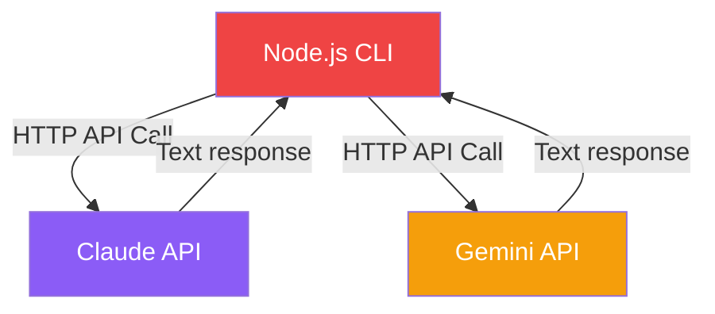
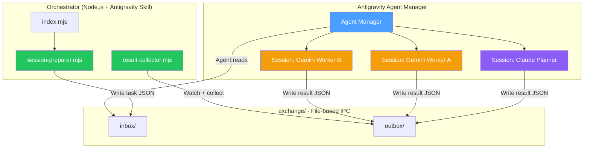
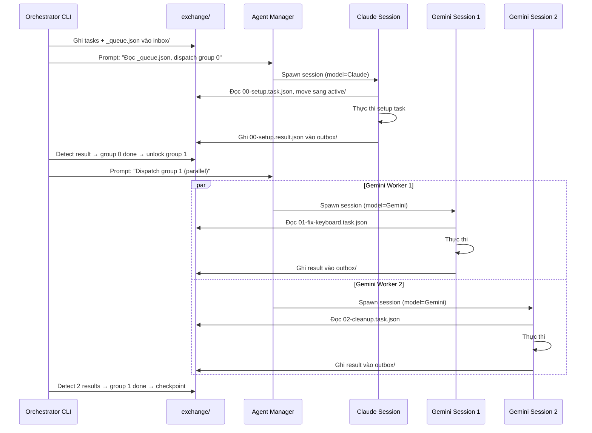
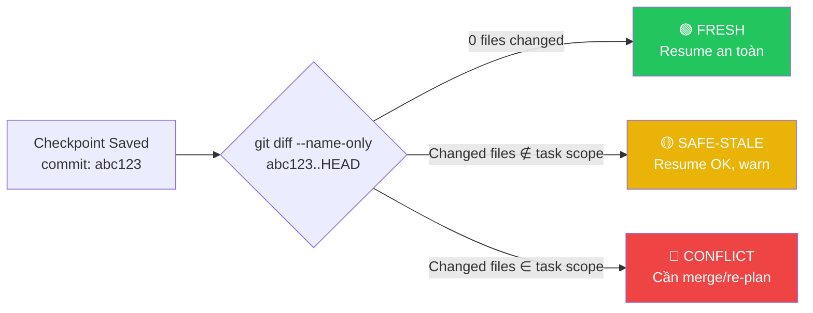
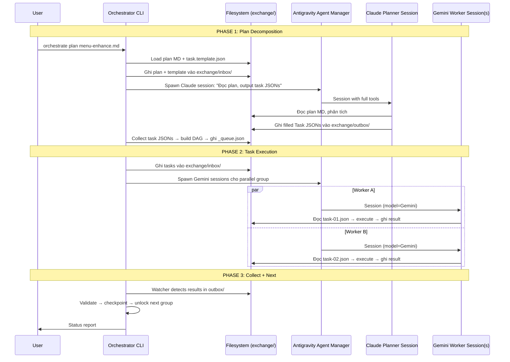

# Plan Hoàn chỉnh: Standalone Antigravity Orchestrator v0.1

> **Trạng thái**: Draft 2.1 — Đã tích hợp constraint Antigravity-native.

---

## Quyết định đã chốt

| # | Chủ đề | Quyết định |
|---|--------|-----------|
| 1 | Repo structure | 1 repo trước mắt, tách 2 repo riêng khi cần |
| 2 | JSON Contracts | 4 JSON templates (Task, Checkpoint, PlanOutput, ArchiveEntry) — bổ sung sau |
| 3 | LLM Provider | Adapter pattern từ đầu. Claude + Gemini có role riêng |
| 4 | Dual-LLM | Phải hỗ trợ chạy 2 LLM cùng lúc — **thông qua Antigravity** |
| 5 | Symlink (Windows) | Junction |
| 6 | Token counting | `tiktoken` |
| 7 | Plan format | MD (natural language) cho plan files, JSON template cho inter-agent communication |
| 8 | Checkpoint stale | 3-level detection (fresh/safe-stale/conflict) + git SHA + file hash |
| 9 | Scope hiện tại | Hoàn tất plan → break → làm sau |
| 10 | **Runtime constraint** | **Mọi LLM call phải thông qua Antigravity, KHÔNG gọi API trực tiếp** |

---

## 1. Kiến trúc Tổng quan (Updated — Antigravity-native)

> [!IMPORTANT]
> Orchestrator **KHÔNG** gọi Claude/Gemini API trực tiếp.
> Mọi LLM interaction phải thông qua **Antigravity Agent Manager**.
> Orchestrator đóng vai trò **"Bộ não điều phối"** — chuẩn bị data, ghi file, và Antigravity agents tự đọc + thực thi.

```
agent-orchestrator/                     ← 1 repo, tách sau nếu cần
├── plan/                               ← Plan documents (MD, human-readable)
├── reference/                          ← Reference materials từ monorepo
├── templates/                          ← JSON contract templates
│   ├── task.template.json
│   ├── checkpoint.template.json
│   ├── plan-output.template.json
│   └── archive-entry.template.json
├── src/
│   ├── index.mjs                       ← CLI entry point
│   ├── config.mjs                      ← Config loader + validation
│   ├── planner/
│   │   ├── task-decomposer.mjs         ← Parse MD plan → Task JSONs
│   │   ├── dependency-resolver.mjs     ← Build execution DAG
│   │   └── setup-detector.mjs          ← Auto-detect env setup tasks
│   ├── dispatcher/                     ← ❌ KHÔNG gọi API, chỉ chuẩn bị dispatch
│   │   ├── session-preparer.mjs        ← Chuẩn bị context cho Antigravity session
│   │   ├── task-queue.mjs              ← Hàng đợi task theo execution DAG
│   │   ├── result-collector.mjs        ← Thu thập kết quả từ completed sessions
│   │   └── watcher.mjs                 ← Watch filesystem cho session output
│   └── utils/
│       ├── tools.mjs                   ← Shell/file tools
│       ├── memory.mjs                  ← Archive, freshness, auto-delete
│       ├── checkpoint.mjs              ← Save/Load/Resume + staleness detection
│       └── token-counter.mjs           ← tiktoken wrapper
├── .agent/                             ← Antigravity skills/workflows
│   ├── skills/
│   │   └── orchestrator-protocol/      ← Skill cho agent đọc khi được dispatch
│   │       └── SKILL.md
│   └── workflows/
│       ├── orchestrate.md              ← Master workflow: plan → dispatch → collect
│       ├── dispatch-task.md            ← Giao task cho Agent Manager session
│       └── collect-results.md          ← Thu thập kết quả từ sessions
├── exchange/                           ← File-based IPC giữa Orchestrator ↔ Agents
│   ├── inbox/                          ← Tasks chờ agent nhận
│   ├── outbox/                         ← Kết quả agent trả về
│   └── active/                         ← Tasks đang được xử lý
├── package.json
└── README.md
```

---

## 2. JSON Contract Templates

Mỗi template được lưu riêng trong `templates/`. Khi cần tạo data mới, load template → fill fields → validate → save.

### 2.1 Task Contract — `task.template.json`

```json
{
  "$schema": "task-v1",
  "id": "",
  "module": "",
  "action": "",
  "status": "todo",
  "priority": 1,
  "assigned_llm": null,
  "dependencies": [],
  "context_files": [],
  "output_files": [],
  "verification": "",
  "plan_reference": "",
  "created_at": "",
  "started_at": null,
  "completed_at": null,
  "blocker": null,
  "result_summary": null
}
```

### 2.2 Checkpoint Contract — `checkpoint.template.json`

```json
{
  "$schema": "checkpoint-v1",
  "checkpoint_id": "",
  "session_id": "",
  "git_state": {
    "commit_sha": "",
    "branch": "",
    "has_uncommitted": false,
    "diff_files": []
  },
  "token_usage": {
    "used": 0,
    "limit": 0,
    "percentage": 0
  },
  "task_progress": {
    "current_task_id": "",
    "current_step": "",
    "completed_tasks": [],
    "pending_tasks": [],
    "blocked_tasks": []
  },
  "llm_sessions": {
    "claude": { "session_id": null, "tokens_used": 0 },
    "gemini": { "session_id": null, "tokens_used": 0 }
  },
  "state_snapshot": {
    "files_modified": [],
    "last_action": "",
    "next_action": ""
  },
  "created_at": "",
  "resumable": true,
  "staleness_info": {
    "saved_commit_sha": "",
    "files_at_save": {},
    "warning": null
  }
}
```

### 2.3 Plan Output Contract — `plan-output.template.json`

```json
{
  "$schema": "plan-output-v1",
  "plan_id": "",
  "source_plan_md": "",
  "created_by": "planner",
  "tasks": [],
  "execution_graph": {
    "parallel_groups": [],
    "sequential_chains": []
  },
  "llm_assignment": {
    "planner": "claude",
    "workers": {}
  },
  "total_estimated_tokens": 0,
  "created_at": ""
}
```

### 2.4 Archive Entry Contract — `archive-entry.template.json`

```json
{
  "$schema": "archive-entry-v1",
  "id": "",
  "module": "",
  "type": "task|bug|feature|plan",
  "title": "",
  "status": "completed|obsolete|superseded",
  "summary": "",
  "original_path": "",
  "archived_at": "",
  "freshness_score": 0,
  "superseded_by": null,
  "tags": []
}
```

---

## 3. Dual-LLM Architecture — Antigravity-Native (Deep Analysis)

> [!CAUTION]
> **Constraint cốt lõi**: Mọi LLM call PHẢI thông qua Antigravity platform.
> Orchestrator KHÔNG gọi Claude API hay Gemini API trực tiếp từ Node.js.
> Thay vào đó, Orchestrator **chuẩn bị data** → Antigravity Agent Manager **dispatch** sessions.

### 3.1 Tại sao KHÔNG gọi API trực tiếp?

| Lý do | Giải thích |
|-------|------------|
| Antigravity đã wrap LLM | Agent Manager quản lý model selection, context window, tools, browser, terminal |
| Không có raw API access | Antigravity sử dụng internal routing, không expose API key trực tiếp cho external scripts |
| Đánh mất tool ecosystem | Gọi API raw = mất toàn bộ tools (view_file, run_command, browser, MCP, etc.) |
| Đã có orchestration layer | Agent Manager cho phép spawn nhiều agent sessions song song |
| Billing/Quota | Antigravity quản lý quota tập trung, gọi ngoài = tách biệt billing |

### 3.2 Mô hình cũ (SAI) vs Mô hình mới (ĐÚNG)

````carousel
#### ❌ Mô hình SAI — Gọi API trực tiếp

**Vấn đề**: Agent chỉ nhận text, không có tools (file edit, terminal, browser).
Phải tự implement toàn bộ tool layer = reinvent Antigravity.
<!-- slide -->
#### ✅ Mô hình ĐÚNG — Thông qua Antigravity

**Ưu điểm**: Agents có full access tới tools, browser, terminal, MCP.
````

### 3.3 Cơ chế hoạt động: File-based IPC + Agent Manager

Antigravity Agent Manager cho phép:
- **Spawn nhiều sessions** song song trên nhiều workspaces
- **Chọn model** (Claude/Gemini) cho mỗi session
- **Agent tự đọc skills/workflows** từ `.agent/` directory
- **Asynchronous execution** — không cần chờ tuần tự

#### Luồng Dispatch qua File-based IPC:

```
┌─────────────────────────────────────────────────────────┐
│  PHASE 1: Orchestrator chuẩn bị (Node.js CLI)           │
│                                                         │
│  1. Đọc plan MD → decompose → Task JSONs                │
│  2. Build execution DAG (dependency-resolver)            │
│  3. Ghi tasks vào exchange/inbox/                        │
│     ├── 01-menu-fix-keyboard.task.json                   │
│     ├── 02-menu-cleanup.task.json                        │
│     └── _queue.json  (thứ tự + parallel groups)          │
│  4. Ghi prompt template vào exchange/inbox/              │
│     └── _dispatch-prompt.md  (hướng dẫn agent đọc task)  │
└─────────────────────────────────────────────────────────┘
                          ↓
┌─────────────────────────────────────────────────────────┐
│  PHASE 2: Antigravity Agent Manager dispatch             │
│                                                         │
│  User (hoặc Master Agent) mở Agent Manager:              │
│  • Session 1 (Claude): "Đọc exchange/inbox/_queue.json,  │
│    lấy task group hiện tại, phân tích và plan"           │
│  • Session 2 (Gemini): "Đọc exchange/inbox/01-xxx.json,  │
│    thực thi task, ghi kết quả vào exchange/outbox/"      │
│  • Session 3 (Gemini): "Đọc exchange/inbox/02-xxx.json,  │
│    thực thi task, ghi kết quả vào exchange/outbox/"      │
│                                                         │
│  → Các session chạy SONG SONG trên Agent Manager         │
└─────────────────────────────────────────────────────────┘
                          ↓
┌─────────────────────────────────────────────────────────┐
│  PHASE 3: Thu thập kết quả (Node.js watcher)            │
│                                                         │
│  1. Watcher theo dõi exchange/outbox/                    │
│  2. Khi có result JSON → validate → move task sang done  │
│  3. Check DAG → unlock next parallel group               │
│  4. Ghi checkpoint                                       │
│  5. Nếu còn tasks → lặp lại Phase 2                      │
└─────────────────────────────────────────────────────────┘
```

### 3.4 Cấu trúc Exchange Directory

```
exchange/
├── inbox/                              ← Orchestrator ghi, Agent đọc
│   ├── _queue.json                     ← Execution order + parallel groups
│   ├── _dispatch-prompt.md             ← Prompt template cho agent sessions
│   ├── 01-menu-fix-keyboard.task.json  ← Task data (from template)
│   └── 02-menu-cleanup.task.json
├── active/                             ← Agent đang xử lý
│   └── 01-menu-fix-keyboard.task.json  ← Moved from inbox khi agent bắt đầu
└── outbox/                             ← Agent ghi kết quả, Orchestrator thu
    └── 01-menu-fix-keyboard.result.json
```

**`_queue.json`** — Execution order:
```json
{
  "plan_id": "plan-menu-enhance-v0.2",
  "current_group_index": 0,
  "groups": [
    {
      "index": 0,
      "type": "sequential",
      "tasks": ["00-setup-environment"],
      "assigned_model": "claude"
    },
    {
      "index": 1,
      "type": "parallel",
      "tasks": ["01-menu-fix-keyboard", "02-menu-cleanup"],
      "assigned_model": "gemini"
    },
    {
      "index": 2,
      "type": "sequential",
      "tasks": ["03-menu-style-polish"],
      "assigned_model": "claude"
    }
  ]
}
```

**`_dispatch-prompt.md`** — Template prompt gửi vào Agent Manager session:
```markdown
Bạn là Worker Agent. Đọc file task được giao và thực thi.

1. Đọc task file: `exchange/inbox/<task-id>.task.json`
2. Move task sang `exchange/active/`
3. Đọc các `context_files` được liệt kê trong task
4. Thực hiện `what_to_do` section
5. Chạy `verification` command
6. Ghi kết quả vào `exchange/outbox/<task-id>.result.json` theo format:
   { "task_id": "...", "status": "done|failed|blocked", 
     "summary": "...", "files_modified": [], "test_output": "..." }
7. KHÔNG làm gì ngoài scope task.
```

### 3.5 Dual-LLM Song Song — Qua Agent Manager

Antigravity Agent Manager **đã hỗ trợ native** việc chạy nhiều agent sessions cùng lúc:

| Khả năng | Agent Manager |
|----------|---------------|
| Multi-session song song | ✅ Spawn N sessions cùng lúc |
| Chọn model per-session | ✅ Claude / Gemini / etc. mỗi session |
| Mỗi session có full tools | ✅ file edit, terminal, browser, MCP |
| Asynchronous execution | ✅ Background agents |
| Inter-session isolation | ✅ Mỗi session tách biệt context |

**Cách Orchestrator tận dụng:**



### 3.6 Role Assignment: Claude vs Gemini

| Task Type | Model | Lý do |
|-----------|-------|-------|
| Planning / Decomposition | **Claude** | Reasoning sâu, phân tích dependency phức tạp |
| Setup Environment | **Claude** | Cần judgment chính xác khi install deps |
| Routine Code Tasks | **Gemini** | Nhanh, cost-effective cho code generation |
| Bug Fix (simple) | **Gemini** | Cần execution speed |
| Bug Fix (complex) | **Claude** | Cần deep analysis |
| Code Review | **Claude** | Cần critical thinking |
| Style/Polish | **Gemini** | Mechanical, pattern-based |

### 3.7 Constraints khi chạy song song qua Antigravity

| Constraint | Giải pháp |
|------------|-----------|
| 2 agents ghi cùng 1 file | `dependency-resolver.mjs` đặt vào sequential group |
| Agent Manager session limit | Config `max_concurrent_sessions` trong Orchestrator |
| File conflict trong exchange/ | Mỗi task có unique ID, agent chỉ đọc file mình |
| Agent không đọc task đúng | `_dispatch-prompt.md` có instructions chi tiết |
| Kết quả sai format | `result-collector.mjs` validate JSON schema trước khi accept |
| Session crash giữa chừng | Watcher detect timeout → move task về inbox → retry |

---

## 4. Checkpoint Staleness — Phân tích chi tiết

> User yêu cầu: "nên phân tích thêm"

### 4.1 Vấn đề

Khi Orchestrator save checkpoint rồi `--resume` sau một khoảng thời gian, codebase có thể đã thay đổi:
- User tự sửa code bằng tay
- Một Worker khác đã merge changes
- Git pull từ remote

Nếu resume mà không detect → Worker sẽ thao tác trên state cũ → **conflict, overwrite, hoặc logic sai**.

### 4.2 Các cấp độ Staleness



### 4.3 Detection Algorithm

```javascript
// src/utils/checkpoint.mjs — staleness detection

class CheckpointManager {
  
  async detectStaleness(checkpoint) {
    const savedSha = checkpoint.git_state.commit_sha;
    const currentSha = await git.getCurrentCommitSha();
    
    // Case 1: Cùng commit → FRESH
    if (savedSha === currentSha) {
      return { level: 'fresh', action: 'resume' };
    }

    // Case 2: Commit khác → check file overlap
    const changedFiles = await git.diffNameOnly(savedSha, currentSha);
    const taskFiles = [
      ...checkpoint.task_progress.current_task.context_files,
      ...checkpoint.task_progress.current_task.output_files
    ];

    const conflictFiles = changedFiles.filter(f => taskFiles.includes(f));

    if (conflictFiles.length === 0) {
      // Changed files không liên quan đến task hiện tại
      return {
        level: 'safe-stale',
        action: 'resume_with_warning',
        changed_files: changedFiles,
        message: `${changedFiles.length} files changed nhưng không ảnh hưởng task scope`
      };
    }

    // Case 3: Conflict — files trong task scope bị thay đổi
    return {
      level: 'conflict',
      action: 'require_replan',
      conflict_files: conflictFiles,
      message: `${conflictFiles.length} files in task scope đã thay đổi`,
      options: [
        'rebase — đọc lại file mới, adjust task accordingly',
        'force — bỏ qua changes, overwrite',
        'abort — huỷ checkpoint, re-plan từ đầu'
      ]
    };
  }
}
```

### 4.4 Xử lý từng cấp độ

#### 🟢 FRESH — Resume ngay
```
$ agent-orchestrator resume --checkpoint cp-20260402
✅ Checkpoint is fresh (same commit). Resuming task 01-menu-fix-keyboard...
```

#### 🟡 SAFE-STALE — Resume + Warning
```
$ agent-orchestrator resume --checkpoint cp-20260402

⚠️  Codebase đã thay đổi kể từ checkpoint:
   Modified: src/theme/colors.ts, README.md
   
   Những file này KHÔNG nằm trong scope task hiện tại.
   → Tiếp tục resume an toàn.

Resuming task 01-menu-fix-keyboard...
```

#### 🔴 CONFLICT — Yêu cầu quyết định
```
$ agent-orchestrator resume --checkpoint cp-20260402

🔴 CONFLICT DETECTED!
   Checkpoint saved at commit: abc1234
   Current commit: def5678
   
   Files trong task scope đã bị thay đổi:
   ├── src/menu/Menu.tsx          (+15 -3 lines)
   └── src/menu/useKeyboard.ts    (+8 -2 lines)

   Chọn hành động:
   [1] rebase  — Đọc lại file hiện tại, điều chỉnh task
   [2] force   — Bỏ qua changes bên ngoài, ghi đè
   [3] abort   — Huỷ checkpoint, cần re-plan
   
   > _
```

### 4.5 Dữ liệu cần lưu trong Checkpoint cho Staleness Detection

```json
{
  "staleness_info": {
    "saved_commit_sha": "abc1234def5678...",
    "saved_branch": "master",
    "task_scope_files": [
      "src/menu/Menu.tsx",
      "src/menu/useKeyboard.ts"
    ],
    "file_hashes_at_save": {
      "src/menu/Menu.tsx": "sha256:a1b2c3...",
      "src/menu/useKeyboard.ts": "sha256:d4e5f6..."
    }
  }
}
```

> [!TIP]
> **File hash** chính xác hơn git commit SHA cho trường hợp user sửa file nhưng chưa commit. Dùng cả hai:
> - Git SHA để detect committed changes
> - File hash để detect uncommitted changes

### 4.6 Edge Cases cần handle

| Edge Case | Giải pháp |
|-----------|-----------|
| User stash/unstash giữa sessions | Check `git stash list` khi resume |
| Branch switch | So sánh branch name, `conflict` nếu khác branch |
| File bị xoá | `conflict` level, suggest `abort` |
| New file xuất hiện ở task scope | `safe-stale` — file mới không ảnh hưởng task cũ |
| Git repo bị reset/force push | So sánh file hash fallback khi SHA không tìm thấy |

---

## 5. Data Flow: MD Plan → JSON Task → Antigravity Agent → Result



---

## 6. Implementation Roadmap (Updated — Antigravity-native)

### Phase 0: Foundation
- [ ] Init Node.js project (ESM, `package.json`)
- [ ] Tạo 4 JSON template files trong `templates/`
- [ ] Tạo `exchange/{inbox,outbox,active}/` directory structure
- [ ] `src/config.mjs` — Config loader (timeouts, thresholds, exchange paths)
- [ ] `src/utils/token-counter.mjs` — tiktoken wrapper

---

### Phase 1: Memory & Checkpoint
- [ ] `src/utils/checkpoint.mjs` — Save/Load + Staleness Detection (Section 4)
- [ ] `src/utils/memory.mjs` — Archive table, freshness scoring, auto-delete
- [ ] `src/utils/tools.mjs` — Shell exec, file read/write helpers

---

### Phase 2: Dispatcher (thay thế LLM Adapters)
- [ ] `src/dispatcher/session-preparer.mjs` — Chuẩn bị task JSON + prompt cho Antigravity session
- [ ] `src/dispatcher/task-queue.mjs` — Quản lý hàng đợi theo execution DAG
- [ ] `src/dispatcher/result-collector.mjs` — Validate + collect results từ outbox/
- [ ] `src/dispatcher/watcher.mjs` — FSWatcher theo dõi exchange/outbox/ cho async results

---

### Phase 3: Planner
- [ ] `src/planner/task-decomposer.mjs` — MD plan → Task JSONs via template
- [ ] `src/planner/dependency-resolver.mjs` — Build DAG from `context_files` overlap
- [ ] `src/planner/setup-detector.mjs` — Auto-detect `00-setup-*` tasks

---

### Phase 4: Antigravity Integration
- [ ] `.agent/skills/orchestrator-protocol/SKILL.md` — Protocol cho dispatched agents
- [ ] `.agent/workflows/orchestrate.md` — Master workflow
- [ ] `.agent/workflows/dispatch-task.md` — Per-task dispatch workflow
- [ ] `.agent/workflows/collect-results.md` — Result collection workflow
- [ ] `exchange/inbox/_dispatch-prompt.md` — Prompt template cho worker sessions

---

### Phase 5: CLI & Polish
- [ ] `src/index.mjs` — CLI commands: `plan`, `run`, `resume`, `status`
- [ ] Integration tests (mock exchange/ filesystem)
- [ ] README + usage docs

---

## Trạng Thái

**Plan v2.1 — Antigravity-native architecture.** Mọi LLM calls thông qua Antigravity Agent Manager, không gọi API trực tiếp. Sẵn sàng để break thành task tickets khi user approve execution.
