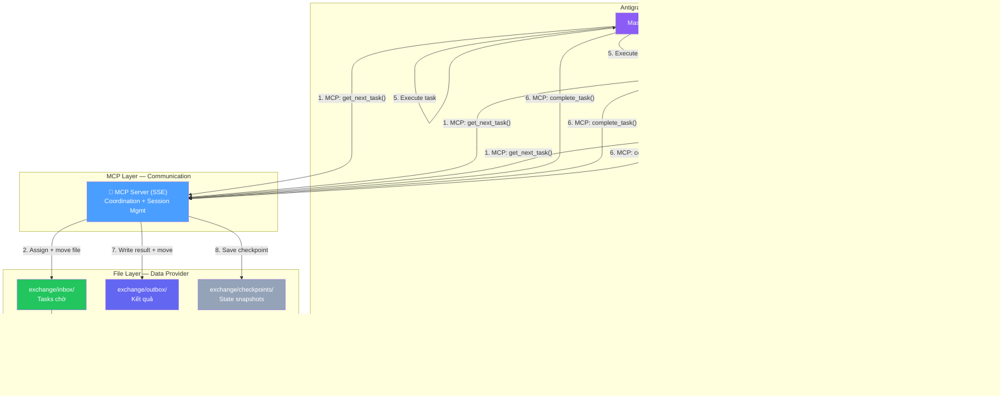

# Agent Orchestrator v0.3 — Dual-Layer: MCP + File IPC

> **Trạng thái**: Draft v0.3.1 — Chờ user approve trước khi thực thi
> **Ngày**: 2026-04-03
> **Thay đổi từ v0.2**: Kết hợp MCP (session/communication) + File IPC (data provider/token-saving)

---

## Quyết định đã chốt (Updated)

| # | Chủ đề | Quyết định |
|---|--------|-----------|
| 1 | Repo structure | 1 repo, tách sau nếu cần |
| 2 | JSON Contracts | 4 JSON templates (giữ nguyên) |
| 3 | LLM Provider | Adapter pattern. Claude + Gemini có role riêng |
| 4 | **Runtime** | **Luôn chạy qua Antigravity** (bất kể model nào) |
| 5 | **Communication** | **Dual-Layer: MCP + File IPC** — MCP điều phối, File lưu data |
| 6 | **Transport** | **SSE (HTTP)** — hỗ trợ multi-session song song |
| 7 | **Session spawning** | Manual click (1+ sessions), MCP server là brain chung |
| 8 | Token counting | `tiktoken` |
| 9 | Plan format | MD (natural language) |
| 10 | Checkpoint stale | 3-level detection (fresh/safe-stale/conflict) |
| 11 | **Plan decomposition** | **Claude parse** qua MCP tools (không dùng Node parser) |
| 12 | **Claude constraints** | **Có giới hạn** — max tasks, required fields, validation |
| 13 | **Error recovery** | 30s timeout, 3 retries via "continue", backoff |
| 14 | **Approach** | **POC-first** — build MCP cơ bản → test → improve |
| 15 | **File IPC** | **Giữ `exchange/`** — data provider, token-efficient context |
| 16 | **Design goal** | **Work đúng + Save token** — file = compressed context |

---

## User Review Required

> [!IMPORTANT]
> ### Execution Strategy: POC-First
> User yêu cầu **priority cao nhất** là build 1 MCP server cơ bản:
> 1. Connect vào Antigravity
> 2. Mở session → type "hello world"
> 3. Phân tích kết quả → improve dần
>
> → Toàn bộ plan bên dưới sẽ được thực hiện **SAU** khi POC thành công.

---

## 1. Kiến trúc Tổng quan — Dual-Layer (v0.3.1)

> [!IMPORTANT]
> **Triết lý thiết kế:**
> - **MCP** = Nervous System (real-time communication, session coordination)
> - **File IPC (exchange/)** = Memory (persistent data, token-efficient context recovery)
> - **Goal**: Work đúng + Save token. Đọc 1 file JSON ngắn << replay conversation

### Tại sao Dual-Layer?

```
Agent mới mở session, cần biết context:
  ❌ Replay conversation history     = hàng nghìn tokens, chậm, thiếu chính xác
  ❌ Chỉ dùng MCP (in-memory only)   = mất state khi crash, không inspect được
  ✅ Đọc exchange/active/task.json   = 50-100 tokens, CHÍNH XÁC, instant
```



### Vai trò mỗi Layer

| Layer | Vai trò | Ví dụ |
|-------|---------|-------|
| **MCP** | Coordination — ai nhận task nào, queue order, concurrency control | `get_next_task()`, `complete_task()`, `get_queue_status()` |
| **File IPC** | Data Provider — task details, results, checkpoints | `exchange/active/01-fix-menu.task.json` (agent đọc trực tiếp) |

### So sánh các approach

| Tiêu chí | Chỉ File (v0.2) | Chỉ MCP | **Dual-Layer (v0.3.1)** |
|----------|-----------------|---------|-------------------------|
| Session spawning | ❌ Cần auto-spawn | ✅ Manual click | ✅ Manual click |
| Concurrency control | ❌ Lock files | ✅ MCP serialize | ✅ MCP serialize |
| Token efficiency | ✅ Đọc file rẻ | ❌ Phải gọi MCP tool | ✅ **File = cheap context** |
| Crash recovery | ✅ File vẫn còn | ❌ Mất in-memory | ✅ **File backup** |
| Debug / Inspect | ✅ Đọc JSON | ❌ Chỉ qua MCP | ✅ **Cả hai** |
| State portability | ✅ Copy files | ❌ Tied to process | ✅ **Copy files** |
| Real-time coordination | ❌ Polling | ✅ Instant | ✅ **MCP instant** |

---

## 2. Folder Structure (v0.3.1)

```
agent-orchestrator/
├── plan/                                 ← Plan documents (MD)
├── reference/                            ← Reference materials
├── templates/                            ← JSON contract templates
│   ├── task.template.json
│   ├── checkpoint.template.json
│   ├── plan-output.template.json
│   └── archive-entry.template.json
├── src/
│   ├── index.mjs                         ← CLI entry: serve, plan, status, resume
│   ├── config.mjs                        ← Config loader + validation
│   ├── mcp-server/                       ← MCP Server — Communication Layer
│   │   ├── index.mjs                     ← MCP bootstrap (SSE transport)
│   │   ├── tools.mjs                     ← Tool definitions cho agents
│   │   ├── task-queue.mjs                ← Queue + DAG + work-stealing
│   │   ├── state-manager.mjs             ← Dual-write: memory + file
│   │   └── recovery.mjs                  ← Timeout (30s), retry (3x), heartbeat
│   ├── planner/
│   │   ├── plan-loader.mjs               ← Load MD plan file (Node deterministic)
│   │   ├── dependency-resolver.mjs       ← Build DAG từ Claude decomposition output
│   │   └── setup-detector.mjs            ← Auto-detect setup tasks
│   └── utils/
│       ├── tools.mjs                     ← Shell/file helpers
│       ├── memory.mjs                    ← Archive, freshness, auto-delete
│       ├── checkpoint.mjs                ← Save/Load/Staleness 3-level
│       ├── file-backend.mjs              ← 🆕 File read/write for exchange/
│       └── token-counter.mjs             ← tiktoken wrapper
├── exchange/                             ← 📁 File IPC — Data Provider Layer
│   ├── inbox/                            ← Tasks chờ agent nhận
│   │   ├── _queue.json                   ← Execution order + parallel groups
│   │   └── 01-fix-menu.task.json         ← Task data (agent đọc trực tiếp)
│   ├── active/                           ← Tasks đang được xử lý
│   │   └── 01-fix-menu.task.json         ← Moved từ inbox khi agent bắt đầu
│   ├── outbox/                           ← Kết quả agent trả về
│   │   └── 01-fix-menu.result.json       ← Result data
│   └── checkpoints/                      ← State snapshots
│       └── cp-20260403-001.json          ← Checkpoint cho crash recovery
├── .agent/                               ← Antigravity integration
│   ├── skills/
│   │   └── orchestrator-protocol/
│   │       └── SKILL.md                  ← Agent protocol: MCP coord → file read → execute → report
│   └── workflows/
│       ├── orchestrate.md                ← "Start server, open session, begin"
│       └── worker.md                     ← "Connect MCP, pull tasks, execute loop"
├── package.json
└── README.md
```

### So sánh với v0.2

| Component v0.2 | v0.3.1 | Thay đổi |
|----------------|--------|----------|
| `exchange/` | ✅ **GIỮ** | Data provider, token-efficient context |
| `exchange/_dispatch-prompt.md` | ❌ **BỎ** | Thay bằng SKILL.md |
| `dispatcher/` (push) | ❌ **BỎ** | Thay bằng MCP pull |
| `dispatcher/watcher.mjs` | ❌ **BỎ** | MCP real-time, file là backup |
| `planner/task-decomposer.mjs` | ❌ **BỎ** | Claude parse via MCP |
| MCP Server | 🆕 **THÊM** | Communication + coordination |
| `file-backend.mjs` | 🆕 **THÊM** | Dual-write memory ↔ file |

---

## 3. MCP Server Design

### 3.1 Transport: SSE (HTTP)

Chọn SSE vì user hướng tới multi-session song song:

```
stdio:   Antigravity spawn → 1 process per session → SEPARATE state ❌
SSE:     1 MCP server chạy → N sessions connect → SHARED state ✅
```

```
$ node src/index.mjs serve --port 3847

┌───────────────────────────────────┐
│  MCP Server listening :3847       │
│  Transport: SSE                   │
│  Exchange: ./exchange/            │
│  Connected agents: 0              │
└───────────────────────────────────┘

Session 1 connects → agent_count: 1
Session 2 connects → agent_count: 2
→ Tất cả share cùng queue + exchange/ files
```

### 3.2 Dual-Write Pattern (MCP ↔ File)

```javascript
// Khi agent gọi MCP tool → MCP server vừa update memory VỪA write file

MCP.get_next_task(worker_id)
  → Memory: mark task as in_progress, assign to worker
  → File:   move task.json từ exchange/inbox/ → exchange/active/
  → Return: task_id (agent tự đọc file để lấy details — TIẾT KIỆM TOKENS)

MCP.complete_task(task_id, summary)
  → Memory: update queue state, unlock next group
  → File:   write result.json vào exchange/outbox/
  → File:   move task.json từ exchange/active/ → done
  → File:   update checkpoint

// Agent workflow:
// 1. Gọi MCP.get_next_task() → nhận task_id (rất ít token)
// 2. Đọc exchange/active/task_id.task.json → full context (file read = rẻ)
// 3. Execute
// 4. Gọi MCP.complete_task() → chỉ gửi summary (ít token)
// → TỔNG TOKEN CHO COORDINATION ≈ rất nhỏ
```

### 3.3 MCP Tools

```javascript
// ═══════════ Core Dispatch (lean — chỉ coordination) ═══════════
get_next_task(worker_id, preferred_model?)     → {task_id, file_path} // agent tự đọc file!
complete_task(task_id, status, summary)        → {accepted, next_unlocked}
report_progress(task_id, step, percentage)     → void

// ═══════════ Plan Decomposition ═══════════
get_plan_for_decomposition()                   → {plan_file_path, template_path}
submit_decomposition(tasks[], graph, reason)   → {accepted, errors}

// ═══════════ Status & Control ═══════════
get_queue_status()                             → {total, done, active, blocked}
get_checkpoint()                               → {checkpoint_file_path}

// ═══════════ Error Recovery ═══════════
request_retry(task_id, reason, attempt)        → {approved, file_path}
```

> [!TIP]
> **Token optimization**: MCP tools trả về `file_path` thay vì full data.
> Agent dùng `view_file` (Antigravity native tool) để đọc → tốn ít MCP token,
> và file read qua Antigravity được tối ưu sẵn.

### 3.4 Task Queue — Work-Stealing Pattern

```
Agent 1: MCP.get_next_task() → {task_id: "01", file: "exchange/active/01.json"}
         → view_file("exchange/active/01.json") // đọc chi tiết, rẻ
         → execute → MCP.complete_task("01", "done", "Fixed menu")

Agent 2: MCP.get_next_task() → {task_id: "02", ...} → execute → complete

Agent 1 xong trước → MCP.get_next_task() → steal Task 03
→ Work-stealing tự nhiên, load-balance không cần assign trước
```

### 3.5 Error Recovery

```
Timeout:  30 giây không report_progress → coi như stall
Retry:    Max 3 lần, backoff [0s, 5s, 10s]
Method:   Agent type "continue" → gọi MCP.request_retry()
Failure:  Sau 3 retry → task.status = "failed" → skip, tiếp tasks khác
Recovery: MCP server crash → restart → load state từ exchange/ files
```

---

## 4. Plan Decomposition — Claude với Constraints

Claude parse plan MD → output Task JSONs, nhưng **có giới hạn**:

| Constraint | Giá trị | Lý do |
|-----------|---------|-------|
| Max tasks per plan | 20 | Tránh over-decomposition |
| Max parallel per group | 5 | Agent Manager session limit |
| Required task fields | `id, module, action, verification` | Đảm bảo quality |
| Task ID format | `XX-kebab-case` (00-setup-env) | Consistency |
| Dependency validation | No circular deps | DAG integrity |
| Reject threshold | plan < 50 chars → reject | Quá mơ hồ để parse |

MCP Server **validate** output từ Claude trước khi accept:
```
Claude submit → MCP validate schema → OK? → Store + build DAG
                                     → FAIL? → Return errors, Claude retry
```

---

## 5. Checkpoint Staleness Detection (giữ nguyên từ v0.2)

3-level: 🟢 FRESH → 🟡 SAFE-STALE → 🔴 CONFLICT

Logic không đổi, storage dùng dual-write:
- Memory: MCP state-manager giữ latest state (fast access)
- File: `exchange/checkpoints/` giữ snapshots (crash recovery + token-efficient resume)

---

## 6. JSON Contract Templates (giữ nguyên từ v0.2)

4 templates không đổi:
- `task.template.json`
- `checkpoint.template.json`
- `plan-output.template.json`
- `archive-entry.template.json`

---

## 7. Cross-Platform Support (Linux + Windows)

> [!IMPORTANT]
> User dùng cả Linux VÀ Windows → KHÔNG detect OS, dùng API cross-platform sẵn

### 7.1 Paths — `path.join()` + `import.meta.url`

```javascript
// ❌ SAI — absolute path, chỉ 1 OS
const file = '/home/user/agent-orchestrator/exchange/inbox/01.json';

// ✅ ĐÚNG — relative + path.join (cả Linux và Windows)
import { fileURLToPath } from 'url';
import { dirname, join } from 'path';

const __dirname = dirname(fileURLToPath(import.meta.url));
const ROOT = join(__dirname, '..');
const file = join(ROOT, 'exchange', 'inbox', '01.json');
```

### 7.2 Linking — `symlinkSync('junction')` (1 API, cả 2 OS)

```javascript
import { symlinkSync, existsSync } from 'fs';
import { resolve } from 'path';

// ✅ 1 dòng, KHÔNG cần if/else detect OS
// Windows: tạo Junction (không cần admin)
// Linux:   type 'junction' bị ignored → tạo symlink bình thường
export function linkDir(source, target) {
  if (existsSync(target)) return;
  symlinkSync(resolve(source), resolve(target), 'junction');
}
```

### 7.3 Quy tắc chung

- MCP tools trả về **relative paths**: `"exchange/active/01.task.json"`
- Agent dùng `view_file()` để đọc (Antigravity tự resolve)
- `config.mjs` build paths từ `import.meta.url` → luôn đúng bất kể CWD
- **KHÔNG** dùng `platform()` hay `process.platform` để switch logic
- **KHÔNG** hardcode `/` hay `\` → dùng `path.join()` everywhere

---

## 8. Implementation Roadmap — POC 5 Phases

> Chi tiết đầy đủ: [tools-skills-workflows.md](file:///home/administrator/back%20up/agent-orchestrator/plan/2026-04-03_tools-skills-workflows.md)

### 🔴 Phase A: MCP Server stdio — Hello World

**Mục tiêu**: Chứng minh MCP server hoạt động với Antigravity

- [ ] Init Node.js project (ESM, package.json)
- [ ] Install `@modelcontextprotocol/sdk` + `zod`
- [ ] Tạo minimal MCP server (stdio) với 2 tools: `hello_world`, `get_status`
- [ ] Config stdio trong `mcp_config.json`
- [ ] Mở Antigravity session → gọi tools → verify
- [ ] Ghi observations

---

### Phase B: Chuẩn hóa Tools / Skills / Workflows

**Mục tiêu**: Chuẩn hóa tất cả assets TRƯỚC KHI build server phức tạp

- [ ] `.agent/skills/orchestrator-protocol/SKILL.md` — Full agent protocol
- [ ] `.agent/workflows/start-server.md` — Auto-start + health check
- [ ] `.agent/workflows/orchestrate.md` — Master: decompose → execute
- [ ] `.agent/workflows/worker.md` — Worker: pull → execute → complete loop
- [ ] `.agent/workflows/decompose-plan.md` — Decompose only
- [ ] `.agent/workflows/status.md` — View queue status
- [ ] Copy generic skills: `strict-scope`, `token-optimization`, `git-commit-convention`
- [ ] `templates/task.template.json` (evolve từ template.md hiện có)
- [ ] `src/config.mjs` — Cross-platform paths (relative + `path.join`)

---

### Phase C: SSE Server + mcp-remote

**Mục tiêu**: Multi-session shared state hoạt động

- [ ] Upgrade MCP server: stdio → SSE (Streamable HTTP)
- [ ] Test: `npx mcp-remote http://localhost:3847/sse`
- [ ] Config `mcp_config.json` dùng mcp-remote bridge
- [ ] Mở 1 session → verify connection
- [ ] Mở 2 sessions → verify SHARED state
- [ ] Test long-running connection (30+ phút)
- [ ] Test reconnect sau disconnect
- [ ] Auto-start script (health check → start if needed)

---

### Phase D: File IPC Integration (Relative Paths)

**Mục tiêu**: Dual-Layer hoạt động, cross-platform

- [ ] Tạo `exchange/{inbox,active,outbox,checkpoints}/`
- [ ] `src/utils/file-backend.mjs` — Read/write/move (cross-platform)
- [ ] `src/mcp-server/state-manager.mjs` — Dual-write: memory + file
- [ ] `get_next_task()` → move file + return relative path
- [ ] `complete_task()` → write result + move file + checkpoint
- [ ] Test crash recovery: kill server → restart → state restored from files
- [ ] Test trên Linux (primary) + Windows (secondary)

---

### Phase E: Full Flow Test — 1 Real Task

**Mục tiêu**: End-to-end proof-of-concept

- [ ] Viết 1 plan MD đơn giản
- [ ] Agent decompose → tạo 1-2 tasks
- [ ] Agent pull task → execute → complete
- [ ] Verify: file flow inbox → active → outbox ✅
- [ ] Verify: result JSON + checkpoint ✅
- [ ] Measure token cost cho coordination
- [ ] Document observations & gaps → plan v0.4

---

### After POC: Production Phases

| Phase | Nội dung | Khi nào |
|-------|----------|---------|
| Phase 1 | Memory, Checkpoint, Staleness Detection | Sau POC |
| Phase 2 | Planner, DAG, Claude constraints | Sau Phase 1 |
| Phase 3 | CLI polish, Integration tests, README | Sau Phase 2 |

---

## Quyết định đã chốt (tất cả)

| # | Chủ đề | Quyết định |
|---|--------|-----------|
| 1-14 | (xem bảng ở đầu doc) | — |
| 15 | **File IPC** | Giữ `exchange/` — data provider, token-efficient |
| 16 | **Design goal** | Work đúng + Save token — file = compressed context |
| 17 | **Paths** | **Relative paths** + `path.join()` — cross-platform Linux/Windows |
| 18 | **SSE bridge** | `npx mcp-remote URL` — Antigravity không hỗ trợ `url` trực tiếp |
| 19 | **POC order** | A (stdio) → B (skills/workflows) → C (SSE) → D (file IPC) → E (full test) |
| 20 | **Auto-start** | Health check script → auto start server nếu chưa chạy |
| 21 | **Architecture target** | **8.5+/10** — 7 quá rủi ro |

---

## Trạng Thái

**Plan v0.3.2 — Dual-Layer: MCP + File IPC.** Đã chuẩn hóa tools/skills/workflows, cross-platform paths, 5-phase POC roadmap. Chờ user approve để bắt đầu Phase A.
