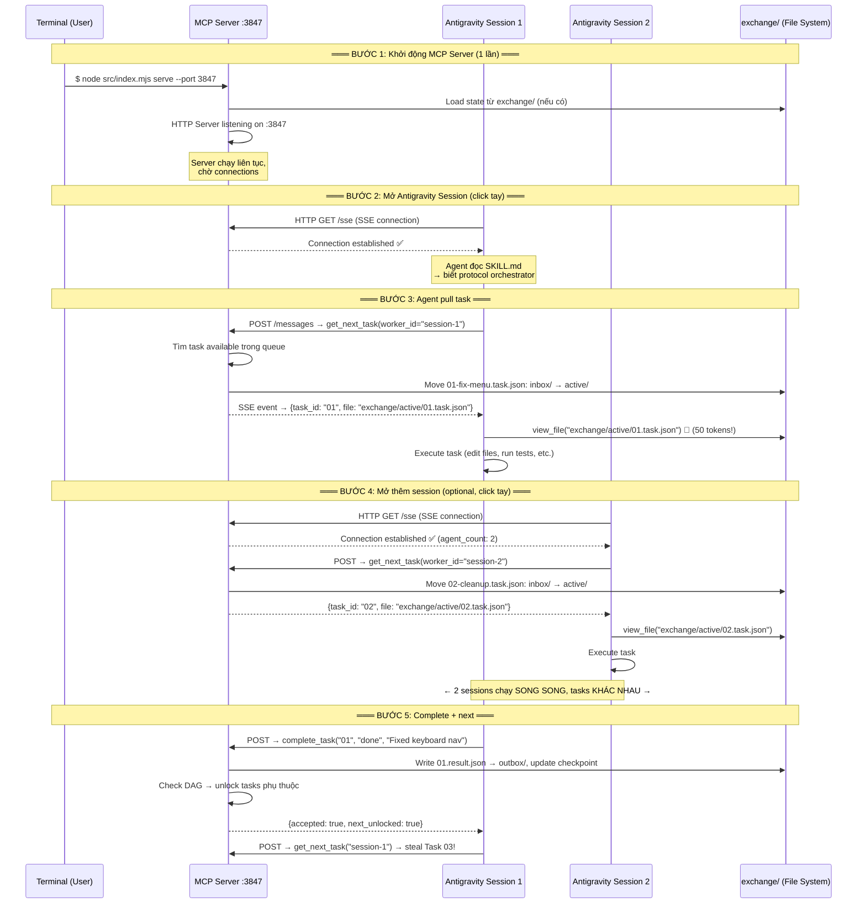
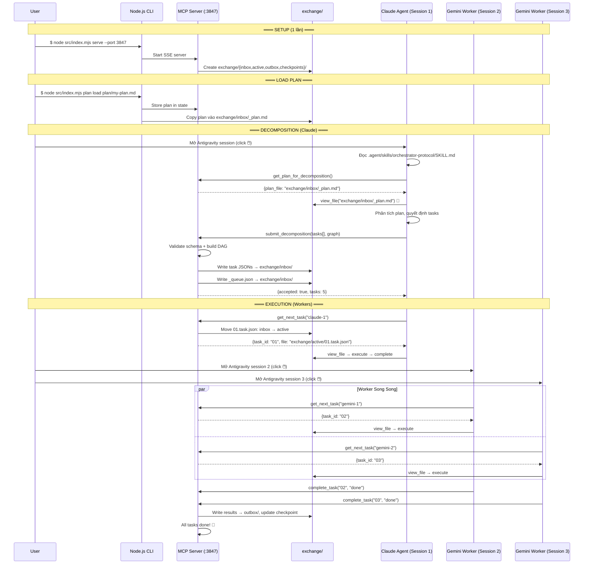

# Architecture Review — Deep Analysis v0.3.1

> **Mục đích**: Phân tích kỹ kiến trúc Dual-Layer, giải thích SSE transport, và xác định gaps  
> **Ngày**: 2026-04-03

---

## 1. SSE Transport — Giải thích Chi Tiết

### 1.1 Vấn đề: Tại sao cần chọn Transport?

MCP hỗ trợ 2 loại transport để agent (Antigravity) giao tiếp với MCP Server:

```
┌──────────────────────────────────────────────────────────────────────┐
│  STDIO Transport (1:1)                                               │
│                                                                      │
│  Antigravity Session 1 ──spawn──> MCP Server Instance 1              │
│  Antigravity Session 2 ──spawn──> MCP Server Instance 2  ← RIÊNG!    │
│  Antigravity Session 3 ──spawn──> MCP Server Instance 3  ← RIÊNG!    │
│                                                                      │
│  → Mỗi session spawn 1 MCP server process RIÊNG                     │
│  → 3 sessions = 3 processes = 3 STATE RIÊNG BIỆT                    │
│  → Agent 1 và Agent 2 KHÔNG BIẾT nhau!                               │
│  → KHÔNG THỂ share task queue!                                       │
└──────────────────────────────────────────────────────────────────────┘

┌──────────────────────────────────────────────────────────────────────┐
│  SSE / Streamable HTTP Transport (1:N)                               │
│                                                                      │
│  [MCP Server] ← chạy độc lập, 1 instance duy nhất                   │
│       ↑  ↑  ↑                                                        │
│       │  │  └── Antigravity Session 3                                │
│       │  └───── Antigravity Session 2                                │
│       └──────── Antigravity Session 1                                │
│                                                                      │
│  → 1 server process = 1 state = SHARED                               │
│  → 3 sessions đều connect vào CÙNG queue                            │
│  → Work-stealing hoạt động!                                          │
└──────────────────────────────────────────────────────────────────────┘
```

### 1.2 Luồng chạy SSE — Từng bước cụ thể



### 1.3 SSE là gì? (Technical)

**SSE = Server-Sent Events** — một chuẩn HTTP cho phép server gửi dữ liệu liên tục tới client qua 1 connection duy nhất.

```
HTTP thường:     Client → Request → Server → Response → Connection đóng
SSE:             Client → Request → Server → Response... Response... Response... (liên tục)
```

Trong MCP:
```
Client (Antigravity) gửi lệnh:   POST /messages  (JSON-RPC)
Server (MCP) trả kết quả:        SSE event stream  (liên tục, không đóng)

Ưu điểm:
- Connection giữ mở → server có thể push notifications
- Nhiều clients kết nối đồng thời → shared state
- Standard HTTP → đi qua proxy, firewall OK
```

### 1.4 Phát hiện quan trọng — Antigravity dùng `mcp-remote`

> [!WARNING]
> **Antigravity KHÔNG hỗ trợ `url` field trực tiếp trong `mcp_config.json`.**
> Phải dùng **`mcp-remote`** package làm bridge:
> ```
> SSE Server ←→ mcp-remote (bridge) ←→ Antigravity (stdio internally)
> ```

#### Configuration thực tế:

```json
// ~/.gemini/antigravity/mcp_config.json
{
  "mcpServers": {
    "orchestrator": {
      "command": "npx",
      "args": [
        "-y",
        "mcp-remote",
        "http://localhost:3847/sse"
      ]
    }
  }
}
```

#### Luồng kỹ thuật thực tế:

```
┌─────────────────────────────────────────────────────────────┐
│  Antigravity nội bộ:                                        │
│                                                             │
│  1. Đọc mcp_config.json → thấy "orchestrator"              │
│  2. Chạy: npx mcp-remote http://localhost:3847/sse          │
│  3. mcp-remote spawn → kết nối SSE tới MCP Server           │
│  4. mcp-remote convert: stdin/stdout ←→ HTTP/SSE            │
│  5. Antigravity giao tiếp qua stdio NHƯNG thực tế           │
│     data đi qua HTTP tới CÙNG MỘT server instance           │
└─────────────────────────────────────────────────────────────┘
```

> [!IMPORTANT]
> **Mỗi Antigravity session spawn 1 `mcp-remote` process riêng, NHƯNG:**
> - Tất cả `mcp-remote` processes đều connect tới **CÙNG 1 MCP Server** qua HTTP
> - MCP Server thấy **N HTTP clients** = shared state
> - → **Multi-session SHARED queue vẫn hoạt động!**

```
Session 1 → mcp-remote → HTTP → ┐
Session 2 → mcp-remote → HTTP → ├→ MCP Server :3847 (1 instance, shared state)
Session 3 → mcp-remote → HTTP → ┘
```

### 1.5 So sánh: POC stdio vs Production SSE

| Giai đoạn | Transport | Lý do |
|-----------|-----------|-------|
| **POC** | stdio | Test nhanh, không cần mcp-remote, 1 session đủ |
| **Phase 1+** | SSE + mcp-remote | Multi-session, shared state |

#### POC config (stdio — đơn giản):
```json
{
  "mcpServers": {
    "orchestrator": {
      "command": "node",
      "args": ["/path/to/agent-orchestrator/src/mcp-server/index.mjs"]
    }
  }
}
```

#### Production config (SSE — multi-session):
```json
{
  "mcpServers": {
    "orchestrator": {
      "command": "npx",
      "args": ["-y", "mcp-remote", "http://localhost:3847/sse"]
    }
  }
}
```

---

## 2. Architecture Review — Vấn đề & Gaps

### 2.1 ✅ Đã giải quyết tốt

| # | Vấn đề | Trạng thái |
|---|--------|-----------|
| 1 | Session spawning | ✅ Manual click, MCP làm brain chung |
| 2 | Multi-session coordination | ✅ SSE transport, shared state |
| 3 | Token efficiency | ✅ File-based context, MCP chỉ coordinate |
| 4 | Crash recovery | ✅ Dual-write: memory + file |
| 5 | Concurrency control | ✅ MCP single-process serialize |
| 6 | Error recovery | ✅ 30s timeout, 3 retries, backoff |
| 7 | Plan decomposition | ✅ Claude parse via MCP tools |
| 8 | Debug/Inspect | ✅ Đọc exchange/ files trực tiếp |

### 2.2 ⚠️ Gaps cần bổ sung / xem xét

#### Gap 1: Startup Order Dependency

```
ĐÚNG:   MCP Server khởi động TRƯỚC → Antigravity session connect SAU
SAI:    Antigravity session mở TRƯỚC → MCP Server chưa chạy → FAIL!
```

**Giải pháp**: 
- Thêm workflow step: "Chạy `node src/index.mjs serve` ở terminal TRƯỚC khi mở session"
- MCP Server khi khởi động in ra banner + port + health check URL
- `mcp-remote` sẽ retry connection nếu server chưa sẵn sàng (built-in)

#### Gap 2: MCP Server Port Conflict

```
Port 3847 đã bị dùng bởi app khác → MCP server không start được
```

**Giải pháp**:
- Config port trong `config.mjs` (mặc định 3847, có thể đổi)
- Startup check: `lsof -i :3847` trước khi bind
- Fallback port auto-increment

#### Gap 3: Security — Localhost Exposure

```
MCP Server listen trên 0.0.0.0 → ai cũng connect được → NGUY HIỂM
```

**Giải pháp**:
- Bind chỉ `127.0.0.1` (localhost only)
- Optional: API key trong header (cho SSE remote access sau này)

#### Gap 4: Agent Protocol Compliance

```
Agent đọc SKILL.md nhưng không tuân thủ → làm sai protocol → hỏng queue
Ví dụ: Agent sửa file mà không report complete → task treo mãi ở active/
```

**Giải pháp**:
- MCP `recovery.mjs`: timeout 30s → auto-requeue nếu agent không report
- SKILL.md viết RẤT CHI TIẾT, step-by-step, không mơ hồ
- MCP tools validate input (reject nếu sai format)

#### Gap 5: Token Counting Không Chính Xác

```
Orchestrator KHÔNG biết agent dùng bao nhiêu tokens thực tế
vì LLM calls đi qua Antigravity, không qua MCP Server
```

**Giải pháp**:
- **V0.1**: Bỏ qua — không track token usage real-time
- **V0.2**: Agent tự report estimated tokens qua `report_progress()` 
- **V0.3**: Thêm MCP tool `report_token_usage(estimated_tokens)` cho agent gọi khi xong task
- Token counter (`tiktoken`) dùng cho **plan decomposition estimation** chứ không phải real-time tracking

#### Gap 6: File Atomicity

```
MCP Server đang write task.json → crash giữa chừng → file corrupted
2 agents move cùng 1 file? (MCP serialize nên không xảy ra, nhưng edge case)
```

**Giải pháp**:
- Write-then-rename pattern: write tới `.tmp` file → rename (atomic trên Linux)
- MCP Server serialize ensures no race conditions giữa agents
- Checkpoints để recover nếu file corrupted

#### Gap 7: Plan File vs Task File — Ranh giới chưa rõ

```
Plan files (MD, human-readable) nằm ở plan/
Task files (JSON, machine-readable) nằm ở exchange/inbox/
→ Ai tạo task files? Claude parse plan → output vào đâu?
```

**Giải pháp cần clarify**:
```
1. User viết plan MD → đặt ở plan/
2. User chạy: node src/index.mjs plan load plan/my-plan.md
3. CLI load plan file → store vào MCP server state + exchange/inbox/_plan.md
4. User mở Antigravity session (Claude)
5. Claude gọi MCP.get_plan_for_decomposition() → nhận file path
6. Claude đọc plan → decompose → gọi MCP.submit_decomposition(tasks[])
7. MCP Server validate → write task JSONs vào exchange/inbox/
8. Queue sẵn sàng cho workers pull
```

#### Gap 8: Khi nào `_queue.json` được tạo?

```
_queue.json chứa execution order (parallel groups, sequential chains)
Ai tạo? Claude hay Node.js?
```

**Phân tích**:
- Claude decompose plan → output tasks **VÀ** execution graph
- `submit_decomposition()` gửi cả `tasks[]` lẫn `execution_graph`
- **Node.js** (dependency-resolver.mjs) validate DAG + generate `_queue.json`
- → Claude đề xuất, Node.js validate và finalize

---

## 3. Data Flow Tổng hợp — End-to-End



---

## 4. Rủi ro cần POC xác minh

| # | Rủi ro | Mức độ | Cách verify |
|---|--------|--------|-------------|
| 1 | Antigravity hỗ trợ `mcp-remote` SSE bridge? | 🔴 Cao | POC: test connect SSE |
| 2 | `mcp-remote` có stable với long-running connections? | 🟡 Trung bình | POC: chạy 30+ phút |
| 3 | Multi `mcp-remote` instances → cùng 1 server = OK? | 🔴 Cao | POC: mở 2 sessions |
| 4 | Agent tuân thủ SKILL.md protocol? | 🟡 Trung bình | POC: test với Claude |
| 5 | File move atomic trên Linux? | 🟢 Thấp | `fs.rename` = atomic |

---

## 5. POC Roadmap (chi tiết)

### POC Phase A: MCP Server stdio (ngày 1)
- [ ] Init project, install SDK
- [ ] Build minimal MCP server (stdio)
- [ ] 1 tool: `hello_world(name)` → return greeting
- [ ] 1 tool: `get_status()` → return server info
- [ ] Config stdio trong `mcp_config.json`
- [ ] Mở Antigravity session → gọi tools → verify

### POC Phase B: SSE + mcp-remote (ngày 2)
- [ ] Chuyển server sang SSE transport (HTTP)
- [ ] Test `npx mcp-remote http://localhost:PORT/sse`
- [ ] Config `mcp_config.json` dùng `mcp-remote`
- [ ] Mở 1 Antigravity session → verify connection
- [ ] Mở 2 sessions → verify SHARED state (cả 2 thấy cùng status)

### POC Phase C: File IPC integration (ngày 3)
- [ ] Thêm `exchange/` directory
- [ ] Tool `get_next_task()` → move file inbox → active → return path
- [ ] Tool `complete_task()` → write result to outbox
- [ ] Test full flow: load fake task → agent pull → execute → complete
- [ ] Test crash recovery: kill server → restart → state restored from files

---

## 6. Kết luận — Kiến trúc đã ổn?

### ✅ Ổn (7/10 components)
- Dual-Layer architecture (MCP + File IPC)
- Token-efficient design (file = compressed context)
- Work-stealing task queue
- Error recovery (timeout + retry)
- Crash recovery (file backup)
- JSON Contract Templates
- Checkpoint Staleness Detection

### ⚠️ Cần clarify/bổ sung (3 items)

1. **`mcp-remote` compatibility** — cần POC xác minh
2. **Startup workflow** — cần document rõ: server trước, session sau
3. **Plan → Task → Queue flow** — cần xác định rõ boundary: Claude đề xuất, Node validate

### ❌ Chưa address (2 items — low priority cho v0.1)

1. **Token counting real-time** — bỏ qua v0.1
2. **Auto-scaling sessions** — manual scale là đủ cho v0.1
