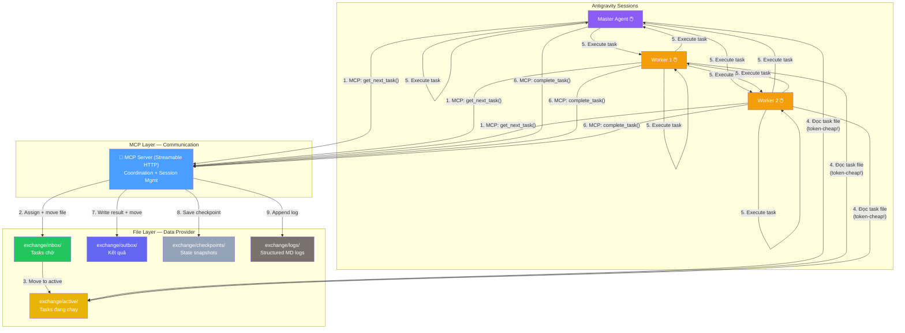

# Agent Orchestrator v0.4 — Dual-Layer: MCP + File IPC

> **Trạng thái**: Approved — Sẵn sàng break thành tasks
> **Ngày**: 2026-04-04
> **Thay đổi từ v0.3**: Streamable HTTP thay SSE, merge phases, structured logging, cross-platform refined

---

## Quyết định đã chốt

| # | Chủ đề | Quyết định |
|---|--------|-----------|
| 1 | Repo structure | 1 repo, tách sau nếu cần |
| 2 | JSON Contracts | 4 JSON templates |
| 3 | LLM Provider | Adapter pattern. Claude + Gemini có role riêng |
| 4 | **Runtime** | **Luôn chạy qua Antigravity** (bất kể model nào) |
| 5 | **Communication** | **Dual-Layer: MCP + File IPC** — MCP điều phối, File lưu data |
| 6 | **Transport** | **Streamable HTTP** — single endpoint `/mcp`, fallback SSE |
| 7 | **Session spawning** | Manual click (1+ sessions), MCP server là brain chung |
| 8 | Token counting | Tạm bỏ qua, enhance sau |
| 9 | Plan format | MD (natural language) |
| 10 | Checkpoint stale | 3-level detection (fresh/safe-stale/conflict) |
| 11 | **Plan decomposition** | **Claude parse** qua MCP tools (không dùng Node parser) |
| 12 | **Claude constraints** | **Có giới hạn** — max tasks, required fields, validation |
| 13 | **Error recovery** | 30s timeout, 3 retries via "continue", backoff |
| 14 | **Approach** | **POC-first** — build MCP cơ bản → test → improve |
| 15 | **File IPC** | **Giữ `exchange/`** — data provider, token-efficient context |
| 16 | **Design goal** | **Work đúng + Save token** — file = compressed context |
| 17 | **Paths** | `path.join()` + `import.meta.url` — 1 solution cho cả Linux + Windows |
| 18 | **SSE bridge** | `npx mcp-remote URL --transport http-first` — ưu tiên Streamable HTTP |
| 19 | **POC order** | A (Streamable HTTP) → B (skills/workflows) → C (file IPC) → D (full test) |
| 20 | **Auto-start** | Health check script → auto start server nếu chưa chạy |
| 21 | **Architecture target** | **8.5+/10** — 7 quá rủi ro |
| 22 | **Worker ID** | UUID — chỉ MCP server tạo và quản lý, 1 nơi duy nhất |
| 23 | **Logging** | Structured MD log files — ngắn gọn, đủ ý, append-only |
| 24 | **Naming convention** | `<module>_<task>_<version>` — áp dụng cho plan files, task files |
| 25 | **Tools strategy** | Tools tạo file MD tạm → agent đọc → xong xóa. Hạn chế agent tự query |

---

## 1. Kiến trúc Tổng quan — Dual-Layer (v0.4)

> [!IMPORTANT]
> **Triết lý thiết kế:**
> - **MCP** = Nervous System (real-time communication, session coordination)
> - **File IPC (exchange/)** = Memory (persistent data, token-efficient context recovery)
> - **Goal**: Work đúng + Save token. Đọc 1 file JSON ngắn << replay conversation

### Tại sao Dual-Layer?

```
Agent mới mở session, cần biết context:
  ❌ Replay conversation history     = hàng nghìn tokens, chậm, thiếu chính xác
  ❌ Chỉ dùng MCP (in-memory only)   = mất state khi crash, không inspect được
  ✅ Đọc exchange/active/task.json   = 50-100 tokens, CHÍNH XÁC, instant
```



### Vai trò mỗi Layer

| Layer | Vai trò | Ví dụ |
|-------|---------|-------|
| **MCP** | Coordination — ai nhận task nào, queue order, concurrency control, worker ID | `get_next_task()`, `complete_task()`, `get_queue_status()` |
| **File IPC** | Data Provider — task details, results, checkpoints, logs | `exchange/active/01-fix-menu.task.json` (agent đọc trực tiếp) |

---

## 2. Folder Structure (v0.4)

```
agent-orchestrator/
├── plan/                                 ← Plan documents (MD)
├── reference/                            ← Reference materials
├── templates/                            ← JSON contract templates
│   ├── task.template.json
│   ├── checkpoint.template.json
│   ├── plan-output.template.json
│   └── archive-entry.template.json
├── src/
│   ├── index.mjs                         ← CLI entry: serve, plan, status, resume
│   ├── config.mjs                        ← Config loader + validation
│   ├── mcp-server/                       ← MCP Server — Communication Layer
│   │   ├── index.mjs                     ← MCP bootstrap (Streamable HTTP transport)
│   │   ├── tools.mjs                     ← Tool definitions cho agents
│   │   ├── task-queue.mjs                ← Queue + DAG + work-stealing
│   │   ├── state-manager.mjs             ← Dual-write: memory + file
│   │   └── recovery.mjs                  ← Timeout (30s), retry (3x), heartbeat
│   ├── planner/
│   │   ├── plan-loader.mjs               ← Load MD plan file (Node deterministic)
│   │   ├── dependency-resolver.mjs       ← Build DAG từ Claude decomposition output
│   │   └── setup-detector.mjs            ← Auto-detect setup tasks
│   └── utils/
│       ├── tools.mjs                     ← Shell/file helpers
│       ├── memory.mjs                    ← Archive, freshness, auto-delete
│       ├── checkpoint.mjs                ← Save/Load/Staleness 3-level
│       ├── file-backend.mjs              ← File read/write for exchange/
│       ├── logger.mjs                    ← Structured MD log writer
│       └── worker-registry.mjs           ← UUID worker ID manager (single source)
├── tools/                                ← Node.js automation scripts (token-saving)
│   ├── health-check.mjs                  ← Check MCP server status → output MD
│   ├── queue-status.mjs                  ← Scan exchange/ → output MD summary
│   ├── init-exchange.mjs                 ← Create exchange directory structure
│   └── task-scanner.mjs                  ← Scan & summarize tasks → output MD
├── exchange/                             ← 📁 File IPC — Data Provider Layer
│   ├── inbox/                            ← Tasks chờ agent nhận
│   │   ├── _queue.json                   ← Execution order + parallel groups
│   │   └── 01-fix-menu.task.json         ← Task data
│   ├── active/                           ← Tasks đang được xử lý
│   ├── outbox/                           ← Kết quả agent trả về
│   ├── checkpoints/                      ← State snapshots
│   └── logs/                             ← Structured MD logs (append-only)
│       └── 2026-04-04.md                 ← Daily log file
├── .agent/                               ← Antigravity integration
│   ├── skills/
│   │   └── orchestrator-protocol/
│   │       └── SKILL.md
│   └── workflows/
│       ├── orchestrate.md
│       ├── worker.md
│       ├── start-server.md
│       ├── decompose-plan.md
│       └── status.md
├── package.json
└── README.md
```

---

## 3. MCP Server Design

### 3.1 Transport: Streamable HTTP

> [!IMPORTANT]
> HTTP+SSE đã deprecated (protocol 2025-03-26).
> Dùng **Streamable HTTP** — single endpoint, modern standard.
> `mcp-remote` dùng `http-first` strategy (ưu tiên Streamable HTTP, fallback SSE).

```
$ node src/index.mjs serve --port 3847

┌───────────────────────────────────┐
│  MCP Server listening :3847       │
│  Transport: Streamable HTTP       │
│  Endpoint: /mcp                   │
│  Health: /health                  │
│  Exchange: ./exchange/            │
│  Connected workers: 0             │
└───────────────────────────────────┘
```

Config cho Antigravity (`mcp_config.json`):
```json
{
  "mcpServers": {
    "orchestrator": {
      "command": "npx",
      "args": [
        "-y",
        "mcp-remote",
        "http://localhost:3847/mcp",
        "--transport", "http-first"
      ]
    }
  }
}
```

### 3.2 Worker Identity — UUID managed centrally

```javascript
// CHỈ MCP server tạo và quản lý worker IDs
// Agent KHÔNG tự tạo UUID

// Khi agent connect lần đầu:
MCP.register_worker()
  → Server tạo UUID: "w-a1b2c3d4"
  → Lưu vào worker registry (memory + file)
  → Return: { worker_id: "w-a1b2c3d4" }

// Agent dùng worker_id cho tất cả calls sau đó:
MCP.get_next_task("w-a1b2c3d4")
MCP.complete_task("01", "done", "Fixed menu", "w-a1b2c3d4")
```

Worker Registry (`exchange/workers.json`):
```jsonc
{
  "workers": {
    "w-a1b2c3d4": {
      "registered_at": "2026-04-04T10:00:00Z",
      "last_heartbeat": "2026-04-04T10:05:00Z",
      "current_task": "01-fix-menu",
      "tasks_completed": 3,
      "status": "active"  // active | idle | disconnected
    }
  }
}
```

### 3.3 Dual-Write Pattern (MCP ↔ File)

```javascript
// Khi agent gọi MCP tool → MCP server vừa update memory VỪA write file

MCP.get_next_task(worker_id)
  → Memory: mark task as in_progress, assign to worker
  → File:   move task.json từ exchange/inbox/ → exchange/active/
  → Log:    append event vào exchange/logs/
  → Return: task_id (agent tự đọc file để lấy details — TIẾT KIỆM TOKENS)

MCP.complete_task(task_id, summary, worker_id)
  → Memory: update queue state, unlock next group
  → File:   write result.json vào exchange/outbox/
  → File:   move task.json từ exchange/active/ → done
  → File:   update checkpoint
  → Log:    append completion event
```

### 3.4 MCP Tools

```javascript
// ═══════════ Worker Registration ═══════════
register_worker()                              → {worker_id}  // Server tạo UUID

// ═══════════ Core Dispatch (lean — chỉ coordination) ═══════════
get_next_task(worker_id)                       → {task_id, file_path}
complete_task(task_id, status, summary, wid)    → {accepted, next_unlocked}
report_progress(task_id, step, percentage)     → void

// ═══════════ Plan Decomposition ═══════════
get_plan_for_decomposition()                   → {plan_file_path, template_path}
submit_decomposition(tasks[], graph, reason)   → {accepted, errors}

// ═══════════ Status & Control ═══════════
get_queue_status()                             → {total, done, active, blocked}
get_checkpoint()                               → {checkpoint_file_path}

// ═══════════ Error Recovery ═══════════
request_retry(task_id, reason, attempt)        → {approved, file_path}
```

> [!TIP]
> **Token optimization**: MCP tools trả về `file_path` thay vì full data.
> Agent dùng `view_file` (Antigravity native tool) để đọc → tốn ít MCP token,
> và file read qua Antigravity được tối ưu sẵn.

### 3.5 Task Queue — Work-Stealing Pattern

```
Agent 1: MCP.get_next_task() → {task_id: "01", file: "exchange/active/01.json"}
         → view_file("exchange/active/01.json") // đọc chi tiết, rẻ
         → execute → MCP.complete_task("01", "done", "Fixed menu")

Agent 2: MCP.get_next_task() → {task_id: "02", ...} → execute → complete

Agent 1 xong trước → MCP.get_next_task() → steal Task 03
→ Work-stealing tự nhiên, load-balance không cần assign trước
```

### 3.6 Error Recovery

```
Timeout:  30 giây không report_progress → coi như stall
Retry:    Max 3 lần, backoff [0s, 5s, 10s]
Method:   Agent type "continue" → gọi MCP.request_retry()
Failure:  Sau 3 retry → task.status = "failed" → skip, tiếp tasks khác
Recovery: MCP server crash → restart → load state từ exchange/ files
```

### 3.7 Graceful Shutdown

```javascript
// SIGINT/SIGTERM handler:
// 1. Flush in-memory state → exchange/ files
// 2. Write server.pid → exchange/.shutdown_clean
// 3. Log shutdown event
// 4. Close HTTP server

// On restart:
// 1. Check exchange/.shutdown_clean exists?
//    → YES: clean shutdown, load state normally
//    → NO:  unclean crash → scan active/ → requeue orphaned tasks
// 2. Remove .shutdown_clean
// 3. Resume queue
```

---

## 4. Logging — Structured MD (from day 1)

> [!IMPORTANT]
> Log files = structured MD, ngắn gọn, đủ ý.
> Mỗi ngày 1 file. Append-only. Agent đọc được bằng `view_file()`.

### Format: `exchange/logs/YYYY-MM-DD.md`

```markdown
# Log 2026-04-04

## 10:00:15 — SERVER_START
- Port: 3847
- Transport: Streamable HTTP
- Restored: 3 tasks from checkpoint

## 10:01:22 — WORKER_REGISTERED
- Worker: `w-a1b2c3d4`

## 10:01:25 — TASK_ASSIGNED
- Task: `01-fix-menu`
- Worker: `w-a1b2c3d4`
- Source: inbox → active

## 10:05:30 — TASK_COMPLETED
- Task: `01-fix-menu`
- Worker: `w-a1b2c3d4`
- Status: done
- Duration: 245s
- Summary: Fixed keyboard navigation in dropdown menu

## 10:05:31 — DAG_UNLOCK
- Unlocked: `03-integration-test` (dependency on 01 satisfied)
```

### Tại sao MD thay vì JSON log?
- Agent đọc bằng `view_file()` → human-readable, ít token parse
- Tools output cũng tạo MD → nhất quán
- Vẫn structured (heading format chuẩn → parseable nếu cần)

---

## 5. Tools Strategy — MD Interaction Pattern

> [!IMPORTANT]
> **Nguyên tắc tools**: Tạo file MD tạm → agent đọc → xong xóa.
> Hạn chế agent tự query (tốn rất nhiều token).

### Pattern:

```javascript
// Tool chạy → output MD file tạm
$ node tools/queue-status.mjs
// → Tạo file: exchange/.tmp/queue-status.md

// Agent đọc bằng view_file (rẻ)
// → Xong thì MCP server hoặc tool tự xóa file tạm
```

### Tools inventory (V0.1):

| Script | Input | Output | Mô tả |
|--------|-------|--------|--------|
| `health-check.mjs` | — | `exchange/.tmp/health.md` | Server status, uptime, worker count |
| `queue-status.mjs` | — | `exchange/.tmp/queue-status.md` | Task summary across all dirs |
| `init-exchange.mjs` | — | Creates dirs | Setup exchange/ structure |
| `task-scanner.mjs` | — | `exchange/.tmp/task-scan.md` | Detailed task listing |

### Tools cần kiểm tra/bổ sung từ reference:

| Tool hiện có | Status | Action |
|-------------|--------|--------|
| `git-push.sh` | ✅ Vẫn dùng | Giữ nguyên |
| `health-check.mjs` | 🆕 Chưa tạo | Tạo mới |
| `queue-status.mjs` | 🆕 Chưa tạo | Tạo mới |
| `init-exchange.mjs` | 🆕 Chưa tạo | Tạo mới |
| `task-scanner.mjs` | 🆕 Chưa tạo | Tạo mới |

---

## 6. Cross-Platform Paths — 1 Solution cho Linux + Windows

> [!IMPORTANT]
> KHÔNG if/else detect OS. Dùng Node.js cross-platform APIs sẵn.

### Quy tắc:

```javascript
// ✅ 1 solution cho CẢ 2 OS:
import { fileURLToPath } from 'url';
import { dirname, join, resolve } from 'path';

const __dirname = dirname(fileURLToPath(import.meta.url));
const ROOT = resolve(__dirname, '..');
const file = join(ROOT, 'exchange', 'inbox', '01.json');

// ✅ Symlink/Junction — 1 API, cả 2 OS:
import { symlinkSync, existsSync } from 'fs';
export function linkDir(source, target) {
  if (existsSync(target)) return;
  symlinkSync(resolve(source), resolve(target), 'junction');
  // Linux: type 'junction' ignored → tạo symlink bình thường
  // Windows: tạo Junction (không cần admin)
}

// ✅ Atomic file write — 1 API, cả 2 OS:
import { writeFileSync, renameSync } from 'fs';
export function atomicWrite(filePath, content) {
  const tmp = filePath + '.tmp';
  writeFileSync(tmp, content, 'utf8');
  renameSync(tmp, filePath);  // atomic trên cả 2 OS
}
```

### KHÔNG được làm:
- ❌ `platform()` hay `process.platform` để switch logic
- ❌ Hardcode `/` hay `\\`
- ❌ Absolute paths trong task files hoặc MCP responses
- ❌ Shell-specific commands (dùng Node.js fs API thay vì `mv`, `cp`)

---

## 7. Naming Convention

### Plan files:
```
plan/<module>_<description>_<version>.md

Ví dụ:
plan/orchestrator_architecture_v0.4.md
plan/orchestrator_poc-results_v0.1.md
```

### Task files:
```
exchange/inbox/<NN>-<module>-<action>.task.json

Ví dụ:
exchange/inbox/01-menu-fix-keyboard.task.json
exchange/inbox/02-config-add-validation.task.json
```

### Log files:
```
exchange/logs/YYYY-MM-DD.md
```

### Checkpoint files:
```
exchange/checkpoints/cp-YYYYMMDD-NNN.json
```

---

## 8. JSON Contract Templates

### 8.1 `task.template.json`

```jsonc
{
  "id": "01-setup-env",
  "title": "Setup Environment",
  "module": "infra",
  "action": "setup",
  "status": "pending",          // pending | active | done | blocked | failed
  "assigned_to": null,          // worker_id (UUID) khi assigned
  "priority": 1,
  "what_to_do": "...",
  "files": [
    { "action": "MODIFY", "path": "relative/path/to/file" },
    { "action": "NEW", "path": "relative/path/to/new/file" }
  ],
  "constraints": {
    "skills": ["strict-scope", "token-optimization"],
    "rules": ["Không sửa file ngoài danh sách"]
  },
  "dependencies": [],
  "verification": {
    "command": "npm test",
    "expected": "All tests pass"
  },
  "done_criteria": [
    "Files modified as specified",
    "Tests pass"
  ],
  "metadata": {
    "created_at": "...",
    "completed_at": null,
    "duration_ms": null,
    "worker_id": null,
    "attempt": 0,
    "partial_progress": null
  }
}
```

### 8.2 `_queue.json`

```jsonc
{
  "version": 1,
  "created_at": "2026-04-04T10:00:00Z",
  "plan_source": "plan/my-plan.md",
  "groups": [
    {
      "group_id": 1,
      "parallel": true,
      "tasks": ["01-setup-env", "02-setup-config"]
    },
    {
      "group_id": 2,
      "parallel": true,
      "tasks": ["03-fix-menu", "04-fix-dialog"],
      "depends_on": [1]
    },
    {
      "group_id": 3,
      "parallel": false,
      "tasks": ["05-integration-test"],
      "depends_on": [2]
    }
  ]
}
```

### 8.3 `checkpoint.template.json`, `plan-output.template.json`, `archive-entry.template.json`

→ Giữ nguyên concept từ v0.3. Define chi tiết khi implement Phase C.

---

## 9. Plan Decomposition — Claude với Constraints

| Constraint | Giá trị | Lý do |
|-----------|---------|-------|
| Max tasks per plan | 20 | Tránh over-decomposition |
| Max parallel per group | 5 | Agent Manager session limit |
| Required task fields | `id, module, action, verification` | Đảm bảo quality |
| Task ID format | `XX-kebab-case` (00-setup-env) | Consistency |
| Dependency validation | No circular deps | DAG integrity |
| Reject threshold | plan < 50 chars → reject | Quá mơ hồ để parse |

---

## 10. Checkpoint Staleness Detection

3-level: 🟢 FRESH → 🟡 SAFE-STALE → 🔴 CONFLICT

- Memory: MCP state-manager giữ latest state (fast access)
- File: `exchange/checkpoints/` giữ snapshots (crash recovery + token-efficient resume)

---

## 11. Implementation Roadmap — POC 4 Phases

> [!IMPORTANT]
> **Thay đổi từ v0.3**: Merge Phase A+C thành 1 (Streamable HTTP là core, làm ngay).
> Tổng cộng 4 phases thay vì 5.

### 🔴 Phase A: MCP Server — Core Foundation

Phase A chia thành 3 bước nhỏ, mỗi bước verify trước khi tiến tiếp:

#### Phase A1: Minimal MCP + Hello World (stdio)

**Mục tiêu**: Chứng minh MCP server kết nối được với Antigravity, gõ hello world trên session

- [ ] Init Node.js project (ESM, `package.json`, `type: module`)
- [ ] Install `@modelcontextprotocol/sdk` + `zod`
- [ ] Tạo minimal MCP server (stdio) — `src/mcp-server/index.mjs`
  - 1 tool duy nhất: `hello_world(name)` → return greeting
- [ ] Config stdio trong `mcp_config.json` (global Antigravity config)
- [ ] Mở Antigravity session → gọi `hello_world` → verify response
- [ ] Ghi observations: latency, tool schema rendering, token cost

> **Done criteria A1**: Mở session, gõ "hello world", agent gọi MCP tool, nhận response. ✅

---

#### Phase A2: Upgrade → Streamable HTTP + mcp-remote

**Mục tiêu**: Chuyển từ stdio sang Streamable HTTP — production transport

- [ ] Install thêm `express` (hoặc Node http)
- [ ] Upgrade MCP server: stdio → Streamable HTTP transport
  - Single endpoint: `/mcp`
  - Health check: `/health`
  - Bind `127.0.0.1` only (security)
- [ ] Thêm tools: `get_status()` → return server info
- [ ] `src/config.mjs` — Cross-platform paths (`import.meta.url` + `path.join()`)
- [ ] Config `mcp_config.json` dùng `mcp-remote` + `--transport http-first`
- [ ] Test: start server → mở 1 session → gọi tools → verify

> **Done criteria A2**: Server chạy Streamable HTTP, 1 session connect qua mcp-remote, gọi tools OK. ✅

---

#### Phase A3: Multi-session + Hardening

**Mục tiêu**: Shared state hoạt động, server ổn định

- [ ] Implement `register_worker()` → MCP server tạo UUID
- [ ] Test: 2 sessions → verify SHARED state (cả 2 thấy cùng status)
- [ ] Test: reconnect sau disconnect
- [ ] Graceful shutdown handler (SIGINT/SIGTERM) → flush state
- [ ] Document observations: shared state behavior, mcp-remote stability

---

### Phase B: Skills / Workflows / Templates

**Mục tiêu**: Chuẩn hóa tất cả assets TRƯỚC KHI build server phức tạp

- [ ] `.agent/skills/orchestrator-protocol/SKILL.md` — Full agent protocol
- [ ] `.agent/workflows/start-server.md` — Auto-start + health check
- [ ] `.agent/workflows/orchestrate.md` — Master: decompose → execute
- [ ] `.agent/workflows/worker.md` — Worker: pull → execute → complete loop
- [ ] `.agent/workflows/decompose-plan.md` — Decompose only
- [ ] `.agent/workflows/status.md` — View queue status
- [ ] Symlink generic skills: `strict-scope`, `token-optimization`, `git-commit-convention`
- [ ] `templates/task.template.json` (format đã finalize ở Section 8.1)
- [ ] `templates/checkpoint.template.json`
- [ ] `templates/plan-output.template.json`
- [ ] `templates/archive-entry.template.json`
- [ ] Review & verify tools/ inventory — bổ sung tools thiếu
- [ ] Tạo `tools/health-check.mjs` → output MD
- [ ] Tạo `tools/queue-status.mjs` → output MD
- [ ] Tạo `tools/init-exchange.mjs`
- [ ] Tạo `tools/task-scanner.mjs` → output MD

---

### Phase C: File IPC + Core MCP Tools

**Mục tiêu**: Dual-Layer hoạt động, full tool set, cross-platform

- [ ] Tạo `exchange/{inbox,active,outbox,checkpoints,logs}/`
- [ ] `src/utils/file-backend.mjs` — Atomic write (write→rename), CRUD
- [ ] `src/utils/logger.mjs` — Structured MD log writer
- [ ] `src/utils/worker-registry.mjs` — UUID manager (single source of truth)
- [ ] `src/mcp-server/state-manager.mjs` — Dual-write: memory + file
- [ ] `src/mcp-server/task-queue.mjs` — Queue + group-based ordering
- [ ] `src/mcp-server/recovery.mjs` — Timeout, retry, stale detection, orphan requeue
- [ ] Implement full MCP tools:
  - `register_worker()` → generate UUID
  - `get_next_task(worker_id)` → move file + return path
  - `complete_task(task_id, status, summary, worker_id)` → write result + move
  - `report_progress(task_id, step, percentage)`
  - `get_queue_status()`
  - `get_checkpoint()`
  - `get_plan_for_decomposition()`
  - `submit_decomposition(tasks[], graph)`
  - `request_retry(task_id, reason, attempt)`
- [ ] Test crash recovery: kill server → restart → state restored from files
- [ ] Test orphan task requeue after unclean shutdown
- [ ] Test on Windows (current dev) + Linux (if available)

---

### Phase D: Full Flow Test — End-to-End

**Mục tiêu**: Chứng minh orchestrator hoạt động từ plan đến done

- [ ] Viết 1 plan MD đơn giản (2-3 tasks)
- [ ] Load plan vào server
- [ ] Agent decompose → submit tasks
- [ ] Agent pull → execute → complete (loop)
- [ ] Verify: inbox → active → outbox flow ✅
- [ ] Verify: result JSON + checkpoint ✅
- [ ] Verify: DAG dependency unlock ✅
- [ ] Verify: logs/YYYY-MM-DD.md complete ✅
- [ ] Verify: worker registry correct ✅
- [ ] Measure token cost for coordination
- [ ] Document observations & gaps → plan v0.5

---

### After POC: Production Phases

| Phase | Nội dung | Khi nào |
|-------|----------|---------|
| Phase 1 | Memory optimization, Checkpoint polish | Sau POC |
| Phase 2 | Planner, DAG advanced, Claude constraints refinement | Sau Phase 1 |
| Phase 3 | CLI polish, Integration tests, README | Sau Phase 2 |
| Future | Token counting, Auto-scaling, Multi-plan, Hot-reload | V0.2+ |

---

## 12. Edge Cases — Đã tính tới

### Happy Path ✅
- [x] Plan → Decompose → Queue → Pull → Execute → Complete → Next
- [x] Multi-session parallel execution
- [x] Work-stealing
- [x] DAG dependency resolution
- [x] Checkpoint save/restore

### Error Cases ✅
- [x] Agent timeout → requeue
- [x] Agent retry (max 3, backoff)
- [x] Task blocked → skip, notify
- [x] Task failed → mark failed, continue
- [x] MCP server crash → restart → reload from files
- [x] Unclean shutdown → orphan task requeue

### Edge Cases (V0.1 approach)
- [x] Agent partial completion → task ghi warning, agent mới kiểm tra `git diff`
- [x] Graceful shutdown → SIGINT handler flush state
- [x] Worker identity → UUID managed by MCP server only
- [x] All tasks done → return null → agent stop
- [x] Queue empty → status returns 0
- [x] Circular dependency → validator rejects
- [x] File corrupted → write-then-rename mitigate
- [x] Agent ngoài scope → SKILL.md warns (accepted risk)

### Deferred (V0.2)
- [ ] Multi-plan support (2 plans simultaneously)
- [ ] Hot-reload plan (add/cancel task mid-execution)
- [ ] Token counting real-time
- [ ] Auto-scaling sessions
- [ ] Memory leak monitoring

---

## Trạng Thái

**Plan v0.4 — Dual-Layer: MCP + File IPC.**
Streamable HTTP transport, UUID worker identity, structured MD logging, cross-platform paths, 4-phase POC roadmap.
Sẵn sàng break thành tasks để thực thi.
