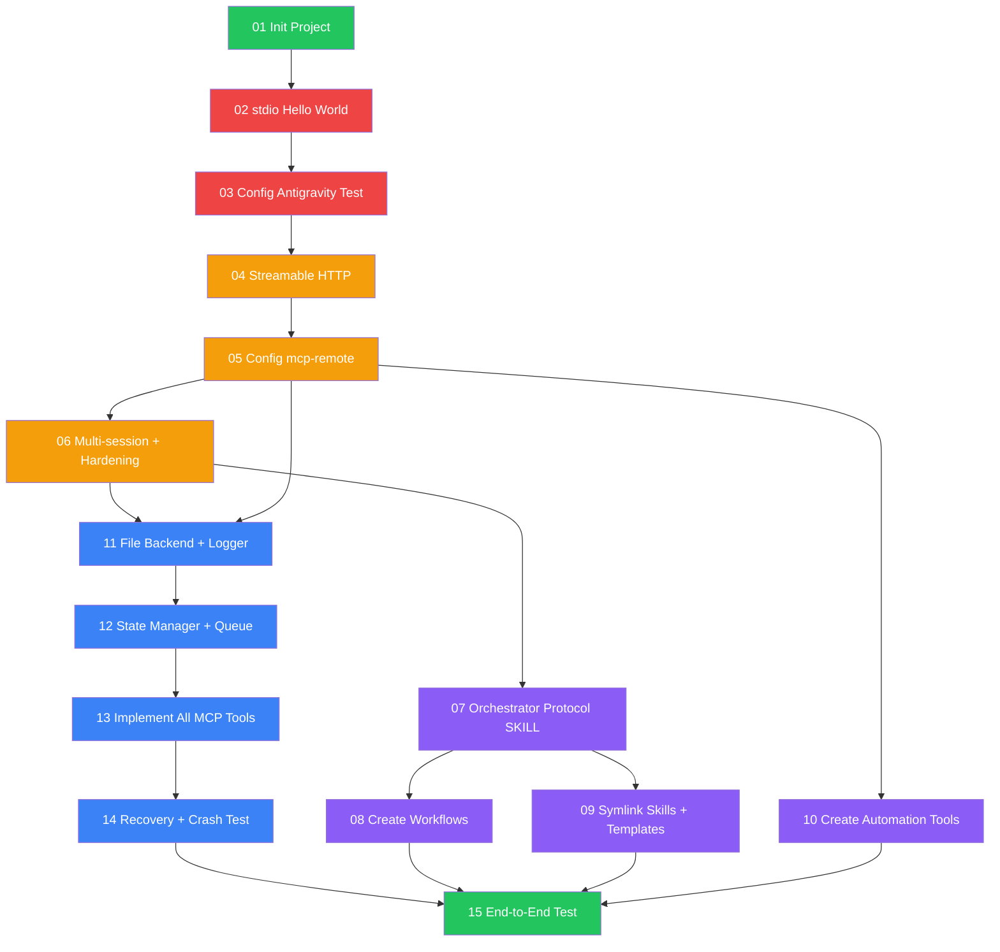

# Task Board — Agent Orchestrator POC v0.4

> **Tổng**: 15 tasks | **Pending**: 12 | **Processing**: 0 | **Done**: 3

---

## Dependency Graph



**Legend**: 🔴 Phase A1 | 🟡 Phase A2-A3 | 🟣 Phase B | 🔵 Phase C | 🟢 Phase D

---

## Task List

### Phase A1: Minimal MCP + Hello World
| # | Task | Status | Dependencies |
|---|------|--------|-------------|
| 01 | [Init Node.js Project](done/01-mcp_init-project.md) | ✅ Done | None |
| 02 | [stdio Hello World](done/02-mcp_stdio-hello-world.md) | ✅ Done | 01 |
| 03 | [Config Antigravity + Test](done/03-mcp_config-antigravity-test.md) | ✅ Done | 02 |

### Phase A2: Streamable HTTP + mcp-remote
| # | Task | Status | Dependencies |
|---|------|--------|-------------|
| 04 | [Upgrade → Streamable HTTP](pending/04-mcp_streamable-http.md) | ⬜ Pending | 03 |
| 05 | [Config mcp-remote + config.mjs](pending/05-mcp_config-mcp-remote.md) | ⬜ Pending | 04 |

### Phase A3: Multi-session + Hardening
| # | Task | Status | Dependencies |
|---|------|--------|-------------|
| 06 | [Multi-session + Graceful Shutdown](pending/06-mcp_multi-session-hardening.md) | ⬜ Pending | 05 |

### Phase B: Skills / Workflows / Templates
| # | Task | Status | Dependencies |
|---|------|--------|-------------|
| 07 | [Orchestrator Protocol SKILL.md](pending/07-skills_orchestrator-protocol.md) | ⬜ Pending | 06 |
| 08 | [Create Workflows (5 files)](pending/08-workflows_create-all.md) | ⬜ Pending | 07 |
| 09 | [Symlink Skills + JSON Templates](pending/09-skills_symlink-templates.md) | ⬜ Pending | 07 |
| 10 | [Create Automation Tools (4 scripts)](pending/10-tools_create-automation.md) | ⬜ Pending | 05 |

### Phase C: File IPC + Core MCP Tools
| # | Task | Status | Dependencies |
|---|------|--------|-------------|
| 11 | [File Backend + Logger + Registry](pending/11-utils_file-backend-logger.md) | ⬜ Pending | 05, 06 |
| 12 | [State Manager + Task Queue](pending/12-mcp_state-manager-queue.md) | ⬜ Pending | 11 |
| 13 | [Implement All MCP Tools (9 tools)](pending/13-mcp_implement-all-tools.md) | ⬜ Pending | 12 |
| 14 | [Recovery + Crash Test](pending/14-mcp_recovery-crash-test.md) | ⬜ Pending | 13 |

### Phase D: Full Flow Test
| # | Task | Status | Dependencies |
|---|------|--------|-------------|
| 15 | [End-to-End Flow Test](pending/15-test_end-to-end-flow.md) | ⬜ Pending | 08, 09, 10, 14 |

---

## Parallel Execution Opportunities

Sau khi Phase A xong (task 01→06), có thể chạy song song:

```
Group 1 (song song):  07 + 10 + 11
Group 2 (song song):  08 + 09 + 12
Group 3 (tuần tự):    13 → 14
Group 4 (cuối):       15 (chờ tất cả)
```

---

## How to Use

```bash
# Xem task pending:
ls tasks/pending/

# Bắt đầu làm task:
mv tasks/pending/01-mcp_init-project.md tasks/processing/

# Xong task:
mv tasks/processing/01-mcp_init-project.md tasks/done/
```
